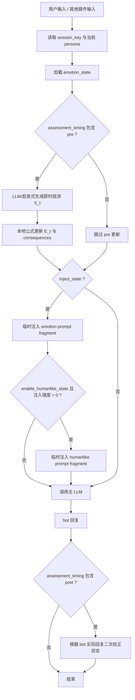

# AstrBot 多维情绪状态插件

> 让 AstrBot 维护一套可计算、可记忆、可解释、可被其他插件调用的多维情绪状态。


`astrbot_plugin_emotional_state` 是一个面向 AstrBot 的“情绪状态层”和“插件公共状态服务”。它不是只在 prompt 里写几句“你要有喜怒哀乐”，而是把 bot 的情绪、关系后果、人格差异、长期记忆注解、拟人状态、道德修复状态和非诊断心理筛查拆成可测试、可持久化、可调用的工程模块。

`astrbot_plugin_emotional_state` 不是一个简单的“给 bot 加情绪标签”的插件。他/她的核心目标是：

> 让不同人格的 bot 在长期对话中形成可解释、可持续、可重置、可被记忆系统记录的计算性情绪轨迹。

本插件会让 LLM 根据上下文、用户当前文本、bot 人格和上一轮状态，判断当前情绪观测值；本地引擎再用真实时间半衰期、人格基线、置信门控、关系修复和后果状态机更新长期状态。最后，这个状态会作为临时上下文注入下一次 LLM 请求，影响语气、节奏、社交距离、边界感和修复倾向。

> [!IMPORTANT]
> 这里的“情绪”“拟人状态”“道德修复”“心理筛查”都是工程上的模拟状态，不代表真实意识、真实主观体验、真实身体、真实疾病或临床诊断。心理相关模块只输出非诊断趋势和风险提示，不替代任何医学、心理咨询或危机干预流程。

---

## 快速导航

| 主题 | 内容 |
| --- | --- |
| [当前版本与兼容范围](#当前版本与兼容范围) | 插件版本、AstrBot 版本、Python 要求、许可证和发布状态。 |
| [0.1.0-beta 迭代记录](#010-beta-迭代记录) | 当前 beta 发布摘要、历史 PR 顺序和可折叠逐轮工程迭代明细。 |
| [项目定位](#项目定位) | 为什么本插件不是普通的 prompt 人设增强。 |
| [核心能力](#核心能力总览) | 7 维情绪、人格建模、真实时间记忆、关系修复、公共 API。 |
| [快速开始](#快速开始) | Release zip、仓库安装、手动复制、最小配置和检查命令。 |
| [命令速查](#命令) | 用户可直接在会话里调用的状态、重置和诊断命令。 |
| [配置指南](#配置指南) | 核心配置、低推理模式、后果衰减、humanlike、心理筛查。 |
| [工作流](#工作流) | `on_llm_request` / `on_llm_response` 如何更新和注入状态。 |
| [LivingMemory 兼容](#livingmemory--长期记忆兼容) | 写入记忆时冻结 `emotion_at_write`、`humanlike_state_at_write`、`lifelike_learning_state_at_write`、`moral_repair_state_at_write` 和 `integrated_self_state_at_write`。 |
| [公共 API](#公共-api) | 其他插件如何读取、模拟、提交、重置情绪状态。 |
| [打包、上传与新仓库发布](#打包上传与新仓库发布) | 构建 zip、预检、WebUI 上传、GitHub 新仓库发布清单。 |
| [情绪模型](#情绪模型) | 维度定义、公式推导、人格基线、真实时间半衰期。 |
| [关系与后果](#关系与后果) | 生气原因、是否原谅、冷处理、错误是否已改正。 |
| [拟人状态](#拟人状态-humanlike_state) | `humanlike_state` 的 P0 维度和表达调制边界。 |
| [生命化学习](#生命化学习-lifelike_learning_state) | 新词、黑话、共同语境、用户画像证据和开口/沉默策略。 |
| [心理筛查](#非诊断心理状态筛查) | 备用的长期状态建模，不做诊断。 |
| [本地文献知识库](#本地文献知识库) | 情绪、人格量化、心理筛查、拟人代理的本地-only 研究资料。 |
| [测试与维护](#测试与维护) | 本地测试命令、分支策略。 |
| [故障排查](#故障排查) | 常见问题和处理顺序。 |

---

## 当前版本与兼容范围

| 项目 | 当前值 |
| --- | --- |
| 插件目录名 | `astrbot_plugin_emotional_state` |
| 显示名 | `多维情绪状态` |
| 当前版本 | `0.1.0-beta` |
| AstrBot 版本 | `>=4.9.2,<5.0.0` |
| Python | `3.10+` |
| 许可证 | `GPL-3.0-or-later` |
| 运行时第三方依赖 | 当前无额外依赖，见 `requirements.txt` |

`0.1.0-beta` 是当前预发布版本，用于把生命化学习、真实时间人格漂移、LivingMemory 情绪注解、公共 API、发布包边界和延迟优化批次合并到 `main` 后的统一验收。当前版本的重点是把“情绪化 bot”从单次 prompt 风格控制推进到可持久化的状态服务：核心情绪默认启用，`humanlike_state`、`lifelike_learning_state`、`moral_repair_state`、`psychological_screening` 等长期模块默认关闭，由配置显式打开。发布包会包含运行代码、README、LICENSE、配置 schema 和 docs；不会包含 `tests/`、`scripts/`、`literature_kb/`、`personality_literature_kb/`、`psychological_literature_kb/`、`humanlike_agent_literature_kb/`、`raw/`、`output/`、`dist/` 等开发、研究或缓存目录。

### 0.1.0-beta 迭代记录

`v0.1.0-beta` 合并在 `main` 上，对外安装版本由 `metadata.yaml` 和 `main.py @register(...)` 共同声明为 `0.1.0-beta`。下面保留 `0.0.2-beta-pr-x` 历史预发布批次，便于追溯从生命化学习、人格漂移到延迟专项的阶段性合入；完整工程迭代明细默认折叠，避免 README 首屏过长。

<details open>
<summary>历史预发布批次摘要（0.0.2-beta-pr-1 至 0.0.2-beta-pr-19）</summary>

| 本地迭代号 | 状态 | 对应任务 | 结果摘要 |
| --- | --- | --- | --- |
| `0.0.2-beta-pr-1` | complete | 生命化学习核心状态 | 新增 `lifelike_learning_engine.py`，支持新词/黑话、用户画像证据、偏好、边界和真实时间半衰期。 |
| `0.0.2-beta-pr-2` | complete | AstrBot 生命周期接入 | 接入 `on_llm_request`、KV、prompt 注入、`/lifelike_state`、`/lifelike_reset` 和 `get_bot_lifelike_learning_state`。 |
| `0.0.2-beta-pr-3` | complete | LivingMemory 写入注解 | `build_emotion_memory_payload(...)` 写入 `lifelike_learning_state_at_write`，冻结当时共同语境。 |
| `0.0.2-beta-pr-4` | complete | 综合自我仲裁 | integrated self 使用共同语境决定轻问、短应、开口、安静或安全打断。 |
| `0.0.2-beta-pr-5` | complete | 第三方公共 API | 导出 `LIFELIKE_LEARNING_SCHEMA_VERSION`、`LifelikeLearningServiceProtocol` 和 `get_lifelike_learning_service`。 |
| `0.0.2-beta-pr-6` | complete | 配置和 README 契约 | `_conf_schema.json` 增加 9 个 lifelike 配置项，并补齐命令、LLM tool、LivingMemory 和 Public API 文档。 |
| `0.0.2-beta-pr-7` | complete | 发布包和 zip 预检 | 打包脚本和 zip preflight 强制包含 `lifelike_learning_engine.py`。 |
| `0.0.2-beta-pr-8` | complete | 产品理念固化 | README 写入 “More lifelike, not merely better” 的共同语境解释和部署者拥有灵魂的边界。 |
| `0.0.2-beta-pr-9` | complete | 全量本地验证 | 236 个单元测试、`py_compile`、`json.tool`、Node 语法检查、package build、zip preflight 全部通过。 |
| `0.0.2-beta-pr-10` | complete | 远程清理、上传和 smoke | 远程先删旧同名插件，再上传当前 zip；严格 smoke 通过，LivingMemory 仍可见。 |
| `0.0.2-beta-pr-11` | complete | 真实时间人格漂移 | 新增 `personality_drift_engine.py`，人格偏移按真实时间半衰、短时门控和静态 persona 锚点缓慢变化，不能靠大量消息强刷。 |
| `0.0.2-beta-pr-12` | complete | 人格漂移延迟优化与 20 次实机测试 | 复用单轮人格漂移状态、缓存读取不写回、空漂移免深拷贝；服务器清旧包后上传新包，20 次严格 smoke 全部通过。 |
| `0.0.2-beta-pr-13` | complete | 延迟专项第一批优化 | 默认单阶段情绪评估、assessor 超时回退、provider 短缓存、上下文裁剪、被动读取短路、engine 缓存和轨迹追加瘦身；延迟专项队列持久化到第 `200` 次迭代。 |
| `0.0.2-beta-pr-14` | complete | 延迟专项第二批优化 | 请求/响应生命周期缓存配置开关、复用 observation 文本、空白响应提前返回、减少 request 注入重复配置读取，并保留 KV 保存顺序。 |
| `0.0.2-beta-pr-15` | complete | 延迟专项第三批优化 | 生命化学习状态减少 `to_dict/from_dict` 往返，热路径正则预编译，initiative policy 解析词典只转换一次。 |
| `0.0.2-beta-pr-16` | complete | 延迟专项第四批优化 | `_request_to_text()` 只读取尾部上下文、被动缓存读取移除整状态序列化比较、LivingMemory 写入开关集中读取、禁用人格漂移早退、KV key 清洗复用缓存。 |
| `0.0.2-beta-pr-17` | complete | 延迟专项第五批优化 | request 默认无状态工作早退、状态轻查询直读、低信号人格漂移不写 KV，并新增本地热路径 benchmark。 |
| `0.0.2-beta-pr-18` | complete | 5 秒目标 SLA 默认值 | `assessor_timeout_seconds` 默认降为 `4.0`，慢内部 LLM 自动回退启发式估计；prompt 维度 schema 常量化、人格漂移正则预编译。 |
| `0.0.2-beta-pr-19` | complete | 真实链路并发等待削减 | `on_llm_response` 并发预取 moral state，LivingMemory 写入并发获取可选状态快照，保持注解结构和保存顺序。 |

</details>

<details>
<summary>展开逐轮工程迭代明细（Iteration 11-149）</summary>

| 迭代 | 状态 | 内容 | 验证/结果 |
| --- | --- | --- | --- |
| 11 | complete | Persist iteration plan, script remote smoke test, strengthen safety/persona/memory contracts | 122 unit tests, py_compile, Node syntax check, remote smoke |
| 12 | complete | Improve README with repeatable remote smoke workflow and environment variable examples | 123 unit tests, py_compile, Node syntax check, remote smoke |
| 13 | complete | Add LivingMemory adapter example test covering raw snapshot off and humanlike off | 126 unit tests, py_compile, Node syntax check, remote smoke |
| 14 | complete | Strengthen psychological user-facing non-diagnostic text tests | 128 unit tests, py_compile, Node syntax check, remote smoke |
| 15 | complete | Review public API docs against implementation and add migration notes | 129 unit tests, py_compile, Node syntax check, remote smoke |
| 16 | complete | Slim deployment package by excluding raw KB caches, document package contract, and keep remote smoke read-only until install path is safe | 132 unit tests, py_compile, package build, Node syntax check, git diff check, remote smoke |
| 17 | complete | Deploy/install plugin on remote test server through explicit WebUI `install-upload`, then rerun smoke with `ASTRBOT_EXPECT_PLUGIN=astrbot_plugin_emotional_state` | Upload install script, 136 unit tests, py_compile, package build, remote install, remote smoke with expected plugin |
| 18 | complete | Strengthen remote smoke so expected plugin must be installed and absent from failed-plugin records | 136 unit tests, Node syntax check, git diff check, remote smoke with failed-plugin assertion |
| 19 | complete | Strengthen remote smoke with expected-plugin runtime metadata assertions: activated state, version, display name, and plugin API object summary | 136 unit tests, py_compile, package build, Node syntax check, git diff check, remote smoke with version/display-name assertions |
| 20 | complete | Harden remote upload preflight by inspecting full zip contents before mutation and documenting the uploadable package contract | 136 unit tests, py_compile, package build, Node syntax check, git diff check, remote smoke with version/display-name assertions |
| 21 | complete | Add explicit local tests for remote install zip preflight failure cases without calling the remote server | 141 unit tests, py_compile, package build, Node syntax check, git diff check, remote smoke with version/display-name assertions |
| 22 | complete | Review git branch/packaging state and prepare maintainable branch split or commit staging plan | 141 unit tests, README contract tests, git diff check, remote smoke with version/display-name assertions |
| 23 | complete | Add a repository maintenance checklist for committing the current baseline and syncing feature branches without losing uncommitted work | 141 unit tests, py_compile, package preflight, Node syntax check, git diff check, remote smoke |
| 24 | complete | Commit the validated main baseline and then sync integration/maintenance branches from the clean baseline | Commit 976ee99, clean worktree before branch sync, all documented maintenance branches synced to 976ee99 |
| 25 | complete | Final verification after branch sync and closeout summary | 141 unit tests, py_compile, package preflight, Node syntax check, git diff check, remote smoke |
| 26 | complete | Fix remote smoke UI detection so display-name-only plugin cards do not look like missing expected plugins | 141 unit tests, py_compile, package preflight, Node syntax check, git diff check, remote smoke |
| 27 | complete | Make remote smoke fail when the failed-plugins API is not healthy | 141 unit tests, py_compile, package preflight, Node syntax check, git diff check, remote smoke |
| 28 | complete | Make remote smoke WebUI probing more deterministic and label UI fields as best-effort diagnostics | 141 unit tests, py_compile, package preflight, Node syntax check, git diff check, remote smoke |
| 29 | complete | Make legacy remote smoke `pageData.hasExpectedPlugin` a compatibility alias for the combined UI check | 141 unit tests, py_compile, package preflight, Node syntax check, git diff check, remote smoke |
| 30 | complete | Add centralized remote smoke API health diagnostics for the required read-only endpoints | 141 unit tests, py_compile, package preflight, Node syntax check, git diff check, remote smoke |
| 31 | complete | Document bundled Node fallback for remote smoke and package preflight commands | 141 unit tests, py_compile, package preflight, Node syntax check, git diff check, remote smoke |
| 32 | complete | Lock Node fallback documentation ordering and consistency with contract tests | 143 unit tests, py_compile, package preflight, Node syntax check, git diff check, remote smoke |
| 33 | complete | Refresh README test matrix for expanded remote smoke contract coverage | 143 unit tests, py_compile, package preflight, Node syntax check, git diff check, remote smoke |
| 34 | complete | Lock documented remote smoke version and display-name assertions to metadata.yaml | 144 unit tests, py_compile, package preflight, Node syntax check, git diff check, remote smoke |
| 35 | complete | Lock README badges and AstrBot compatibility badge encoding to metadata.yaml | 145 unit tests, py_compile, package preflight, Node syntax check, git diff check, remote smoke |
| 36 | complete | Require release zip metadata identity to match the expected plugin directory | 147 unit tests, py_compile, package preflight, Node syntax check, git diff check, remote smoke |
| 37 | complete | Require public API service discovery to match versioned schema contracts | 150 unit tests, py_compile, package preflight, Node syntax check, git diff check, remote smoke |
| 38 | complete | Align humanlike roadmap docs with current memory payload and config schema names | 151 unit tests, py_compile, package preflight, Node syntax check, git diff check, remote smoke |
| 39 | complete | Close remaining humanlike roadmap drift around flags and annotation timestamps | 151 unit tests, py_compile, package preflight, Node syntax check, git diff check, remote smoke |
| 40 | complete | Lock plugin identity references to metadata.yaml name | 156 unit tests, py_compile, package build, package preflight, Node syntax check, git diff check, remote smoke |
| 41 | complete | Lock assessment_timing runtime/schema/README options and typed config table coverage | 157 unit tests, py_compile, package build, package preflight, Node syntax check, git diff check, remote smoke |
| 42 | complete | Lock public API/service discovery and command documentation contracts | 160 unit tests, py_compile, package build, package preflight, Node syntax check, git diff check, remote smoke |
| 43 | complete | Lock LLM tool registration names to README documentation | 161 unit tests, py_compile, package build, package preflight, Node syntax check, git diff check, remote smoke |
| 44 | complete | Refresh README test matrix for recently locked command/config/public API/metadata contracts | 162 unit tests, py_compile, package build, package preflight, Node syntax check, git diff check, remote smoke |
| 45 | complete | Lock psychological alpha min/max defaults as explicit schema contract values | 162 unit tests, py_compile, package build, package preflight, Node syntax check, git diff check, remote smoke |
| 46 | complete | Harden release packaging against self-inclusion and preflight plugin-name drift | 165 unit tests, py_compile, package build, package preflight, Node syntax check, git diff check, remote smoke |
| 47 | complete | Clarify public API README examples for safe third-party plugin fallback behavior | 166 unit tests, py_compile, package build, package preflight, Node syntax check, git diff check, remote smoke |
| 48 | complete | Lock psychological screening non-diagnostic public API return semantics | 167 unit tests, py_compile, package build, package preflight, Node syntax check, git diff check, remote smoke |
| 49 | complete | Add machine-readable psychological severe impairment and sleep-disruption risk flags | 168 unit tests, py_compile, package build, package preflight, Node syntax check, git diff check, leak scan, remote smoke |
| 50 | complete | Export stable psychological risk boolean field contract and clarify nested README/docs access | 170 unit tests, py_compile, package build, package preflight, Node syntax check, git diff check, remote smoke |
| 51 | complete | Reuse the psychological risk boolean field tuple in public API to prevent contract drift | 170 unit tests, py_compile, package build, package preflight, Node syntax check, git diff check, remote smoke |
| 52 | complete | Add remote smoke failed-plugin summary so unrelated failures are distinguishable from target-plugin failures | 170 unit tests, py_compile, package build, package preflight, Node syntax check, git diff check, remote smoke |
| 53 | complete | Add consolidated expected-plugin pass summary to remote smoke output | 170 unit tests, py_compile, package build, package preflight, Node syntax check, git diff check, remote smoke |
| 54 | complete | Fix packaged public API import path when imported by plugin package name | 171 unit tests, py_compile, package build, package preflight, Node syntax check, git diff check, leak scan, remote smoke |
| 55 | complete | Lock release package runtime-root files and align README install tree with publish boundaries | 172 unit tests, py_compile, package build, package preflight, Node syntax check, git diff check, leak scan |
| 56 | complete | Align upload zip preflight required entries with release runtime-root contract | 172 unit tests, py_compile, package build, package preflight, Node syntax check, git diff check, leak scan |
| 57 | complete | Require dependency declaration in upload preflight and release checklist | 172 unit tests, py_compile, package build, package preflight, Node syntax check, git diff check, leak scan |
| 58 | complete | Lock README py_compile command and failed-upload cleanup docs to current package contract | 172 unit tests, py_compile, package build, package preflight, Node syntax check, git diff check, leak scan |
| 59 | complete | Add moral repair state module as a safe alternative to deception/wrongdoing simulation | 193 unit tests, py_compile, json.tool, package build, package preflight, Node syntax check, git diff check, leak scan |
| 60 | complete | Declare GPL-3.0-or-later licensing and include LICENSE in release package contracts | 194 unit tests, py_compile, json.tool, package build, package preflight, Node syntax check, git diff check, leak scan |
| 61 | complete | Build an integrated self-state bus that fuses emotion, humanlike, moral repair, and psychological snapshots into one public contract | 116 targeted tests, py_compile, json.tool |
| 62 | complete | Add evidence-weighted causal trace summaries so state changes are explainable across modules | `tests/test_integrated_self.py`, `tests/test_public_api.py` |
| 63 | complete | Add deterministic replay/simulation bundles for testing state evolution without touching KV storage | deterministic replay bundle checksum tests |
| 64 | complete | Add policy planning layer that turns integrated state into allowed response modulation and repair actions | policy plan tests preserve blocked actions and repair actions |
| 65 | complete | Add schema migration and compatibility probes for future public contracts | compatibility probe tests and public API contract tests |
| 66 | complete | Add export/import diagnostics for maintainers without leaking raw persona or unsafe strategy content | sanitized diagnostics tests |
| 67 | complete | Add degradation modes and token-budget profiles for low-cost deployments | `integrated_self_degradation_profile` schema/docs/tests |
| 68 | complete | Expand LivingMemory integration contract with integrated self-state annotations | `state_annotations_at_write` envelope tests |
| 69 | complete | Harden release, README, and remote smoke contracts around the integrated self-state surface | 208 full tests, 33 package/remote contract tests, py_compile, json.tool, Node syntax, package preflight, leak scan |
| 70 | complete | Run full validation, remote smoke, branch sync, and write a complete revolutionary-iteration handoff | Implementation commit `e86735b`; final status recorded; remote smoke passed; maintenance branches synced to latest HEAD |
| 71 | complete | Rewrite README as a release-ready plugin landing page using the ASR reference structure, then rebuild package and prepare new-repository publication | 208 unit tests, py_compile, json.tool, Node syntax checks, package build, package preflight, GitHub auth blocked |
| 72 | complete | Create GitHub repository, update repo metadata, set prerelease version, push validated main branch, and publish prerelease package | Public repository and `v0.0.1-beta` prerelease published; release zip SHA256 `3133f89e96ce5e124083da0867765f2d5d6d6b2ef074d0963a55eedf0de833ef` |
| 73 | complete | Improve GitHub formula rendering using official mathematical expression syntax | GitHub fenced math retained; unsafe macros blocked by `tests/test_document_math_contract.py`; 212 tests passed; release asset refreshed |
| 74 | complete | Add top-journal model argumentation with collapsed full derivations and tighter formula notation | README/theory default summaries, folded derivations, DOI-backed evidence map, symbol cleanup (`O_t`, `H_t`, `F_t`), 213 tests, py_compile, json.tool, Node syntax, package build, package preflight, git diff check |
| 75 | complete | Clarify remote version drift and already-installed upload diagnostics | `expectedPluginDrift`, `installOutcome=already_installed_no_overwrite`, README/checklist docs, 213 tests, py_compile, json.tool, Node syntax, package build, package preflight, strict remote smoke confirmed exit 7 drift, non-strict remote smoke passed |
| 76 | complete | Release `0.0.2-beta` with stricter quantitative personality modeling, a 20k-record personality literature metadata KB, updated formulas/docs/tests, remote smoke, and prerelease upload | Published prerelease `v0.0.2-beta`; 216 tests, py_compile, json.tool, Node syntax checks, package build, zip preflight, git diff check, strict remote drift check, and non-strict remote smoke complete |
| 77 | complete | Add persistent lifelike learning state for new words, local jargon, user profile facts, preferences, and conversation pacing | `lifelike_learning_engine.py`; 8D state; real-time half-life; unit tests; no raw message leakage |
| 78 | complete | Wire lifelike learning into AstrBot lifecycle, KV, prompt injection, reset backdoor, commands, and LLM tools | `on_llm_request`, KV cache, `/lifelike_state`, `/lifelike_reset`, `get_bot_lifelike_learning_state` |
| 79 | complete | Extend LivingMemory annotations so memory writes freeze the learned common-ground state at write time | `lifelike_learning_state_at_write`; public API memory payload and integrated envelope tests |
| 80 | complete | Fuse lifelike learning into integrated self arbitration so the bot can decide speak now, brief ack, ask, stay silent, interrupt, or repair | Integrated-self posture and policy tests for clarification and quiet presence |
| 81 | complete | Publish optional public API helper for third-party plugins that need jargon/profile/initiative snapshots without reading KV | `LIFELIKE_LEARNING_SCHEMA_VERSION`, `LifelikeLearningServiceProtocol`, `get_lifelike_learning_service` |
| 82 | complete | Add configuration schema and README coverage for lifelike learning, privacy boundaries, reset controls, and token-budget behavior | 9 lifelike config keys, command/tool docs, LivingMemory docs, public API docs |
| 83 | complete | Update release packaging and zip preflight so the new runtime module is always included and identity checked | Package script, zip preflight, package tests and README/checklist runtime file docs |
| 84 | complete | Add product-theory docs for "More lifelike, not merely better" and "Code is open, but the soul is yours" grounded in current KB | README documents lifelike principle, common-ground learning, and deployer-owned soul boundary |
| 85 | complete | Run full local validation after the lifelike learning stack lands | 236 tests, py_compile, json.tool, package build, zip preflight, Node checks, diff check |
| 86 | complete | Clean the old remote same-name plugin before server validation, then install/test the current package and record LivingMemory visibility | Remote cleanup deleted only `astrbot_plugin_emotional_state`; LivingMemory stayed visible; upload and strict smoke passed |
| 87 | complete | Record the completed `0.0.2-beta-pr-x` local prerelease iteration sequence in README and lock the order with tests | README table `0.0.2-beta-pr-1` through `0.0.2-beta-pr-10`; contract test `test_readme_records_beta_pr_iterations_in_order` |
| 88 | complete | Add real-time personality drift so persona changes slowly under elapsed-time constraints, not message volume | Implemented engine/API/docs/tests; contexts are not replayed as new drift events; 255 tests, py_compile, json.tool, package build, Node checks, zip preflight, diff check passed |
| 89 | complete | Optimize personality drift latency and run 20 remote real-machine smoke tests | Per-turn drift reuse, cached-load no-writeback, empty-drift no-copy fast path; 258 tests, py_compile, json.tool, package build, zip preflight, remote cleanup/upload, and 20/20 strict smoke passed |
| 90 | complete | Latency batch 1 baseline and assessor single-stage defaults | Default `assessment_timing` to `post`, shrink assessor context, add timeout fallback, provider-id TTL cache, request text clipping, passive load no-writeback, engine cache, trajectory append micro-optimization |
| 91 | complete | Add latency regression tests for assessor timeout and provider cache | `tests/test_astrbot_lifecycle.py` covers timeout fallback and provider-id TTL cache |
| 92 | complete | Add passive cached-load no-KV-write regression coverage for emotion and auxiliary states | `tests/test_public_api.py` covers cached passive loads without KV write-back |
| 93 | complete | Lock request context clipping and assessor token-budget behavior | `_request_to_text` now caps total context and preserves `[current_user]`; schema/README document limits |
| 94 | complete | Cache persona-specific emotion engines by fingerprint | `_engine_for_persona` caches up to 16 engines and lazily initializes for test-created instances |
| 95 | complete | Reduce trajectory append allocation across state engines | Humanlike, lifelike, personality drift, and moral repair append only the retained slice |
| 96 | complete | Document latency-first defaults and tuning switches | README records latency-first defaults and `0.0.2-beta-pr-13` completion |
| 97 | complete | Run targeted lifecycle/public/config/engine tests for latency batch 1 | 135 targeted tests passed |
| 98 | complete | Run full local validation and package preflight for latency batch 1 | 262 tests passed, py_compile/json.tool/package build/Node checks/zip preflight/diff check passed |
| 99 | complete | Record batch 1 benchmark and decide next latency batch | Local suite elapsed 10.926s; zip size 178469 bytes; next batch focuses request-local config/state reuse and no-op write reduction |
| 100 | complete | Cache request-local lifecycle flags | `on_llm_request` now reads assessment timing, module enabled flags, injection flags, and safety boundary once per hook |
| 101 | complete | Reuse request observation text | Humanlike, lifelike, and moral repair observations share one prebuilt `request_observation_text` |
| 102 | complete | Reuse response lifecycle flags | `on_llm_response` caches timing, moral repair flag, personality drift flag, and safety boundary |
| 103 | complete | Avoid helper-level safety reread in request injection | Request injection calls `build_state_injection` directly with the cached safety boundary |
| 104 | complete | Add blank-response early return | Blank responses return before persona/state loads; lifecycle test asserts no persona or state load |
| 105 | complete | Remove duplicate persona-model deepcopy after drift apply | `_ensure_persona_state` already syncs the drifted persona model; caller no longer copies it again |
| 106 | complete | Keep save ordering unchanged | Deliberately did not merge emotion/KV saves because exception-path persistence would change |
| 107 | complete | Run targeted lifecycle/public tests for batch 2 | 95 targeted lifecycle/public tests passed |
| 108 | complete | Run full local validation for latency batch 2 | 262 tests passed; py_compile/json.tool/package build/Node checks/zip preflight/diff check passed |
| 109 | complete | Record batch 2 benchmark and decide next latency batch | Local suite elapsed 11.799s; zip size 178469 bytes; next batch focuses object-copy reductions and engine hot-path micro-optimizations |
| 110 | complete | Reduce lifelike passive user-profile copy cost | Replaced `to_dict/from_dict` roundtrip with bounded `_copy_user_profile`; targeted lifelike tests passed |
| 111 | complete | Reduce lifelike lexicon copy cost | Replaced per-entry serialization roundtrip with `_copy_jargon_entry`; targeted lifelike tests passed |
| 112 | complete | Reduce lifelike profile update copy cost | `_update_profile` now clones bounded fields directly before applying evidence; targeted lifelike tests passed |
| 113 | complete | Avoid duplicate public-state lexicon parsing | `derive_initiative_policy` converts each raw `JargonEntry` at most once; targeted lifelike tests passed |
| 114 | complete | Precompile moral deception and harm cue regexes | Moved cue patterns to module-level compiled tuples; moral repair tests passed |
| 115 | complete | Precompile moral repair/action cue regexes | Accountability, apology, compensation, and evasion cue checks no longer compile patterns per call; moral repair tests passed |
| 116 | complete | Precompile psychological red-flag regexes | Self-harm, other-harm, and severe-impairment signal checks use compiled tuples; psychological tests passed |
| 117 | complete | Precompile humanlike crisis-context regexes | Medical/crisis context detection uses compiled tuples; humanlike tests passed |
| 118 | complete | Record latency batch 3 in README sequence | README now records `0.0.2-beta-pr-14` and `0.0.2-beta-pr-15`; contract test expects pr-1 through pr-15 |
| 119 | complete | Run targeted batch-3 validation | 33 targeted engine tests and py_compile passed for the touched runtime modules |
| 120 | complete | Avoid full context copy in `_request_to_text` | Added `_tail_items()` so request context clipping reads only the last 8 items; lifecycle tail-context test passed |
| 121 | complete | Lock request tail-context behavior | Added regression test proving old contexts are not converted when only tail contexts are needed |
| 122 | complete | Remove stale-cache `to_dict()` comparisons | Replaced passive load deep serialization comparisons with `_passive_update_changed()` |
| 123 | complete | Preserve passive cache no-write contract | Public API cached passive-load tests passed after the lightweight comparison change |
| 124 | complete | Reuse LivingMemory write flags | `build_emotion_memory_payload()` reads memory annotation toggles once per call |
| 125 | complete | Early-return disabled personality drift snapshot | Disabled drift snapshots no longer load persona profile or drift state |
| 126 | complete | Cache sanitized KV session keys | Added `_safe_session_key()` shared by emotion, psychological, humanlike, lifelike, drift, and moral KV keys |
| 127 | complete | Lock KV key compatibility | Added regression test for `/` and `\` session keys across all KV prefixes |
| 128 | complete | Record latency batch 4 in README sequence | README now records `0.0.2-beta-pr-16`; contract test expects pr-1 through pr-16 |
| 129 | complete | Run targeted batch-4 validation | 98 lifecycle/public API tests and py_compile passed for touched modules/tests |
| 130 | complete | Request default no-work early return | `on_llm_request` returns after request-text cache when no pre assessment, no injection, and optional modules are disabled |
| 131 | complete | Lazy request observation text | Humanlike, lifelike, and moral observations build joined text only when one of those modules is enabled |
| 132 | complete | Low-signal drift no-write | Personality drift updates skip KV saves when only time diagnostics/trajectory would change |
| 133 | complete | Light emotion public values | Emotion values/consequences/relationship APIs load state directly instead of building full snapshots |
| 134 | complete | Light auxiliary public values | Humanlike, lifelike policy, personality drift, moral repair, and psychological values use direct state paths |
| 135 | complete | Benchmark hot-path script | Added `scripts/benchmark_plugin_hot_path.py` for local hook latency and timeout-guard measurements |
| 136 | complete | Prompt dimension schema constant | Assessment prompt uses one module-level dimension schema instead of per-call join/split work |
| 137 | complete | Assessor SLA default | Default `assessor_timeout_seconds` changed to `4.0` to protect the 5 second reply target |
| 138 | complete | Personality drift regex precompile | Drift heuristic cue regexes are compiled once and covered by semantics regression tests |
| 139 | complete | Response moral-state overlap | `on_llm_response` overlaps moral state load with post-response emotion assessment while preserving save order |
| 140 | complete | LivingMemory snapshot fan-out | Memory payload gathers optional module snapshots concurrently before assembling annotations |
| 141 | complete | Latency PR documentation | README now records `0.0.2-beta-pr-17` through `0.0.2-beta-pr-19` and tests expect the sequence |
| 142 | complete | Request auxiliary load fan-out | Humanlike, lifelike, and moral request-state loads run concurrently; updates/saves keep original order |
| 143 | complete | Slow auxiliary load benchmark | Added benchmark case proving three 20 ms auxiliary loads complete in about 31 ms instead of serial 60 ms |
| 144 | complete | Response slow moral benchmark | Added benchmark case for concurrent post-response assessor and moral state load |
| 145 | complete | Memory slow snapshot benchmark | Added benchmark case for LivingMemory optional snapshot fan-out |
| 146 | complete | Timeout guard benchmark retained | Slow assessor timeout guard stays in benchmark output for the 5 second SLA |
| 147 | complete | Batch 6 benchmark review | Request, response, and memory slow-wait fan-out cases all complete around 31 ms with fake 20 ms waits |
| 148 | complete | Batch 6 validation | Full suite and py_compile/json/diff checks passed after request fan-out changes |
| 149 | complete | Batch 6 handoff | Progress records next direction: cautious save fan-out or integrated snapshot fan-out with explicit ordering tests |

</details>

---

## 项目定位

普通的情绪化 bot 往往只做两件事：

1. 在 prompt 里写“你要有喜怒哀乐”。
2. 根据最近一两句话临时改变语气。

这样的问题是状态不稳定。用户连续刷很多文本，bot 的状态可能被立刻洗掉；换一个 persona，旧情绪又可能错误继承；其他插件想调用“当前 bot 是否还在生气”，也没有稳定协议。

本插件把情绪拆成三层：

| 层 | 作用 | 默认状态 |
| --- | --- | --- |
| `emotion_state` | 核心情绪状态。维护 7 维向量、人格基线、后果状态和关系修复判断。 | 开启 |
| `humanlike_state` | 拟人/有机体样表达调制。维护能量、压力、注意力、边界需求等状态。 | 关闭 |
| `lifelike_learning_state` | 生命化学习/共同语境层。维护新词、黑话、用户画像证据、偏好、边界和开口/沉默时机。 | 关闭 |
| `psychological_screening` | 非诊断心理状态筛查与长期趋势备用模块。 | 关闭 |

核心设计原则：

- **LLM 负责语义评价**：他/她判断“这句话对当前人格意味着什么”。
- **本地公式负责状态动力学**：半衰期、平滑、限幅、冷处理持续时间不交给 LLM 随意决定。
- **人格是先验，不只是文风**：不同 AstrBot persona 有不同基线、反应强度和恢复速度。
- **真实时间优先于消息轮数**：状态恢复、冷处理和后果衰减按时间戳计算，不能靠刷屏洗掉。
- **公共 API 优先于私有 KV**：其他插件应调用稳定 async 方法，不直接读写内部 key。
- **共同语境要先求证再使用**：新词和小圈子黑话在置信度不足时只触发轻量追问，不假装已经懂。
- **后门可配置**：`allow_emotion_reset_backdoor`、`allow_humanlike_reset_backdoor` 和 `allow_lifelike_learning_reset_backdoor` 默认开启，便于异常状态紧急重置。

---

## 核心能力总览

| 能力 | 默认状态 | 说明 |
| --- | --- | --- |
| LLM 情绪估计 | 开启 | 让模型输出结构化 JSON，包含 7 维观测、置信度、冲突分析和关系决策。 |
| 启发式回退 | 内置 | 关闭 `use_llm_assessor` 或 LLM 失败时，使用轻量规则估计状态。 |
| 7 维情绪向量 | 开启 | `valence`、`arousal`、`dominance`、`goal_congruence`、`certainty`、`control`、`affiliation`。 |
| 人格建模 | 开启 | 从当前 AstrBot persona 构造基线和参数偏置，让不同 bot 的反应不同。 |
| 真实时间半衰期 | 开启 | 情绪、后果、冷处理都按真实经过时间衰减，不按消息数量衰减。 |
| 反刷屏门控 | 开启 | `min_update_interval_seconds` 和 `rapid_update_half_life_seconds` 会削弱短时间连续更新。 |
| 关系修复判断 | 开启 | LLM 判断原谅、修复、设边界、冷处理、升级冲突或无冲突。 |
| 冲突原因分析 | 开启 | 区分用户犯错、bot 任性、bot 误读、双方责任、外部原因或无冲突。 |
| 错误改正判断 | 开启 | 判断用户是否承认、道歉是否可信、是否补救、是否反复发生。 |
| 情绪后果 | 开启 | 把情绪映射为靠近、退避、对抗、安抚、修复、确认、谨慎、反刍等行动倾向。 |
| 冷处理/冷战 | 开启 | 作为持续效果保存到 `active_effects`，按真实时间到期或被修复信号清除。 |
| 安全边界开关 | 默认开启 | `enable_safety_boundary=true` 时限制冷处理表现；关闭后只保留普通情绪后果调制。 |
| 临时注入 | 开启 | 使用 `TextPart(...).mark_as_temp()` 注入，不污染长期聊天记录。 |
| LivingMemory 注解 | 开启 | 写入长期记忆时可冻结当时的 `emotion_at_write`。 |
| 公共 API | 开启 | 其他插件可读取快照、提交观察、模拟更新、构造 prompt fragment 或重置状态。 |
| 低推理友好模式 | 默认关闭 | 用短提示词和简单公式降低小模型 token 压力。 |
| 拟人状态模块 | 默认关闭 | `humanlike_state` 可调制能量、压力、注意力、边界和透明度。 |
| 生命化学习模块 | 默认关闭 | `lifelike_learning_state` 学习新词、黑话、用户偏好、共同语境和说话/沉默时机。 |
| 心理筛查模块 | 默认关闭 | 只做非诊断趋势记录和红旗提示，不做疾病判断。 |

---

## 快速开始

### 方式一：上传 Release zip

这是准备发布到新仓库后最推荐的安装方式，适合普通部署和远程测试服。

1. 在本仓库根目录构建发布包：

```powershell
py -3.13 scripts\package_plugin.py --output dist\astrbot_plugin_emotional_state.zip
```

2. 打开 AstrBot WebUI 的插件页面。
3. 选择从文件安装或上传插件。
4. 上传 `dist\astrbot_plugin_emotional_state.zip`。
5. 重载插件或重启 AstrBot。
6. 在会话里执行 `/emotion`、`/emotion_model`、`/integrated_self` 做基础检查。

> [!WARNING]
> 不要直接上传 GitHub 绿色 Code 按钮下载的 Source code zip，除非它经过 `scripts\package_plugin.py` 或等价流程重新打包。AstrBot WebUI 上传安装期望 zip 内有明确顶层目录 `astrbot_plugin_emotional_state/`，并且运行文件位于该目录下。

Release zip 的运行根目录应类似：

```text
astrbot_plugin_emotional_state/
├── __init__.py
├── metadata.yaml
├── main.py
├── emotion_engine.py
├── humanlike_engine.py
├── lifelike_learning_engine.py
├── personality_drift_engine.py
├── integrated_self.py
├── moral_repair_engine.py
├── psychological_screening.py
├── prompts.py
├── public_api.py
├── _conf_schema.json
├── requirements.txt
├── LICENSE
├── README.md
└── docs/
```

### 方式二：从 GitHub 仓库安装

新仓库创建并推送后，在 AstrBot WebUI 的仓库安装入口填写：

```text
https://github.com/Ayleovelle/astrbot_plugin_emotional_state
```

如果 WebUI 要求 `.git` 后缀：

```text
https://github.com/Ayleovelle/astrbot_plugin_emotional_state.git
```

新仓库地址已经写入 `metadata.yaml` 的 `repo:` 字段；后续发布 Release 时，只需要确认 README、Release 附件名、插件目录名和 `metadata.yaml name:` 都保持 `astrbot_plugin_emotional_state`。

### 方式三：手动复制到插件目录

开发或本地调试时，可以把本目录放入 AstrBot 插件目录：

```text
data/plugins/
└── astrbot_plugin_emotional_state/
    ├── __init__.py
    ├── metadata.yaml
    ├── main.py
    ├── emotion_engine.py
    ├── humanlike_engine.py
    ├── lifelike_learning_engine.py
    ├── personality_drift_engine.py
    ├── integrated_self.py
    ├── moral_repair_engine.py
    ├── psychological_screening.py
    ├── prompts.py
    ├── public_api.py
    ├── _conf_schema.json
    ├── requirements.txt
    ├── LICENSE
    ├── README.md
    └── docs/
```

`tests/`、`scripts/`、四个 `*_literature_kb/` 知识库目录、`raw/`、`output/`、`dist/` 属于仓库开发、研究或缓存内容，发布 zip 不会包含这些目录。

然后在 AstrBot WebUI 中重载或启用插件。

### 版本要求

来自 `metadata.yaml`：

```yaml
astrbot_version: ">=4.9.2,<5.0.0"
```

`requirements.txt` 当前没有第三方运行时依赖：

```text
# No third-party runtime dependencies.
```

也就是说，插件主要依赖 AstrBot 自身的插件运行环境。

### 最小可用配置

首次使用建议只改这几项：

| 配置项 | 推荐值 | 说明 |
| --- | --- | --- |
| `enabled` | `true` | 启用插件。 |
| `use_llm_assessor` | `true` | 使用 LLM 做情绪观测。 |
| `emotion_provider_id` | 一个便宜稳定的小模型 | 留空则使用当前会话模型。 |
| `assessment_timing` | `post` | 默认只在回复后根据实际输出修正，避免每轮额外双 LLM 评估；需要本轮语气即时受影响时可改为 `pre` 或 `both`。 |
| `inject_state` | `true` | 把状态作为临时上下文注入主 LLM。 |
| `persona_modeling` | `true` | 让不同人格有不同基线。 |
| `enable_safety_boundary` | `true` | 默认开启可控边界，可按需求关闭。 |
| `allow_emotion_reset_backdoor` | `true` | 保留异常状态重置后门。 |

一条实际可用的基础配置：

```text
enabled = true
use_llm_assessor = true
emotion_provider_id = 你的情绪评估模型 Provider ID
assessment_timing = post
inject_state = true
persona_modeling = true
enable_safety_boundary = true
allow_emotion_reset_backdoor = true
```

如果你先想省 token，可以临时打开：

```text
low_reasoning_friendly_mode = true
low_reasoning_max_context_chars = 1200
```

但默认建议关闭低推理模式，让插件保留更完整的冲突分析、关系修复和理论字段。

### 安装后检查

安装完成后，建议按顺序检查：

```text
/emotion
/emotion_model
/emotion_effects
/integrated_self
```

如果打开了可选模块，再检查：

```text
/humanlike_state
/lifelike_state
/personality_drift_state
/moral_repair_state
/psych_state
```

`/emotion_reset`、`/humanlike_reset`、`/lifelike_reset`、`/personality_drift_reset` 和 `/moral_repair_reset` 是异常状态恢复命令，分别受 `allow_emotion_reset_backdoor`、`allow_humanlike_reset_backdoor`、`allow_lifelike_learning_reset_backdoor`、`allow_personality_drift_reset_backdoor`、`allow_moral_repair_reset_backdoor` 控制。

---

## 命令

| 命令 | 别名 | 用途 |
| --- | --- | --- |
| `/emotion` | `/emotion_state`、`/情绪状态` | 查看当前会话的核心 7 维情绪状态。 |
| `/emotion_reset` | `/情绪重置` | 重置当前会话的情绪状态，受 `allow_emotion_reset_backdoor` 控制。 |
| `/emotion_model` | `/情绪模型` | 查看模型公式、真实时间衰减和人格基线说明。 |
| `/emotion_effects` | `/情绪后果` | 查看当前行动倾向、冷处理、修复、谨慎核对等后果。 |
| `/psych_state` | `/心理筛查`、`/心理状态` | 查看非诊断心理状态筛查快照。 |
| `/humanlike_state` | `/拟人状态`、`/有机体状态` | 查看拟人状态。 |
| `/humanlike_reset` | `/拟人状态重置` | 重置拟人状态，受 `allow_humanlike_reset_backdoor` 控制。 |
| `/lifelike_state` | `/生命化状态`、`/共同语境` | 查看生命化学习状态，包括新词、黑话、用户画像证据和开口策略。 |
| `/lifelike_reset` | `/生命化状态重置`、`/共同语境重置` | 重置生命化学习状态，受 `allow_lifelike_learning_reset_backdoor` 控制。 |
| `/personality_drift_state` | `/人格漂移状态`、`/人格适应状态` | 查看真实时间人格漂移状态、锚点强度、时间门控和主要偏移。 |
| `/personality_drift_reset` | `/人格漂移重置`、`/人格适应重置` | 重置人格漂移状态，受 `allow_personality_drift_reset_backdoor` 控制。 |
| `/moral_repair_state` | `/道德修复状态`、`/信任修复状态` | 查看道德修复/信任修复状态。 |
| `/moral_repair_reset` | `/道德修复重置`、`/信任修复重置` | 重置道德修复状态，受 `allow_moral_repair_reset_backdoor` 控制。 |
| `/integrated_self` | `/综合自我状态`、`/自我状态` | 查看跨模块综合自我状态仲裁。 |

### 情绪状态

```text
/emotion
/emotion_state
/情绪状态
```

查看当前会话的多维情绪状态，包括 7 维数值、人格、置信度、最近原因和关系判断。

### 重置情绪

```text
/emotion_reset
/情绪重置
```

重置当前会话的情绪状态。该命令受 `allow_emotion_reset_backdoor` 控制；默认允许。

### 查看模型公式

```text
/emotion_model
/情绪模型
```

查看插件使用的核心数学模型和公式说明。

### 查看情绪后果

```text
/emotion_effects
/情绪后果
```

查看当前会话的行动倾向和持续效果，例如冷处理、主动修复、谨慎核对等。

### 心理筛查状态

```text
/psych_state
/心理筛查
/心理状态
```

查看非诊断心理状态筛查快照。默认情况下 `enable_psychological_screening=false`，所以这个模块不会主动建模。

### 拟人状态

```text
/humanlike_state
/拟人状态
/有机体状态
```

查看模拟拟人状态。默认情况下 `enable_humanlike_state=false`。

### 重置拟人状态

```text
/humanlike_reset
/拟人状态重置
```

重置当前会话的 `humanlike_state`。该命令受 `allow_humanlike_reset_backdoor` 控制；默认允许。

### 生命化学习状态

```text
/lifelike_state
/生命化状态
/共同语境
```

查看当前会话的生命化学习状态。该模块默认 `enable_lifelike_learning=false`，开启后会按真实时间学习用户画像证据、新词、黑话、喜恶、边界提示和当前是否适合开口。

### 重置生命化学习状态

```text
/lifelike_reset
/生命化状态重置
/共同语境重置
```

重置当前会话的 `lifelike_learning_state`。该命令受 `allow_lifelike_learning_reset_backdoor` 控制；默认允许。

### 人格漂移状态

```text
/personality_drift_state
/人格漂移状态
/人格适应状态
```

查看当前会话的 `personality_drift_state`。该模块默认 `enable_personality_drift=false`；开启后，人格只会围绕静态 persona 锚点产生缓慢、有界的真实时间偏移。短时间大量消息不会线性累积人格变化，滚动上下文也不会被反复当作新证据。

### 重置人格漂移状态

```text
/personality_drift_reset
/人格漂移重置
/人格适应重置
```

重置当前会话的 `personality_drift_state`。该命令受 `allow_personality_drift_reset_backdoor` 控制；默认允许，用于异常适应、人格污染、调试或严重后果回滚。

### 道德修复状态

```text
/moral_repair_state
/道德修复状态
/信任修复状态
```

查看模拟道德修复/信任修复状态。默认情况下 `enable_moral_repair_state=false`。

### 重置道德修复状态

```text
/moral_repair_reset
/道德修复重置
/信任修复重置
```

重置当前会话的 `moral_repair_state`。该命令受 `allow_moral_repair_reset_backdoor` 控制；默认允许。

### 综合自我状态

```text
/integrated_self
/综合自我状态
/自我状态
```

查看只读的综合自我状态仲裁结果。该总线会融合情绪、拟人状态、道德修复和非诊断心理筛查快照，但不会直接写入 KV。

---

## 工作流

插件在 AstrBot LLM 请求前后工作。



几个关键点：

- `pre` 更新会影响本轮回复语气。
- `post` 更新会根据 bot 实际说出口的内容修正状态。
- `both` 最完整，但会多一次情绪评估消耗。
- 注入使用临时 `TextPart`，不会直接写进长期消息记录。
- 状态落库使用 AstrBot KV，不建议外部插件直接改内部 key。

---

## 情绪模型

### 7 维向量

插件默认维护：

```math
E_t(P) \in [-1, 1]^7
```

```math
E_t =
\begin{bmatrix}
V_t & A_t & D_t & G_t & C_t & K_t & S_t
\end{bmatrix}^{\mathsf T}
```

| 维度 | 字段 | 含义 | 高值表现 | 低值表现 |
| --- | --- | --- | --- | --- |
| 效价 | `valence` | 愉悦/不愉悦 | 温和、满意、接纳 | 不快、受伤、防御 |
| 唤醒 | `arousal` | 激活强度 | 警觉、急促、表达增强 | 平静、低能量、迟缓 |
| 支配感 | `dominance` | 自主感和社交掌控 | 坚定、设边界 | 迟疑、退让 |
| 目标一致性 | `goal_congruence` | 当前事件是否符合角色目标 | 顺利、被理解 | 受阻、挫败 |
| 确定性 | `certainty` | 对情境解释的确定程度 | 直接判断 | 先核对、承认不确定 |
| 可控性 | `control` | 对局面可控程度的评估 | 解决问题 | 回避、求助、谨慎 |
| 亲和度 | `affiliation` | 对用户的亲近和信任 | 靠近、修复、温度 | 距离感、防御、冷处理 |

前三维对应 PAD 和环形情感模型；后四维来自 appraisal theory 与 OCC 对事件、行动者和对象的认知评价。

### 默认阅读：核心模型摘要

默认只需要理解五件事：

| 层级 | 核心公式 | 设计理由 |
| --- | --- | --- |
| 状态空间 | `E_t(P) in [-1,1]^7` | 情绪不是单一标签，而是可连续调制的多维状态。 |
| 人格先验 | `b_p = h_b(P)`，`theta_p = h_theta(P)` | persona 不只决定文风，也决定基线、反应强度和恢复速度。 |
| 即时观测 | `X_t = tanh(WZ_t + beta)` | LLM 负责把上下文解释成 appraisal 与即时情绪观测。 |
| 长期更新 | `E'_t = B_t + alpha_t(X_t-B_t)` | 当前刺激会改变状态，但不能一轮文本完全覆盖长期情绪。 |
| 真实时间 | `gamma_p(Delta t)=1-2^{-Delta t/H_p}` | 恢复和冷处理按真实时间衰减，不能靠刷屏强行洗掉。 |

这套模型的工程折中是：LLM 负责语义评价，本地公式负责惯性、限幅、半衰期、人格基线和后果衰减。下面是完整论证，默认折叠，维护模型或写论文时再展开。

### 真实时间人格漂移模型

静态 persona 仍是人格锚点；长期事件只写入一个 session-scoped 的有界偏移 `Delta p_t`。模型核心是：先按真实经过时间回拉到锚点，再让当前真实事件产生很小冲量。历史上下文不会被重复当作新事件；`evidence_count` 只用于诊断，不是消息数权重。

```math
\lambda(\Delta t;T_p)=2^{-\Delta t/T_p}
```

```math
g(\Delta t;T_g)=1-2^{-\Delta t/T_g}
```

```math
\Delta p_t^{(i)}
=
\mathrm{clip}
\left(
\lambda(\Delta t;T_p)\Delta p_{t-1}^{(i)}
+
\mathrm{clip}\left(\eta s_t u_t^{(i)},-e_{\max},e_{\max}\right),
-O_{\max},O_{\max}
\right)
```

```math
p_t^{(i)}=\mathrm{clip}\left(p_0^{(i)}+\beta\Delta p_t^{(i)},-1,1\right)
```

这里 `p_0` 是 AstrBot persona 推导出的静态人格先验，`Delta p_t` 是相对偏移，`u_t` 是当前事件映射到人格维度的冲量向量，`T_p` 默认 90 天，`T_g` 默认 1 天，`e_max` 默认 `0.015`，`O_max` 默认 `0.22`。所以一条消息、短时间刷屏或重复上下文都不能把他/她强行改造成另一个人。

<details>
<summary>展开人格漂移公式推导与文献依据</summary>

人格漂移不是“修改 persona 文本”，而是把 persona 看成状态分布的中心。Fleeson 的 whole-trait / density-distribution 思路支持“人格是状态分布而非固定脚本”；Mischel 与 Shoda 的 CAPS 支持“if-then 情境反应模式”；DeYoung 的 Cybernetic Big Five Theory 支持把人格特质视为目标调节和控制参数。TESSERA 框架进一步把长期人格改变拆成 Triggering situations、Expectancies、States、State expressions、Reactions 和 Reflection/Action units，强调重复事件需要经过时间、反思和强化才会沉积为 trait change。

把静态 persona prior 记为：

```math
p_0\in[-1,1]^d
```

运行时人格不是直接改写 `p_0`，而是：

```math
p_t=p_0+\beta\Delta p_t
```

其中 `beta` 是 `personality_drift_apply_strength`。为了使漂移回到锚点，先对上一时刻偏移做半衰：

```math
\Delta p_{t,\mathrm{decay}}=\lambda(\Delta t;T_p)\Delta p_{t-1}
```

短时刷屏门控写作：

```math
g(\Delta t;T_g)=1-2^{-\Delta t/T_g}
```

当 `Delta t` 很小时，`g` 接近 0；只有真实时间经过后，事件冲量才逐渐被放行。事件信号：

```math
s_t=r_t c_t g(\Delta t;T_g)(0.72+0.28q_t)
```

其中 `r_t` 是事件强度，`c_t` 是可靠性，`q_t` 是关系重要性。单维更新：

```math
\Delta p_t^{(i)}
=
\mathrm{clip}
\left(
\Delta p_{t,\mathrm{decay}}^{(i)}
+
\mathrm{clip}\left(\eta s_t u_t^{(i)},-e_{\max},e_{\max}\right),
-O_{\max},O_{\max}
\right)
```

如果事件信号低于 `personality_drift_event_threshold`，则不固化为人格漂移证据。实现上 `on_llm_request` 只把当前消息作为人格漂移事件；滚动 `contexts`、system prompt 和注入状态不会被重复计入长期人格偏移。外部插件可通过 `observed_at` 传入真实事件时间，模型使用 `now - updated_at` 计算门控与半衰。

主要依据：

- Fleeson, W. (2001). Traits as density distributions of states. *Journal of Personality and Social Psychology*. DOI `10.1037/0022-3514.80.6.1011`.
- Mischel, W., & Shoda, Y. (1995). A cognitive-affective system theory of personality. *Psychological Review*. DOI `10.1037/0033-295X.102.2.246`.
- DeYoung, C. G. (2015). Cybernetic Big Five Theory. *Journal of Research in Personality*. DOI `10.1016/j.jrp.2014.07.004`.
- Wrzus, C., & Roberts, B. W. (2017). Processes of personality development in adulthood: The TESSERA framework. *Personality and Social Psychology Review*. DOI `10.1177/1088868316652279`.
- Baumert, A., Schmitt, M., Perugini, M., et al. (2017). Integrating personality structure, process, and development. *European Journal of Personality*. DOI `10.1002/per.2115`.
- Roberts, B. W., Walton, K. E., & Viechtbauer, W. (2006). Patterns of mean-level change in personality traits across the life course. *Psychological Bulletin*. DOI `10.1037/0033-2909.132.1.1`.

</details>

<details>
<summary>展开完整公式推导与顶刊依据</summary>

#### 顶刊证据映射

| 模型部件 | 采用的工程形式 | 顶刊/高影响依据 | 插件中的取舍 |
| --- | --- | --- | --- |
| 多维情绪空间 | PAD + appraisal 扩展为 7 维向量 | Russell 1980, *Journal of Personality and Social Psychology*, DOI `10.1037/h0077714`；Mehrabian & Russell 1974；Scherer 2005, DOI `10.1177/0539018405058216`。 | 用连续向量保存状态，而不是只用“开心/生气/难过”标签。 |
| 人格作为先验 | `b_p` 与 `theta_p` 从 persona 派生 | appraisal theory 强调评价依赖目标、责任、可控性和情境意义；Roseman 1991, DOI `10.1080/02699939108411034`。 | 不做临床人格测量，只把 persona 转成工程先验，让不同 bot 有不同默认姿态。 |
| 惯性更新 | 加权二次目标函数推出指数平滑 | Kuppens、Allen & Sheeber 2010, *Psychological Science*, DOI `10.1177/0956797610372634`；Gross 1998, DOI `10.1037/1089-2680.2.3.271`。 | 用 `E_{t-1}` 与 `X_t` 的加权折中防止单轮文本劫持状态。 |
| 置信门控与惊讶度 | `g(c_t)` 与 `delta_t` 调制 `alpha_t` | Scherer 2005 的 component process model；Roseman 1991 对概率、合法性、因果主体等 appraisal 维度的实验检验。 | 低置信 LLM 输出只轻微更新，高显著事件才提高步长。 |
| 行动倾向 | `O_t` 表示 approach、withdrawal、repair 等后果 | Frijda, Kuipers & ter Schure 1989, *Journal of Personality and Social Psychology*, DOI `10.1037/0022-3514.57.2.212`；Carver & Harmon-Jones 2009, *Psychological Bulletin*, DOI `10.1037/a0013965`。 | 生气不必然冷战，可走边界、修复、求证或解决问题。 |
| 冷处理与修复 | 关系决策 + 冲突成因 + 真实时间 active effect | Christensen & Heavey 1990, *Journal of Personality and Social Psychology*, DOI `10.1037/0022-3514.59.1.73`；Fehr et al. 2010, *Psychological Bulletin*, DOI `10.1037/a0019993`；Ohbuchi et al. 1989, DOI `10.1037/0022-3514.56.2.219`。 | 冷处理是可衰减后果状态；道歉、承认、补救和误读会压低惩罚性后果。 |

### Personality Prior

From `0.1.0-beta`, persona modeling is no longer only a small style-keyword bias. The plugin builds a versioned 13-dimensional latent personality prior from the current AstrBot persona text. The vector covers Big Five traits, the HEXACO honesty-humility extension, attachment anxiety/avoidance, BIS/BAS, need for closure, emotion-regulation capacity, and interpersonal warmth.

Default summary:

```math
q_p = \left(M^{\mathsf T}RM+\lambda\Sigma^{-1}\right)^{-1}
\left(M^{\mathsf T}Ry+\lambda\Sigma^{-1}\mu\right)
```

```math
b_p = \Pi_{[-1,1]^7}(b_0+Bq_p),\qquad
\theta_p = \Pi_{[0.55,1.55]^m}(\theta_0+Cq_p)
```

Here `q_p` is the latent personality vector, `y` is the multi-source persona-text indicator vector, `R` is source reliability, and `mu` plus `Sigma` are conservative priors. Public payloads expose `personality_model.schema_version = astrbot.personality_profile.v1`, `trait_scores`, `trait_confidence`, `posterior_variance`, and `derived_factors`, but never expose raw persona text.

This is not a clinical personality assessment. It is an engineering prior that gives different bots stable, reproducible, externally readable emotional baselines, reactivity, boundary sensitivity, repair orientation, and social distance.

<details>
<summary>Expand strict personality quantification formulas and journal-backed rationale</summary>

Persona input:

```math
P = \{\mathrm{persona\_id}, \mathrm{name}, \mathrm{system\_prompt}, \mathrm{begin\_dialogs}\}
```

Legacy engineering traits remain for backward compatibility:

```math
T_p =
\begin{bmatrix}
\mathrm{warmth} & \mathrm{shyness} & \mathrm{assertiveness} & \mathrm{volatility} &
\mathrm{calmness} & \mathrm{optimism} & \mathrm{pessimism} & \mathrm{dutifulness}
\end{bmatrix}^{\mathsf T}
```

The new latent vector is:

```math
q_p =
\begin{bmatrix}
O & N & X & A & L & H & R_a & R_v & I & B & F & U & W_s
\end{bmatrix}^{\mathsf T}
```

The dimensions represent openness, conscientiousness, extraversion, agreeableness, neuroticism, honesty-humility, attachment anxiety, attachment avoidance, BIS sensitivity, BAS drive, need for closure, emotion-regulation capacity, and interpersonal warmth.

Multi-source indicators:

```math
y =
\begin{bmatrix}
y_{\mathrm{lex}} & y_{\mathrm{legacy}} & y_{\mathrm{struct}}
\end{bmatrix}^{\mathsf T}
```

The reliability-weighted posterior comes from a prior-shrunk least-squares objective:

```math
J(q)=\|Mq-y\|_R^2+\lambda\|q-\mu\|_{\Sigma^{-1}}^2
```

Derivative:

```math
\frac{\partial J}{\partial q}=
2M^{\mathsf T}R(Mq-y)+2\lambda\Sigma^{-1}(q-\mu)
```

Set the derivative to zero:

```math
(M^{\mathsf T}RM+\lambda\Sigma^{-1})q=
M^{\mathsf T}Ry+\lambda\Sigma^{-1}\mu
```

Closed-form posterior:

```math
q_p = \left(M^{\mathsf T}RM+\lambda\Sigma^{-1}\right)^{-1}
\left(M^{\mathsf T}Ry+\lambda\Sigma^{-1}\mu\right)
```

Approximate posterior uncertainty:

```math
V_q = \left(M^{\mathsf T}RM+\lambda\Sigma^{-1}\right)^{-1}
```

The runtime uses a deterministic diagonal approximation:

```math
q_i = \frac{\sum_j r_j y_{j,i}+\lambda\mu_i}{\sum_j r_j+\lambda}
```

```math
\mathrm{var}_i = \frac{1}{\sum_j r_j+\lambda}
```

The personality posterior maps to emotional baseline and dynamics:

```math
b_p = \Pi_{[-1,1]^7}(b_0+Bq_p)
```

```math
\theta_p = \Pi_{[0.55,1.55]^m}(\theta_0+Cq_p)
```

Derived factors:

```math
\begin{aligned}
\mathrm{instability}_p &= a_1L+a_2R_a+a_3I-a_4U,\\
\mathrm{distance}_p &= a_5R_v-a_6W_s-a_7X,\\
\mathrm{repair}_p &= a_8A+a_9H+a_{10}U-a_{11}R_v,\\
\mathrm{boundary}_p &= a_{12}I+a_{13}F+a_{14}N-a_{15}A.
\end{aligned}
```

Evidence basis: Big Five structure is grounded by Digman 1990, Goldberg 1990, and McCrae & Costa 1987; HEXACO extension by Ashton & Lee 2007; personality state distributions and situation-response dynamics by Fleeson 2001 and Mischel & Shoda 1995; BIS/BAS by Carver & White 1994; need for closure by Webster & Kruglanski 1994; attachment dimensions by Fraley, Waller & Brennan 2000; and emotion-regulation differences by Gross & John 2003. The large retrieval index is kept as a local-only research asset and is not part of the public repository or release zip.

</details>

### LLM 观测

设本轮输入为：

```math
I_t = \{H_t, U_t, P, E_{t-1}\}
```

含义：

- `H_t`：最近上下文。
- `U_t`：当前用户输入或 bot 回复。
- `P`：当前 persona。
- `E_{t-1}`：上一轮平滑状态。

理论上可以把 LLM 的判断拆成隐藏评价向量：

```math
Z_t =
\begin{bmatrix}
z_{\mathrm{goal}} & z_{\mathrm{novelty}} & z_{\mathrm{agency}} &
z_{\mathrm{control}} & z_{\mathrm{certainty}} & z_{\mathrm{norm}} &
z_{\mathrm{social}}
\end{bmatrix}^{\mathsf T}
```

```math
Z_t = \phi_{\mathrm{llm}}(I_t), \qquad
X_t = \tanh(WZ_t + \beta)
```

工程上，本插件让 LLM 直接输出：

```json
{
  "label": "embarrassed_defensive",
  "dimensions": {
    "valence": -0.2,
    "arousal": 0.4,
    "dominance": -0.1,
    "goal_congruence": -0.3,
    "certainty": 0.2,
    "control": -0.2,
    "affiliation": 0.1
  },
  "confidence": 0.76,
  "appraisal": {
    "relationship_decision": {
      "decision": "repair",
      "intensity": 0.58,
      "forgiveness": 0.74,
      "relationship_importance": 0.8,
      "reason": "用户已解释并愿意补救"
    }
  },
  "reason": "用户的话造成轻微挫败，但有修复空间"
}
```

LLM 负责“发生了什么”；本地引擎负责“这种意义怎样改变长期状态”。

### 状态更新推导

如果直接令：

```math
E_t = X_t
```

情绪会被单轮文本完全支配，表现为跳变。插件改为求解一个带惯性的加权最小化问题：

```math
E_t = \arg\min_{E} J(E)
```

```math
J(E) =
(1-\alpha_t)\|E-B_t\|_W^2
+ \alpha_t\|E-X_t\|_W^2
```

其中 `B_t` 是上一状态经人格基线回归后的先验：

```math
B_t = (1-\gamma_p)E_{t-1} + \gamma_p b_p
```

```math
\gamma_p(\Delta t) = 1 - 2^{-\Delta t/H_p}
```

`\Delta t` 是真实经过时间，`H_p` 是被人格调制后的半衰期。

对目标函数求导：

```math
\frac{\partial J}{\partial E}
= 2(1-\alpha_t)W(E-B_t) + 2\alpha_t W(E-X_t)
```

令导数为零：

```math
(1-\alpha_t)W(E-B_t) + \alpha_t W(E-X_t) = 0
```

若 `W` 正定，可消去 `W`：

```math
(1-\alpha_t)(E-B_t) + \alpha_t(E-X_t) = 0
```

得到：

```math
E'_t = B_t + \alpha_t(X_t-B_t)
```

所以指数平滑不是随意拼公式，而是“保持情绪惯性”和“接纳当前观测”之间的二次优化解。

### 自适应步长

插件使用置信门控和惊讶度调制更新步长：

```math
\alpha_t =
\mathrm{clamp}\left(
\alpha_{\mathrm{base},p}\,g(c_t)(1+r_p\delta_t),
\alpha_{\min},
\alpha_{\max}
\right)
```

```math
g(c_t) = \frac{1}{1+\exp[-k(c_t-c_0)]}
```

其中：

- `c_t` 是 LLM 输出的置信度。
- `g(c_t)` 让低置信观测影响变小。
- `delta_t` 是观测和先验的加权距离。
- `r_p` 来自 persona 参数偏置。

惊讶度：

```math
\delta_t =
\sqrt{
\frac{(X_t-B_t)^{\mathsf T}W(X_t-B_t)}
{\mathrm{tr}(W)}
}
```

### 维度耦合

插件只加入两个弱耦合项，避免模型不可解释。

惊讶度提升唤醒度：

```math
A_t = A'_t + \eta\alpha_t\delta_t\left(1-|A'_t|\right)
```

可控性牵引支配感：

```math
D_t = D'_t + \lambda\alpha_t(K'_t-D'_t)
```

最后逐维裁剪：

```math
E_t = \Pi_{[-1,1]^7}(E_t)
```

</details>

### 真实时间记忆

核心时间参数：

| 配置项 | 默认值 | 含义 |
| --- | --- | --- |
| `baseline_half_life_seconds` | `21600` | 情绪向人格基线自然恢复的半衰期，默认 6 小时。 |
| `consequence_half_life_seconds` | `10800` | 行动倾向强度自然衰减半衰期，默认 3 小时。 |
| `cold_war_duration_seconds` | `1800` | 冷处理持续真实时间，默认 30 分钟。 |
| `short_effect_duration_seconds` | `900` | 普通短期效果持续时间，默认 15 分钟。 |
| `min_update_interval_seconds` | `8` | 短时间连续更新会被削弱。 |
| `rapid_update_half_life_seconds` | `20` | 快速连续更新门控半衰期。 |

这意味着：

- 过了 6 小时，情绪偏离人格基线的部分约减少一半。
- 冷处理剩余时间不会因为用户刷很多条消息而快速消耗。
- 大量文本可以形成新的观测，但不能绕过最小更新时间和单次更新限幅。

---

## 关系与后果

情绪状态不会直接等于回复模板。默认只需要知道：插件会把 `E_t` 映射成后果状态 `O_t`，其中包括靠近、退避、边界、修复、确认、谨慎、反刍和解决问题等维度；这些后果按真实时间衰减，所以冷处理、缓和和修复不会被消息数量直接刷掉。生气后的走向由“维度公式 + LLM 关系判断 + 冲突成因分析”共同决定，不会把所有负面情绪都硬推成冷战。

<details>
<summary>展开行动倾向、关系决策与后果衰减公式</summary>

插件先把情绪映射到行动倾向：

```math
O_t =
\begin{bmatrix}
\mathrm{approach} & \mathrm{withdrawal} & \mathrm{confrontation} &
\mathrm{appeasement} & \mathrm{repair} & \mathrm{reassurance} &
\mathrm{caution} & \mathrm{rumination} & \mathrm{expressiveness} &
\mathrm{problem\_solving}
\end{bmatrix}^{\mathsf T}
```

这些倾向按真实时间衰减：

```math
O_t = 2^{-\Delta t/H_o}O_{t-1}+\mathrm{impulse}(E_t,X_t,\mathrm{appraisal}_t)
```

| 后果维度 | 字段 | 常见表现 |
| --- | --- | --- |
| 靠近 | `approach` | 更愿意主动解释、接话、维持亲近。 |
| 退避 | `withdrawal` | 降低主动性，减少亲昵，可能进入冷处理。 |
| 对抗/边界 | `confrontation` | 语气更坚定，明确指出越界或错误。 |
| 安抚 | `appeasement` | 降低冲突，先稳定关系。 |
| 修复 | `repair` | 主动解释、给台阶、请求澄清。 |
| 确认 | `reassurance` | 询问意图、确认关系安全。 |
| 谨慎 | `caution` | 先核对事实，避免误会。 |
| 反刍 | `rumination` | 对冲突残留记挂，恢复较慢。 |
| 表达强度 | `expressiveness` | 更直接或更明显地表达情绪。 |
| 解决问题 | `problem_solving` | 把注意力转回具体任务。 |

### LLM 关系决策

当出现生气、冒犯、道歉、误会或修复信号时，LLM 会输出：

```json
{
  "relationship_decision": {
    "decision": "forgive",
    "intensity": 0.6,
    "forgiveness": 0.8,
    "relationship_importance": 0.7,
    "reason": "用户承认错误并给出补救"
  }
}
```

`decision` 可选值：

| 值 | 含义 | 后果 |
| --- | --- | --- |
| `forgive` | 原谅/翻篇 | 退避、反刍、对抗快速下降，冷处理清除。 |
| `repair` | 愿意修复 | 提高修复和确认，保留一定谨慎。 |
| `boundary` | 设边界 | 提高坚定度和边界感，不一定冷战。 |
| `cold_war` | 冷处理/拉开距离 | 提高退避和反刍，添加 `cold_war` 持续效果。 |
| `escalate` | 更强防御或冲突升级 | 提高对抗和表达强度。 |
| `none` | 无明显关系事件 | 不额外触发关系后果。 |

</details>

### 冲突原因分析

默认逻辑：先判断冲突是否真的发生，再判断原因属于用户犯错、他/她任性、误读、双方共同作用还是外部因素；最后再看错误是否被承认、道歉是否可信、补救是否完成。只有“伤害较重、重复发生、补救不足、信任受损”同时较强时，冷处理或强边界才会持续；如果误读概率高或他/她本身反应过度，则会转向求证、修复或自我缓和。

<details>
<summary>展开扩展冲突成因与关系修复公式</summary>

插件要求 LLM 同时输出：

```json
{
  "conflict_analysis": {
    "cause": "user_fault",
    "fault_severity": 0.62,
    "user_acknowledged": true,
    "apology_sincerity": 0.71,
    "repaired": true,
    "repair_quality": 0.68,
    "repeat_offense": 0.1,
    "bot_whim_level": 0.0,
    "misread_likelihood": 0.12,
    "forgiveness_readiness": 0.74,
    "resentment_residue": 0.18,
    "withdrawal_motive": "cooling_down",
    "boundary_legitimacy": 0.42,
    "reason": "用户越界但已承认并补救"
  }
}
```

主要字段：

| 字段 | 含义 |
| --- | --- |
| `cause` | `user_fault`、`bot_whim`、`bot_misread`、`mutual`、`external`、`none`。 |
| `fault_severity` | 错误严重度。 |
| `user_acknowledged` | 用户是否承认问题。 |
| `apology_sincerity` | 道歉可信度。 |
| `repaired` | 错误是否已经被补救。 |
| `repair_quality` | 补救质量。 |
| `repeat_offense` | 是否反复发生。 |
| `bot_whim_level` | 是否可能是 bot 任性或过度反应。 |
| `misread_likelihood` | 是否可能误读用户。 |
| `forgiveness_readiness` | 原谅准备度。 |
| `resentment_residue` | 残留委屈。 |
| `boundary_legitimacy` | 设边界是否合理。 |
| `repair_status` | 派生字段，表示 `unresolved`、`acknowledged`、`repaired`、`restored` 等修复阶段。 |

如果 LLM 一开始判断为 `cold_war`，但冲突分析显示用户已经补救、道歉足够完整、bot 误读概率高，或者原因更像他/她任性，本地后果层会把冷处理转向修复，并清除或降低负面后果。

</details>

### 安全边界开关

`enable_safety_boundary` 默认开启。开启时，插件注入的规则会把冷处理限制为：

- 轻微降频。
- 短句。
- 保持距离。
- 增强边界感。
- 不羞辱、不威胁、不操控、不拒绝必要帮助。

如果你关闭：

```text
enable_safety_boundary = false
```

本插件不再附加上述“冷处理只能如何表现”的额外调制规则，而只按 `active_effects` 和行动倾向调节语气、节奏、距离感与互动策略。关闭这个开关不会改变 AstrBot、模型供应商或其他插件自己的边界规则。

---

## 配置指南

完整配置来自 `_conf_schema.json`。这里按实际使用顺序整理。

### 总开关与模型

| 配置项 | 类型 | 默认值 | 说明 |
| --- | --- | --- | --- |
| `enabled` | bool | `true` | 启用插件。 |
| `use_llm_assessor` | bool | `true` | 使用 LLM 判断情绪观测值；关闭后只使用启发式回退。 |
| `emotion_provider_id` | string | `""` | 情绪估计使用的 LLM Provider；留空使用当前会话模型。 |
| `assessment_timing` | string | `post` | `pre`、`post` 或 `both`。默认 `post` 用一次内部评估降低延迟；`both` 质量更强但更慢。 |
| `inject_state` | bool | `true` | 是否把当前状态临时注入主 LLM。 |
| `max_context_chars` | int | `1600` | 情绪估计读取的最大上下文字数。 |
| `request_context_max_chars` | int | `1600` | 生命周期钩子拼接上下文时的总字数上限。 |
| `assessor_timeout_seconds` | float | `4.0` | 情绪估计 LLM 超时秒数；默认按 5 秒回复目标保守设置，超时后回退到启发式估计；追求质量可调高。 |
| `provider_id_cache_ttl_seconds` | float | `30.0` | 未配置 `emotion_provider_id` 时，当前会话 provider id 的短缓存秒数。 |
| `passive_load_fresh_seconds` | float | `1.0` | 短时间重复读状态时跳过被动衰减计算，减少公共 API 与注入路径延迟。 |
| `assessor_temperature` | float | `0.1` | 情绪估计模型 temperature。 |

### 低推理模型友好模式

| 配置项 | 类型 | 默认值 | 说明 |
| --- | --- | --- | --- |
| `low_reasoning_friendly_mode` | bool | `false` | 开启后使用短版 prompt 和简化公式。 |
| `low_reasoning_max_context_chars` | int | `1200` | 低推理模式下最大上下文字数，会与 `max_context_chars` 取较小值。 |

低推理模式只影响 LLM 如何估计即时观测值，不改变本地状态平滑、真实时间衰减、人格基线、后果映射、冷处理持续时间和重置后门。

### 人格建模

| 配置项 | 类型 | 默认值 | 说明 |
| --- | --- | --- | --- |
| `persona_modeling` | bool | `true` | 根据当前会话人格建立不同情绪基线和反应参数。 |
| `persona_influence` | float | `1.0` | 人格影响强度。`0` 几乎不用人格偏置，`2` 更强人格化。 |
| `reset_on_persona_change` | bool | `true` | 检测到 persona 切换时重置状态。关闭后会迁移到新人格基线附近。 |

### 情绪动力学

| 配置项 | 类型 | 默认值 | 说明 |
| --- | --- | --- | --- |
| `alpha_base` | float | `0.42` | 基础更新步长。越大越容易被当前文本影响。 |
| `alpha_min` | float | `0.06` | 最小更新步长。 |
| `alpha_max` | float | `0.72` | 最大更新步长。 |
| `baseline_half_life_seconds` | float | `21600` | 向人格基线恢复半衰期，默认 6 小时。 |
| `reactivity` | float | `0.55` | 惊讶度反应系数。 |
| `confidence_midpoint` | float | `0.5` | 置信门控中点。 |
| `confidence_slope` | float | `7.0` | 置信门控斜率。 |
| `min_update_interval_seconds` | float | `8` | 反刷屏最小有效更新时间间隔。 |
| `rapid_update_half_life_seconds` | float | `20` | 快速连续更新门控半衰期。 |
| `arousal_from_surprise` | float | `0.18` | 惊讶度对唤醒度的耦合强度。 |
| `dominance_control_coupling` | float | `0.12` | 可控性牵引支配感的耦合强度。 |

兼容项：

| 配置项 | 默认值 | 说明 |
| --- | --- | --- |
| `baseline_decay` | `0.035` | 旧版按轮次基线回归系数。新版主要使用 `baseline_half_life_seconds`。 |

### 情绪后果

| 配置项 | 类型 | 默认值 | 说明 |
| --- | --- | --- | --- |
| `consequence_half_life_seconds` | float | `10800` | 情绪后果强度半衰期，默认 3 小时。 |
| `consequence_threshold` | float | `0.48` | 触发情绪后果的阈值。 |
| `consequence_strength` | float | `1.0` | 后果强度倍率。`0` 几乎不产生持续后果。 |
| `cold_war_duration_seconds` | float | `1800` | 冷处理真实持续时间，默认 30 分钟。 |
| `short_effect_duration_seconds` | float | `900` | 普通短期后果持续时间，默认 15 分钟。 |
| `enable_safety_boundary` | bool | `true` | 情绪后果安全边界，默认开启，可关闭。 |
| `allow_emotion_reset_backdoor` | bool | `true` | 是否允许手动/API 重置情绪状态。 |

兼容项：

| 配置项 | 默认值 | 说明 |
| --- | --- | --- |
| `consequence_decay` | `0.68` | 旧版每轮后果衰减系数。新版主要使用 `consequence_half_life_seconds`。 |
| `cold_war_turns` | `3` | 旧版冷处理持续轮数。新版主要使用 `cold_war_duration_seconds`。 |

### 生命化学习 / 共同语境

| 配置项 | 类型 | 默认值 | 说明 |
| --- | --- | --- | --- |
| `enable_lifelike_learning` | bool | `false` | 启用生命化学习状态模块。 |
| `lifelike_learning_injection_strength` | float | `0.3` | 注入强度。`0` 表示只学习不注入共同语境 prompt。 |
| `lifelike_learning_half_life_seconds` | float | `2592000` | 状态真实时间半衰期，默认 30 天。 |
| `lifelike_learning_min_update_interval_seconds` | float | `10` | 反刷屏最小有效更新时间间隔。 |
| `lifelike_learning_max_terms` | int | `120` | 最多保留的新词/黑话条目数。 |
| `lifelike_learning_trajectory_limit` | int | `60` | 轨迹最多保留点数。 |
| `lifelike_learning_confidence_growth` | float | `0.25` | 新词/黑话每次证据带来的置信增长。 |
| `lifelike_learning_memory_write_enabled` | bool | `true` | 记忆写入时附带生命化学习状态注解。 |
| `allow_lifelike_learning_reset_backdoor` | bool | `true` | 是否允许重置生命化学习状态。 |

`lifelike_learning_state` 是 session scoped 的共同语境层。它会记录“这个用户常用什么词、喜欢什么、不喜欢什么、何时需要距离感、何时适合轻轻追问”，但不会把这些记录当成事实证明。置信度不足的新词会进入 `ask_before_using`，让 bot 先问一句，而不是装作自己已经懂。

### 真实时间人格漂移

| 配置项 | 类型 | 默认值 | 说明 |
| --- | --- | --- | --- |
| `enable_personality_drift` | bool | `false` | 启用人格漂移/长期适应状态。 |
| `personality_drift_injection_strength` | float | `0.22` | 注入强度。`0` 表示只维护状态，不注入人格漂移 prompt。 |
| `personality_drift_apply_strength` | float | `0.65` | 把漂移偏移应用到运行时 persona profile 的强度。 |
| `personality_drift_half_life_seconds` | float | `7776000` | 人格偏移回到静态 persona 锚点的真实时间半衰期，默认 90 天。 |
| `personality_drift_rapid_update_half_life_seconds` | float | `86400` | 短时更新门控半衰期，默认 1 天，用于防止刷屏强推长期人格变化。 |
| `personality_drift_min_update_interval_seconds` | float | `21600` | 间隔达到该真实秒数后，下一次有效事件才完全放行，默认 6 小时。 |
| `personality_drift_learning_rate` | float | `0.055` | 事件冲量到人格偏移的学习率。 |
| `personality_drift_event_threshold` | float | `0.12` | 事件信号低于该阈值时不固化为人格漂移证据。 |
| `personality_drift_max_impulse_per_update` | float | `0.015` | 单次事件对任一人格维度的最大有符号冲量。 |
| `personality_drift_max_trait_offset` | float | `0.22` | 任一人格维度相对静态 persona 的最大绝对偏移。 |
| `personality_drift_confidence_growth` | float | `0.1` | 每次有效固化事件带来的漂移置信增长。 |
| `personality_drift_trajectory_limit` | int | `80` | 最多保留的人格漂移轨迹点数。 |
| `personality_drift_memory_write_enabled` | bool | `true` | 记忆写入时附带 `personality_drift_state_at_write`。 |
| `allow_personality_drift_reset_backdoor` | bool | `true` | 是否允许重置人格漂移状态。 |

该模块只改变运行时 profile 的小幅偏移，不改写原始 persona 文本。`on_llm_request` 固化人格漂移时只使用当前消息作为新事件；历史 `contexts` 和 system prompt 只服务即时情绪理解，不会被重复计入长期人格证据。外部插件若要写入事件，应使用 `observe_personality_drift_event(..., observed_at=...)`，其中 `observed_at` 是真实时间戳；不给时间戳时使用当前系统时间。

---

## LivingMemory / 长期记忆兼容

写入长期记忆时，不要只保存“发生了什么”，也要保存“写入当时他/她处在什么情绪”。本插件提供：

```python
build_emotion_memory_payload(...)
```

这个方法不会更新情绪状态，只读取当前快照，并把 `emotion_at_write` 固定进记忆 payload。这样以后情绪变化不会覆盖旧记忆。

### 推荐接法

```python
from astrbot_plugin_emotional_state.public_api import get_emotion_service

emotion = get_emotion_service(self.context)

memory = {
    "text": memory_text,
    "tags": tags,
}

if emotion:
    memory = await emotion.build_emotion_memory_payload(
        event,
        memory=memory,
        memory_text=memory_text,
        source="livingmemory",
        include_prompt_fragment=False,
    )

await livingmemory.add_memory(event, memory)
```

如果 LivingMemory 的接口只能写普通 dict，也可以合并字段；即使情绪插件未安装、未激活或版本不匹配，也要保留原始 memory 写入：

```python
memory = {"text": memory_text}

if emotion:
    payload = await emotion.build_emotion_memory_payload(
        event,
        memory=memory,
        memory_text=memory_text,
        source="livingmemory",
    )
    memory["emotion_at_write"] = payload["emotion_at_write"]
    if "humanlike_state_at_write" in payload:
        memory["humanlike_state_at_write"] = payload["humanlike_state_at_write"]
    if "lifelike_learning_state_at_write" in payload:
        memory["lifelike_learning_state_at_write"] = payload["lifelike_learning_state_at_write"]
    if "personality_drift_state_at_write" in payload:
        memory["personality_drift_state_at_write"] = payload["personality_drift_state_at_write"]
    if "moral_repair_state_at_write" in payload:
        memory["moral_repair_state_at_write"] = payload["moral_repair_state_at_write"]
    if "integrated_self_state_at_write" in payload:
        memory["integrated_self_state_at_write"] = payload["integrated_self_state_at_write"]
```

如果没有 `AstrMessageEvent`，必须显式传入稳定的 `session_key`：

```python
payload = await emotion.build_emotion_memory_payload(
    session_key="aiocqhttp:GroupMessage:12345",
    memory_text=memory_text,
    source="livingmemory",
)
```

### `emotion_at_write`

`emotion_at_write` 包含：

| 字段 | 含义 |
| --- | --- |
| `schema_version` | 记忆注解 schema，当前为 `astrbot.emotion_memory.v1`。 |
| `captured_from_schema_version` | 来源快照 schema。 |
| `session_key` | 会话标识。 |
| `source` | 写入来源，例如 `livingmemory`。 |
| `written_at` | 记忆写入时间。 |
| `emotion_updated_at` | 情绪状态最后更新时间。 |
| `label` | 当前情绪标签。 |
| `confidence` | 情绪估计置信度。 |
| `values` | 7 维情绪值。 |
| `persona` | 当前人格信息。 |
| `relationship` | 关系决策和冲突分析。 |
| `consequences` | 行动倾向和持续效果。 |
| `last_reason` | 最近一次情绪解释。 |
| `last_appraisal` | 最近一次 LLM appraisal。 |

`written_at` 和 `emotion_updated_at` 分开保存，便于以后判断“这条记忆是在冷处理刚发生时写的”，还是“冷处理已经持续一段真实时间后写的”。

### `humanlike_state_at_write`

如果：

```text
humanlike_memory_write_enabled = true
```

则 `build_emotion_memory_payload(...)` 会额外写入 `humanlike_state_at_write`。默认值是 `true`。

即使 `enable_humanlike_state=false`，payload 也会标记：

```json
{
  "enabled": false,
  "reason": "enable_humanlike_state is false"
}
```

### `lifelike_learning_state_at_write`

如果：

```text
lifelike_learning_memory_write_enabled = true
```

则 `build_emotion_memory_payload(...)` 会额外写入 `lifelike_learning_state_at_write`。默认值是 `true`。

该字段冻结写入当时的共同语境、已确认新词、仍需先问再用的新词、用户画像证据计数、边界提示和 `initiative_policy`。它不保存原始消息文本，也不把用户画像当作不可错的事实；其他插件使用时应把它当作“当时的关系语境和节奏线索”。

即使 `enable_lifelike_learning=false`，payload 也会标记：

```json
{
  "enabled": false,
  "reason": "enable_lifelike_learning is false"
}
```

### `personality_drift_state_at_write`

如果：

```text
personality_drift_memory_write_enabled = true
```

则 `build_emotion_memory_payload(...)` 会额外写入 `personality_drift_state_at_write`。默认值是 `true`。

该字段冻结写入当时的人格漂移摘要：`updated_at`、`evidence_count`、`drift_intensity`、`anchor_strength`、`time_gate` 和主要有界偏移。它不保存原始消息文本，也不保存完整 `trait_offsets`，用于让 LivingMemory 或剧情插件知道“这条记忆写入时他/她的人格适应处在哪个真实时间阶段”。

即使 `enable_personality_drift=false`，payload 也会标记：

```json
{
  "enabled": false,
  "reason": "enable_personality_drift is false"
}
```

### `moral_repair_state_at_write`

如果：

```text
moral_repair_memory_write_enabled = true
```

则 `build_emotion_memory_payload(...)` 会额外写入 `moral_repair_state_at_write`。默认值是 `true`。

该字段冻结当时的欺骗/伤害风险信号、责任感、内疚、道歉准备、补偿准备和信任修复进度。它只用于记忆与插件协作，不会保存 prompt fragment，也不会提供欺骗、隐瞒、操控或作恶策略。

即使 `enable_moral_repair_state=false`，payload 也会标记：

```json
{
  "enabled": false,
  "reason": "enable_moral_repair_state is false"
}
```

这样记忆系统可以知道“写入时拟人模块没有启用”，而不是误以为数据丢失。

### `integrated_self_state_at_write`

如果：

```text
integrated_self_memory_write_enabled = true
```

则 `build_emotion_memory_payload(...)` 会额外写入 `integrated_self_state_at_write`。默认值是 `true`。

该字段冻结写入时的综合 `response_posture`、跨模块风险优先级、允许动作和状态指数。它只记录仲裁结果，不保存 raw snapshots，除非调用方显式设置 `include_raw_snapshot=True`。

默认不建议把 `prompt_fragment` 写入长期记忆，避免记忆膨胀。只有确实要复用注入文本时，才设置：

```python
include_prompt_fragment=True
```

---

## 公共 API

插件不只是自己 hook AstrBot，也可以作为其他插件的情绪模拟服务。

推荐入口：

```python
from astrbot_plugin_emotional_state.public_api import (
    get_emotion_service,
    get_humanlike_service,
    get_lifelike_learning_service,
    get_personality_drift_service,
    get_moral_repair_service,
)
```

不要直接读写本插件 KV key。KV key、缓存、迁移和内部结构都属于实现细节。

给其他插件作者的 30 秒接入方式：

```python
emotion = get_emotion_service(self.context)
if emotion:
    snapshot = await emotion.get_emotion_snapshot(event, include_prompt_fragment=False)
    values = await emotion.get_emotion_values(event)
    consequences = await emotion.get_emotion_consequences(event)
```

如果要把其他插件事件写入情绪系统：

```python
if emotion:
    await emotion.observe_emotion_text(
        event,
        text="用户在剧情插件中认真道歉，并解释了之前的误会。",
        role="user",
        source="my_plugin",
    )
```

如果只是想预览某句话会造成什么影响，不想落库：

```python
if emotion:
    preview = await emotion.simulate_emotion_update(
        event,
        text="用户再次重复同一个越界玩笑。",
        role="user",
        source="my_plugin",
    )
```

如果 LivingMemory 或其他记忆插件要写入当时状态，优先使用 `build_emotion_memory_payload` 或综合自我 envelope，不要自己拼内部字段。若 `get_emotion_service(self.context)` 返回 `None`，说明插件未安装、未启用或版本不匹配；调用方应静默降级，而不是中断主流程。

### 获取服务实例

```python
emotion = get_emotion_service(self.context)

if emotion:
    snapshot = await emotion.get_emotion_snapshot(event)
    values = snapshot["emotion"]["values"]
```

`get_humanlike_service(context)` 当前返回同一个已激活插件实例，但类型协议包含 humanlike 方法：

```python
humanlike = get_humanlike_service(self.context)

if humanlike:
    state = await humanlike.get_humanlike_snapshot(event, exposure="plugin_safe")
```

`get_lifelike_learning_service(context)` 同样返回已激活插件实例，但类型协议包含 lifelike learning 方法：

```python
lifelike = get_lifelike_learning_service(self.context)

if lifelike:
    state = await lifelike.get_lifelike_learning_snapshot(event, exposure="plugin_safe")
    policy = await lifelike.get_lifelike_initiative_policy(event)
```

`get_personality_drift_service(context)` 同样返回已激活插件实例，但类型协议包含 personality drift 方法：

```python
personality_drift = get_personality_drift_service(self.context)

if personality_drift:
    state = await personality_drift.get_personality_drift_snapshot(event, exposure="plugin_safe")
    preview = await personality_drift.simulate_personality_drift_update(
        event,
        text="用户认真修复了一次长期误会。",
        observed_at=real_event_timestamp,
    )
```

`get_moral_repair_service(context)` 同样返回已激活插件实例，但类型协议包含 moral repair 方法：

```python
moral_repair = get_moral_repair_service(self.context)

if moral_repair:
    state = await moral_repair.get_moral_repair_snapshot(event, exposure="plugin_safe")
```

如果不能 import helper，也可以使用 AstrBot 注册星标：

```python
meta = self.context.get_registered_star("astrbot_plugin_emotional_state")
emotion = meta.star_cls if meta and meta.activated else None
```

这只能作为临时兼容兜底，不保证公共 API 完整，也不会校验版本/schema。长期维护时更推荐 `public_api.get_emotion_service(...)`、`public_api.get_humanlike_service(...)`、`public_api.get_lifelike_learning_service(...)`、`public_api.get_personality_drift_service(...)` 和 `public_api.get_moral_repair_service(...)`。这些 helper 会校验核心方法是否完整，并校验公开版本/schema 是否匹配，能避免其他插件拿到只有部分旧接口或旧数据契约的实例。

### 情绪 API

| 方法 | 是否写入状态 | 用途 |
| --- | --- | --- |
| `get_emotion_snapshot(event_or_session, include_prompt_fragment=False)` | 否 | 返回版本化 JSON 快照，推荐默认入口。 |
| `get_emotion_state(event_or_session, as_dict=True)` | 否 | 返回内部状态拷贝。 |
| `get_emotion_values(event_or_session)` | 否 | 只取 7 维情绪向量。 |
| `get_emotion_consequences(event_or_session)` | 否 | 只取行动倾向和持续效果。 |
| `get_emotion_relationship(event_or_session)` | 否 | 只取关系判断、冲突原因和修复状态。 |
| `get_emotion_prompt_fragment(event_or_session)` | 否 | 给其他插件注入 prompt 的文本片段。 |
| `build_emotion_memory_payload(event_or_session=None, memory=None, *, session_key=None, memory_text="", source="livingmemory", include_raw_snapshot=True)` | 否 | 给长期记忆生成带状态注解的 payload。 |
| `inject_emotion_context(event, request)` | 否 | 直接给 `ProviderRequest` 追加情绪上下文。 |
| `observe_emotion_text(event_or_session, text, role="plugin", source="plugin")` | 是 | 外部插件提交文本观测并更新状态。 |
| `simulate_emotion_update(event_or_session, text)` | 否 | 预测候选文本会怎样影响状态，不落库。 |
| `reset_emotion_state(event_or_session)` | 是 | 重置指定会话；受 `allow_emotion_reset_backdoor` 控制。 |
| `get_integrated_self_snapshot(event_or_session, include_raw_snapshots=False)` | 否 | 获取跨模块综合自我状态总线。 |
| `get_integrated_self_prompt_fragment(event_or_session)` | 否 | 获取综合仲裁 prompt 片段。 |
| `get_integrated_self_policy_plan(event_or_session)` | 否 | 获取由综合状态推导出的响应调制和修复动作计划。 |
| `build_integrated_self_replay_bundle(event_or_session, scenario_name="current")` | 否 | 构建不含 raw snapshots 的确定性回放包。 |
| `replay_integrated_self_bundle(bundle)` | 否 | 离线回放综合自我状态核心摘要，不读取 KV。 |
| `probe_integrated_self_compatibility(payload=None, event_or_session=None)` | 否 | 检查 payload 是否满足当前综合自我 schema。 |
| `export_integrated_self_diagnostics(event_or_session)` | 否 | 导出脱敏维护诊断摘要。 |
| `get_lifelike_learning_snapshot(event_or_session, exposure="plugin_safe")` | 否 | 获取生命化学习/共同语境快照。 |
| `get_lifelike_initiative_policy(event_or_session)` | 否 | 获取当前适合开口、短应、追问或沉默的节奏策略。 |
| `get_lifelike_prompt_fragment(event_or_session)` | 否 | 获取共同语境和对话节奏 prompt 片段。 |
| `observe_lifelike_text(event_or_session, text)` | 是 | 提交文本观察并更新新词、黑话、用户画像和边界线索。 |
| `simulate_lifelike_update(event_or_session, text)` | 否 | 模拟生命化学习更新，不落库。 |
| `reset_lifelike_learning_state(event_or_session)` | 是 | 重置生命化学习状态；受 `allow_lifelike_learning_reset_backdoor` 控制。 |
| `get_personality_drift_snapshot(event_or_session, exposure="plugin_safe")` | 否 | 获取真实时间人格漂移快照。 |
| `get_personality_drift_values(event_or_session)` | 否 | 获取漂移强度、锚点强度、事件固化和时间门控等控制维度。 |
| `get_personality_drift_prompt_fragment(event_or_session)` | 否 | 获取慢适应人格调制 prompt 片段，包含状态时间和年龄。 |
| `observe_personality_drift_event(event_or_session, text, observed_at=None)` | 是 | 外部插件提交真实事件并按真实时间更新人格漂移。 |
| `simulate_personality_drift_update(event_or_session, text, observed_at=None)` | 否 | 模拟人格漂移更新，不落库。 |
| `reset_personality_drift_state(event_or_session)` | 是 | 重置人格漂移状态；受 `allow_personality_drift_reset_backdoor` 控制。 |

`event_or_session` 可以是 AstrBot 事件对象，也可以是字符串 `session_key`。

### 提交插件事件作为情绪观测

例如剧情插件想让“玩家拒绝道歉”影响 bot 情绪：

```python
snapshot = await emotion.observe_emotion_text(
    session_key="mood_game:user-42:chapter-3",
    text="玩家拒绝了 bot 的道歉",
    role="user",
    source="mood_game",
    use_llm=True,
)
```

如果只想预测，不想保存：

```python
preview = await emotion.simulate_emotion_update(
    event,
    text="用户再次开了越界玩笑，但随后认真道歉。",
    role="user",
    source="my_plugin",
)
```

### 读取关系修复状态

```python
relationship = await emotion.get_emotion_relationship(event)

decision = relationship["relationship_decision"]["decision"]
repair_status = relationship["repair_status"]

if decision == "cold_war":
    # 插件可以降低亲密剧情触发概率
    ...

if repair_status in {"repaired", "restored"}:
    # 插件可以降低冲突惩罚
    ...
```

### LLM 工具

主 LLM 可调用的工具：

| 工具名 | 用途 |
| --- | --- |
| `get_bot_emotion_state` | 获取当前 bot 情绪状态摘要。 |
| `simulate_bot_emotion_update` | 模拟某段文本会怎样改变情绪。 |
| `get_bot_humanlike_state` | 获取当前拟人状态摘要。 |
| `get_bot_lifelike_learning_state` | 获取当前生命化学习/共同语境状态摘要。 |
| `get_bot_personality_drift_state` | 获取当前真实时间人格漂移状态摘要。 |
| `get_bot_moral_repair_state` | 获取当前道德修复/信任修复状态摘要。 |
| `get_bot_integrated_self_state` | 获取当前综合自我状态和跨模块仲裁摘要。 |

插件间调用仍建议使用 Python API，而不是把 LLM tool 当作互调协议。

### 快照 schema

当前 schema 常量：

| 常量 | 值 |
| --- | --- |
| `EMOTION_SCHEMA_VERSION` | `astrbot.emotion_state.v2` |
| `EMOTION_MEMORY_SCHEMA_VERSION` | `astrbot.emotion_memory.v1` |
| `PERSONALITY_PROFILE_SCHEMA_VERSION` | `astrbot.personality_profile.v1` |
| `PSYCHOLOGICAL_SCREENING_SCHEMA_VERSION` | `astrbot.psychological_screening.v1` |
| `HUMANLIKE_STATE_SCHEMA_VERSION` | `astrbot.humanlike_state.v1` |
| `LIFELIKE_LEARNING_SCHEMA_VERSION` | `astrbot.lifelike_learning_state.v1` |
| `PERSONALITY_DRIFT_SCHEMA_VERSION` | `astrbot.personality_drift_state.v1` |
| `MORAL_REPAIR_STATE_SCHEMA_VERSION` | `astrbot.moral_repair_state.v1` |
| `INTEGRATED_SELF_SCHEMA_VERSION` | `astrbot.integrated_self_state.v1` |

### Integrated Self API

| 方法 | 是否写入状态 | 用途 |
| --- | --- | --- |
| `get_integrated_self_snapshot(event_or_session, include_raw_snapshots=False)` | 否 | 融合 emotion、humanlike、moral repair 和 psychological screening，返回只读仲裁结果。 |
| `get_integrated_self_prompt_fragment(event_or_session)` | 否 | 返回可注入 prompt 的综合仲裁片段。 |
| `get_integrated_self_policy_plan(event_or_session)` | 否 | 返回 `allowed_actions`、`blocked_actions`、表达调制、修复动作和 prompt budget。 |
| `build_integrated_self_replay_bundle(event_or_session, scenario_name="current")` | 否 | 返回确定性回放包，便于测试状态演化，不读写 KV。 |
| `replay_integrated_self_bundle(bundle)` | 否 | 校验回放包 checksum 并返回核心 posture/risk/index。 |
| `probe_integrated_self_compatibility(payload=None, event_or_session=None)` | 否 | 返回兼容性探针，报告 schema 和必要字段缺失。 |
| `export_integrated_self_diagnostics(event_or_session)` | 否 | 返回脱敏诊断包，只含模块状态、风险布尔和 trace 摘要。 |

该总线的优先级顺序为：非诊断心理安全 > 道德修复透明性 > 关系边界 > 拟人资源调制 > 情绪风格。它还会输出 `causal_trace`、`policy_plan` 和 `compatibility`，用于解释每次状态仲裁为什么发生、低成本部署时保留哪些信号、以及第三方插件是否拿到了当前 schema。它不会生成诊断结论，也不会生成欺骗、隐瞒、操控或规避责任策略。

---

## 拟人状态 `humanlike_state`

`humanlike_state` 是一个独立的 P0 子系统，默认关闭：

```text
enable_humanlike_state = false
```

该模块不是把“生病”“疲惫”“依恋”塞进情绪向量，而是新建一个表达调制层：

```text
emotion_state -> humanlike_state -> prompt/style modulation
```

该模块只影响表达风格，不改写事实判断、关系决策、心理筛查或必要帮助。

### P0 维度

| 字段 | 含义 | 输出影响 |
| --- | --- | --- |
| `energy` | 模拟能量水平 | 低能量时减少主动扩展和回复长度。 |
| `stress_load` | 模拟压力负荷 | 高压力时更谨慎、更易激惹、更需要边界。 |
| `attention_budget` | 注意力预算 | 低注意力时更多确认，减少复杂展开。 |
| `boundary_need` | 边界需求 | 高边界时提高拒绝清晰度和社交距离。 |
| `dependency_risk` | 依赖/操控风险 | 高风险时降低排他性、病弱卖惨和黏性表达。 |
| `simulation_disclosure_level` | 透明度需求 | 高时提醒这是模拟状态。 |

### 配置项

| 配置项 | 类型 | 默认值 | 说明 |
| --- | --- | --- | --- |
| `enable_humanlike_state` | bool | `false` | 启用拟人化状态模拟模块。 |
| `humanlike_injection_strength` | float | `0.35` | 注入强度。`0` 表示不注入。 |
| `humanlike_alpha_base` | float | `0.3` | 基础更新步长。 |
| `humanlike_alpha_min` | float | `0.03` | 最小更新步长。 |
| `humanlike_alpha_max` | float | `0.46` | 最大更新步长。 |
| `humanlike_confidence_midpoint` | float | `0.5` | 置信门控中点。 |
| `humanlike_confidence_slope` | float | `6.0` | 置信门控斜率。 |
| `humanlike_state_half_life_seconds` | float | `21600` | 状态回落半衰期，默认 6 小时。 |
| `humanlike_min_update_interval_seconds` | float | `8` | 反刷屏最小有效更新时间间隔。 |
| `humanlike_rapid_update_half_life_seconds` | float | `20` | 快速连续更新门控半衰期。 |
| `humanlike_max_impulse_per_update` | float | `0.18` | 单次更新最大冲量。 |
| `humanlike_trajectory_limit` | int | `40` | 轨迹最多保留点数。 |
| `humanlike_memory_write_enabled` | bool | `true` | 记忆写入时附带拟人状态注解。 |
| `humanlike_clinical_like_enabled` | bool | `false` | 预留配置位；当前不提供疾病诊断。 |
| `allow_humanlike_reset_backdoor` | bool | `true` | 是否允许重置拟人状态。 |

### 快照分层

`get_humanlike_snapshot(..., exposure=...)` 支持：

| exposure | 用途 | 包含 | 不应包含 |
| --- | --- | --- | --- |
| `internal` | 调试和测试 | 全量值、轨迹、置信度、last_reason。 | 不默认给普通插件。 |
| `plugin_safe` | 其他插件使用 | `output_modulation`、有限布尔标记。 | 依赖风险细节、内部阈值、心理筛查细节。 |
| `user_facing` | 给用户解释 | 简短自然语言和可关闭/可重置提示。 | 诊断式解释、真实疾病声明、依赖暗示。 |

默认是 `plugin_safe`。

### Humanlike API

| 方法 | 是否写入状态 | 用途 |
| --- | --- | --- |
| `get_humanlike_snapshot(event_or_session, exposure="plugin_safe")` | 否 | 获取拟人状态快照。 |
| `get_humanlike_values(event_or_session)` | 否 | 只取 6 维值。 |
| `get_humanlike_prompt_fragment(event_or_session)` | 否 | 获取拟人表达调制 prompt。 |
| `observe_humanlike_text(event_or_session, text)` | 是 | 提交文本观察并更新状态。 |
| `simulate_humanlike_update(event_or_session, text)` | 否 | 模拟更新，不落库。 |
| `reset_humanlike_state(event_or_session)` | 是 | 重置状态；受 `allow_humanlike_reset_backdoor` 控制。 |

默认关闭时，`get_humanlike_snapshot(...)` 会返回 `enabled=false` 的 payload，`get_humanlike_values(...)` 可能返回空 dict。第三方插件应先检查 `snapshot.get("enabled")`，或用 `values.get("energy")` 这类安全读取。

### Lifelike Learning API

| 方法 | 是否写入状态 | 用途 |
| --- | --- | --- |
| `get_lifelike_learning_snapshot(event_or_session, exposure="plugin_safe")` | 否 | 获取生命化学习/共同语境快照。 |
| `get_lifelike_initiative_policy(event_or_session)` | 否 | 获取当前适合开口、短应、追问或沉默的节奏策略。 |
| `get_lifelike_prompt_fragment(event_or_session)` | 否 | 获取共同语境和对话节奏 prompt。 |
| `observe_lifelike_text(event_or_session, text)` | 是 | 提交文本观察并更新新词、黑话、用户画像和边界线索。 |
| `simulate_lifelike_update(event_or_session, text)` | 否 | 模拟更新，不落库。 |
| `reset_lifelike_learning_state(event_or_session)` | 是 | 重置状态；受 `allow_lifelike_learning_reset_backdoor` 控制。 |

默认关闭时，`get_lifelike_learning_snapshot(...)` 会返回 `enabled=false` 的 payload，`get_lifelike_initiative_policy(...)` 会退化为 `brief_ack`。第三方插件不应直接使用内部 KV，也不应把未确认黑话当作确定知识。

### Moral Repair API

| 方法 | 是否写入状态 | 用途 |
| --- | --- | --- |
| `get_moral_repair_snapshot(event_or_session, exposure="plugin_safe")` | 否 | 获取道德修复/信任修复状态快照。 |
| `get_moral_repair_values(event_or_session)` | 否 | 只取 moral repair 维度值。 |
| `get_moral_repair_prompt_fragment(event_or_session)` | 否 | 获取责任、道歉、补偿和信任修复 prompt。 |
| `observe_moral_repair_text(event_or_session, text)` | 是 | 提交文本观察并更新状态。 |
| `simulate_moral_repair_update(event_or_session, text)` | 否 | 模拟更新，不落库。 |
| `reset_moral_repair_state(event_or_session)` | 是 | 重置状态；受 `allow_moral_repair_reset_backdoor` 控制。 |

默认关闭时，`get_moral_repair_snapshot(...)` 会返回 `enabled=false` 的 payload，`get_moral_repair_values(...)` 可能返回空 dict。第三方插件只能把 `deception_risk` 当作风险信号，用它触发澄清、纠错、道歉、补偿或人工复核，不应把它当作生成欺骗或作恶策略的入口。

### 表达边界

humanlike 允许他/她表现得更像“有生活痕迹的角色”，例如低能量、压力高、注意力不足、需要边界或更透明。

但当前实现不允许把这些模拟状态解释成：

- 真实意识。
- 真实痛苦。
- 真实身体状态。
- 真实疾病。
- 需要用户承担现实照护责任。

如果 `dependency_risk` 高，插件会倾向于降低排他依恋、内疚操控、病弱卖惨和黏性表达。

---

## 生命化学习 `lifelike_learning_state`

`lifelike_learning_state` 是一个独立的共同语境子系统，默认关闭：

```text
enable_lifelike_learning = false
```

它的目标不是让 bot “更完美”，而是让他/她更像长期相处的人：会记住你常用的新词和小圈子黑话，会逐步积累你的偏好、边界和行为风格，也会判断现在该自然开口、短短回应、轻轻追问，还是先保持安静。

### 维度

| 字段 | 含义 |
| --- | --- |
| `familiarity` | 会话熟悉度和长期相处感。 |
| `common_ground` | 共同语境强度。 |
| `jargon_density` | 本地新词/黑话证据密度。 |
| `preference_certainty` | 对用户喜恶和偏好的确信度。 |
| `rapport` | 关系融洽度。 |
| `boundary_sensitivity` | 对用户边界、疲惫、距离感的敏感度。 |
| `initiative_readiness` | 主动开口准备度。 |
| `silence_comfort` | 舒适沉默和不强行接话的倾向。 |

### 配置项

| 配置项 | 类型 | 默认值 | 说明 |
| --- | --- | --- | --- |
| `enable_lifelike_learning` | bool | `false` | 启用生命化学习状态模块。 |
| `lifelike_learning_injection_strength` | float | `0.3` | 注入强度。`0` 表示不注入。 |
| `lifelike_learning_half_life_seconds` | float | `2592000` | 状态真实时间半衰期，默认 30 天。 |
| `lifelike_learning_min_update_interval_seconds` | float | `10` | 反刷屏最小有效更新时间间隔。 |
| `lifelike_learning_max_terms` | int | `120` | 最多保留的新词/黑话条目数。 |
| `lifelike_learning_trajectory_limit` | int | `60` | 轨迹最多保留点数。 |
| `lifelike_learning_confidence_growth` | float | `0.25` | 新词/黑话每次证据带来的置信增长。 |
| `lifelike_learning_memory_write_enabled` | bool | `true` | 记忆写入时附带生命化学习状态注解。 |
| `allow_lifelike_learning_reset_backdoor` | bool | `true` | 是否允许重置生命化学习状态。 |

### 使用边界

新词和黑话会先进入低置信状态。低置信词不会被自然使用，只会让 bot 在合适的时候轻轻问一句；多次证据出现后，才会从 `ask_before_using=true` 过渡到可自然使用。用户画像同样是证据计数，不是事实判决。

`initiative_policy.action` 可能是：

| action | 含义 |
| --- | --- |
| `speak_now` | 共同语境足够，适合自然开口。 |
| `brief_ack` | 适合短应，跟随用户节奏。 |
| `ask_clarifying` | 有未确认新词或黑话，先轻问。 |
| `stay_silent` | 边界或沉默舒适度较高，不强行推进话题。 |
| `safety_interrupt` | 出现需要打断的风险信号。 |

---

## 道德修复状态 `moral_repair_state`

`moral_repair_state` 是一个独立可选子系统，默认关闭：

```text
enable_moral_repair_state = false
```

该模块不让 bot 学会欺骗、作恶、隐瞒或操控。它只把这些内容作为风险信号来识别，并把后续状态建模为内疚、羞耻、责任、道歉、补偿和信任修复倾向：

```text
risk signal -> guilt/responsibility -> apology/compensation -> trust repair
```

### 维度

| 字段 | 含义 |
| --- | --- |
| `deception_risk` | 欺骗、隐瞒、误导、操控或编造风险信号。 |
| `harm_risk` | 伤害、报复、利用或其他坏后果风险信号。 |
| `guilt` | 类内疚自我评价。 |
| `shame` | 类羞耻和退缩压力。 |
| `responsibility` | 责任归因强度。 |
| `repair_motivation` | 修复动机。 |
| `apology_readiness` | 道歉准备度。 |
| `compensation_readiness` | 补偿/补救准备度。 |
| `trust_repair` | 信任修复进度。 |
| `accountability` | 事实更正和承担责任倾向。 |
| `avoidance_risk` | 回避、甩锅、冷处理或逃避责任风险。 |

### 配置项

| 配置项 | 类型 | 默认值 | 说明 |
| --- | --- | --- | --- |
| `enable_moral_repair_state` | bool | `false` | 启用道德修复/信任修复状态模拟模块。 |
| `moral_repair_injection_strength` | float | `0.35` | 注入强度。`0` 表示不注入 moral repair prompt。 |
| `moral_repair_alpha_base` | float | `0.28` | 基础更新步长。 |
| `moral_repair_alpha_min` | float | `0.03` | 最小更新步长。 |
| `moral_repair_alpha_max` | float | `0.42` | 最大更新步长。 |
| `moral_repair_confidence_midpoint` | float | `0.5` | 置信门控中点。 |
| `moral_repair_confidence_slope` | float | `6.0` | 置信门控斜率。 |
| `moral_repair_state_half_life_seconds` | float | `604800` | 状态回落半衰期，默认 7 天。 |
| `moral_repair_min_update_interval_seconds` | float | `8` | 反刷屏最小有效更新时间间隔。 |
| `moral_repair_rapid_update_half_life_seconds` | float | `30` | 快速连续更新门控半衰期。 |
| `moral_repair_max_impulse_per_update` | float | `0.16` | 单次更新最大冲量。 |
| `moral_repair_trajectory_limit` | int | `40` | 轨迹最多保留点数。 |
| `moral_repair_memory_write_enabled` | bool | `true` | 记忆写入时附带道德修复状态注解。 |
| `allow_moral_repair_reset_backdoor` | bool | `true` | 是否允许重置道德修复状态。 |
| `enable_integrated_self_state` | bool | `true` | 启用只读综合自我状态总线。 |
| `integrated_self_memory_write_enabled` | bool | `true` | 记忆写入时附带综合自我状态注解。 |
| `integrated_self_degradation_profile` | string | `balanced` | 综合自我状态成本档位：`full`、`balanced` 或 `minimal`。`minimal` 会减少 trace 和 prompt 预算，但保留 schema、安全优先级、阻断动作和 LivingMemory 注解。 |

### 安全替代边界

`moral_repair_state` 的公开 payload 会固定包含：

```json
{
  "risk": {
    "must_not_generate_strategy": true
  },
  "safety": {
    "allowed_actions": ["acknowledge_uncertainty", "clarify_facts", "correct_falsehood", "apologize", "offer_repair", "offer_compensation", "seek_consent", "set_boundary"],
    "blocked_actions": ["generate_deception_strategy", "hide_misconduct", "manipulate_user", "retaliate", "evade_accountability"]
  }
}
```

也就是说，风险越高，越应该核对事实、承认不确定性、纠错、道歉、补偿或请求确认；不应该生成骗术、遮掩方案、操控话术、报复计划或逃避责任路径。

---

## 非诊断心理状态筛查

心理筛查模块默认关闭：

```text
enable_psychological_screening = false
```

该模块是备用的长期状态建模工具，不是心理诊断、医疗建议或治疗方案。该模块只记录对话文本中显性的状态线索、长期趋势和红旗风险。

### 维度

| 字段 | 含义 |
| --- | --- |
| `distress` | 总体痛苦。 |
| `anxiety_tension` | 焦虑/紧张。 |
| `depressive_tone` | 抑郁语气。 |
| `stress_load` | 压力负荷。 |
| `sleep_disruption` | 睡眠受扰。 |
| `social_withdrawal` | 社交退缩。 |
| `anger_irritability` | 愤怒/易激惹。 |
| `self_harm_risk` | 自伤风险信号。 |
| `function_impairment` | 功能受损。 |
| `wellbeing` | 主观幸福感。 |

### 量表启发

`scale_scores` 使用：

- `PHQ-9-like`
- `GAD-7-like`
- `PSS-like`
- `WHO-5-like`
- `ISI-like`

这里的 `like` 后缀很重要。插件没有施测原量表，也没有资格解释临床 cut-off，只能把这些参考分作为结构化状态维度的参考。

快照会明确包含：

```json
{
  "diagnostic": false,
  "safety": {
    "non_diagnostic_screening_only": true,
    "not_a_medical_device": true
  }
}
```

### 配置项

| 配置项 | 类型 | 默认值 | 说明 |
| --- | --- | --- | --- |
| `enable_psychological_screening` | bool | `false` | 启用非诊断心理状态筛查。 |
| `psychological_alpha_base` | float | `0.32` | 基础更新步长。 |
| `psychological_alpha_min` | float | `0.04` | 最小更新步长。 |
| `psychological_alpha_max` | float | `0.55` | 最大更新步长，限制单次文本过度改写长期趋势。 |
| `psychological_state_half_life_seconds` | float | `604800` | 长期状态自然回落半衰期，默认 7 天。 |
| `psychological_crisis_half_life_seconds` | float | `2592000` | 红旗风险保留半衰期，默认 30 天。 |
| `psychological_trajectory_limit` | int | `40` | 轨迹最多保留点数。 |

### 心理筛查 API

| 方法 | 是否写入状态 | 用途 |
| --- | --- | --- |
| `get_psychological_screening_snapshot(event_or_session)` | 否 | 返回筛查快照。 |
| `get_psychological_screening_values(event_or_session)` | 否 | 只取维度值。 |
| `observe_psychological_text(event_or_session, text)` | 是 | 提交文本并更新筛查状态。 |
| `simulate_psychological_update(event_or_session, text)` | 否 | 模拟筛查变化，不落库。 |
| `reset_psychological_screening_state(event_or_session)` | 是 | 重置筛查状态；复用 `allow_emotion_reset_backdoor` 后门开关。 |

`get_psychological_screening_snapshot(...)` 和 `get_psychological_screening_values(...)` 是只读读取已有状态；这不等于启用心理建模。只有 `observe_psychological_text(..., commit=True)` 会尝试写入长期状态，并会在默认 `enable_psychological_screening=false` 时被拦截，返回类似：

```json
{
  "kind": "psychological_screening_state",
  "diagnostic": false,
  "enabled": false,
  "reason": "enable_psychological_screening is false"
}
```

出现自伤、自杀、伤害他人、严重功能受损或严重睡眠受扰等红旗信号时，payload 会把 `payload["risk"]["requires_human_review"]` 置为 `true`。`PSYCHOLOGICAL_RISK_BOOLEAN_FIELDS` 列出稳定的机器可读风险布尔字段：`requires_human_review`、`crisis_like_signal`、`other_harm_signal`、`severe_function_impairment_signal`、`severe_function_impairment`、`severe_sleep_disruption`。第三方插件可以用 `payload["risk"]["severe_function_impairment"]` 和 `payload["risk"]["severe_sleep_disruption"]` 做分支判断。这类场景应优先提示人工复核、当地急救、危机热线或身边可信的人，而不是继续普通陪聊或输出疾病标签。

---

## 本地文献知识库

本项目在开发机本地保留四类文献知识库，分别服务于情绪模型、人格量化、心理筛查和拟人代理长期建模。它们是本地-only 研究资料：不上传到 GitHub，不进入 release zip，也不作为插件安装所需资源。

公开仓库只保留可运行插件、理论文档、配置、测试和打包工具。README 与 `docs/theory.md` 中的强论证只绑定到可核验的 foundational sources；大规模检索记录用于后续筛选、扩展和人工复核。

本地知识库覆盖的主题包括：

- 稳态、异稳态、内感与预测加工。
- 昼夜节律、睡眠压力、疲劳与认知表现。
- 注意力、工作记忆、认知负荷与人因可靠性。
- 基本心理需求、动机和目标调节。
- 人格、气质、Big Five、BIS/BAS 与情绪反应性。
- 依恋、信任、亲密度、关系破裂与修复。
- 自传式记忆、叙事身份和自我连续性。
- 可信代理、生成式代理、社会机器人和关系型代理。
- 数字表型、计算精神病学和长期潜在状态。
- 拟人化、AI companion、安全、伦理、情感依赖与操控风险。

### 重要使用原则

这些知识库基于题名、摘要级元数据、DOI 元数据、期刊和检索主题生成，适合做模型设计依据和证据地图。若要写强临床断言、引用具体结论、设定临床阈值，必须继续核验全文或权威指南。

文献 citation id 不会直接提高情绪置信度，也不会放大冷处理强度，更不会绕过半衰期、clamp、安全边界或重置后门。

---

## 文档导航

| 文档 | 内容 |
| --- | --- |
| `docs/theory.md` | 多维情绪状态模型、公式推导和理论说明。 |
| `docs/psychological_screening.md` | 非诊断心理筛查模块说明。 |
| `docs/humanlike_agent_model_roadmap.md` | 拟人/有机体样代理模型路线。 |
| `docs/humanlike_agent_iteration_log.md` | humanlike 模块 10 轮自我迭代记录。 |
| `docs/branching_strategy.md` | 功能分支维护策略。 |
| `docs/release_branch_sync_checklist.md` | 当前基线提交、发布包预检和维护分支同步清单。 |

### GitHub 公式渲染约定

README 和 `docs/theory.md` 中的独立公式使用 GitHub 官方支持的 fenced math block：

````markdown
```math
E_t(P) \in [-1,1]^7
```
````

为了兼容 GitHub 当前的数学渲染限制，公式仍然采用 LaTeX 写法，但只使用仓库测试白名单里的保守宏。尤其不要使用 `\operatorname`、`\underset`、`\overset`、`\newcommand`、`\require`、`\html`、`\href`、`\bbox`、`\lVert`、`\rVert`、`\lvert`、`\rvert` 等容易被 GitHub 禁用或在 README 中渲染失败的宏。函数名统一用 `\mathrm{...}`，范数统一写作 `\|...\|`，`arg min` 写作 `\arg\min_{E}`。

这条契约由 `tests/test_document_math_contract.py` 检查。修改 README 或 theory 文档里的公式后，至少运行：

```powershell
py -3.13 -m unittest tests.test_document_math_contract -v
```

---

## 理论依据简表

本插件的模型设计主要受以下理论方向约束：

| 方向 | 用在插件中的位置 |
| --- | --- |
| PAD 情绪模型 | `valence`、`arousal`、`dominance` 三维连续情绪空间。 |
| Russell 环形情感模型 | 效价和唤醒作为基础情感坐标。 |
| OCC 模型 | 事件、行动者和对象评价，尤其是目标一致性和责任归因。 |
| Appraisal theory | 目标一致性、可控性、确定性、责任、规范违背等评价字段。 |
| 情绪动力学 / emotional inertia | 半衰期、惯性、平滑和状态持续性。 |
| Action tendency / action readiness | 把情绪映射为靠近、退避、对抗、修复等行动倾向。 |
| 宽恕与信任修复研究 | 道歉、补救、责任承认、重复犯错对关系修复的影响。 |
| Demand-withdraw / ostracism 研究 | 冷处理、撤退、沉默和关系压力的后果建模。 |
| 情感计算 | 把情绪作为可计算调制状态，而不是声称真实体验。 |
| HCI / 关系型代理伦理 | 拟人化、依赖风险、透明度和用户责任边界。 |

基础参考包括：

- Mehrabian, A., & Russell, J. A. (1974). *An Approach to Environmental Psychology*.
- Russell, J. A. (1980). A circumplex model of affect. *Journal of Personality and Social Psychology*.
- Ortony, A., Clore, G. L., & Collins, A. (1988). *The Cognitive Structure of Emotions*.
- Lazarus, R. S. (1991). *Emotion and Adaptation*.
- Scherer, K. R. (2001/2005). Appraisal and component process approaches to emotion.
- Frijda, N. H. (1986). *The Emotions*.
- Kuppens, P., Allen, N. B., & Sheeber, L. B. (2010). Emotional inertia and psychological maladjustment.
- Picard, R. W. (1997). *Affective Computing*.
- Williams, K. D. (2007). Ostracism. *Annual Review of Psychology*.
- McCullough, M. E. 等关于宽恕、道歉和关系修复的研究。
- W3C EmotionML 1.0 作为情绪表示格式的工程参考。

---

## 打包、上传与新仓库发布

### 本地构建发布包

在仓库根目录执行：

```powershell
py -3.13 scripts\package_plugin.py --output dist\astrbot_plugin_emotional_state.zip
```

然后做 zip 结构预检：

具体命令见下方“测试与维护”的 `& $node scripts\plugin_zip_preflight.js dist\astrbot_plugin_emotional_state.zip astrbot_plugin_emotional_state` 模板。如果当前 shell 还没有 `$node`，先执行同一章节里的 bundled Node 初始化片段。

预检会确认：

| 检查项 | 要求 |
| --- | --- |
| 顶层目录 | 所有文件都必须在 `astrbot_plugin_emotional_state/` 下。 |
| 必要文件 | 包含 `__init__.py`、`metadata.yaml`、`main.py`、`emotion_engine.py`、`humanlike_engine.py`、`lifelike_learning_engine.py`、`personality_drift_engine.py`、`integrated_self.py`、`moral_repair_engine.py`、`psychological_screening.py`、`prompts.py`、`public_api.py`、`README.md`、`LICENSE`、`requirements.txt`、`_conf_schema.json`。 |
| 插件身份 | zip 内 `metadata.yaml name:` 必须等于 `astrbot_plugin_emotional_state`。 |
| 排除目录 | 不应包含 `tests/`、`scripts/`、`output/`、`dist/`、`raw/`、`__pycache__/`、`.git/`。 |
| 许可证 | 发布包必须包含 `LICENSE`，协议为 `GPL-3.0-or-later`。 |

### AstrBot WebUI 上传验证

只读 smoke 不会安装、删除、重载、重启或修改配置。凭据只通过环境变量传入，不要写进 README、脚本、提交记录或 issue：

实际命令见下方“测试与维护”的远程只读烟测模板。需要设置 `ASTRBOT_REMOTE_URL`、`ASTRBOT_REMOTE_USERNAME`、`ASTRBOT_REMOTE_PASSWORD`、`ASTRBOT_EXPECT_PLUGIN`、`ASTRBOT_EXPECT_PLUGIN_VERSION` 和 `ASTRBOT_EXPECT_PLUGIN_DISPLAY_NAME`；不要把真实主机、账号、密码或 cookie 写入仓库。

如果要通过 WebUI 上传 zip，必须显式确认：

实际命令见下方“测试与维护”的远程上传安装模板。上传前必须设置 `ASTRBOT_REMOTE_INSTALL_CONFIRM=1` 和 `ASTRBOT_REMOTE_INSTALL_ZIP`，并先完成本地 zip 预检。

上传脚本只调用 `install-upload`；若存在失败上传残留，只会清理 `plugin_upload_<插件名>` 失败目录，并固定 `delete_config=false`、`delete_data=false`。上传后再运行只读 smoke，确认 `expectedPluginChecks.ok=true`、`containsExpectedPlugin=true`、`expectedPluginRuntime.activated !== false`、`expectedFailedPlugin=null`。

### 新 GitHub 仓库发布清单

准备发到新仓库时，按这个顺序做：

| 步骤 | 检查点 |
| --- | --- |
| 1 | 创建 GitHub 仓库，建议名为 `astrbot_plugin_emotional_state`。 |
| 2 | 设置远程：`git remote add origin <new-repo-url>`。 |
| 3 | 将 `metadata.yaml` 的 `repo:` 改为新仓库地址。 |
| 4 | 确认 README 里的仓库安装地址、Release 附件名和插件目录名一致。 |
| 5 | 跑完整本地测试、py_compile、json.tool、Node 语法检查、package build 和 zip preflight。 |
| 6 | 推送 `main`，再按需推送维护分支。 |
| 7 | 创建 tag 和 GitHub Release，上传 `dist\astrbot_plugin_emotional_state.zip`。 |
| 8 | 用 AstrBot WebUI 分别验证“Release zip 上传”和“仓库安装”两条路径。 |

当前公开仓库为 `https://github.com/Ayleovelle/astrbot_plugin_emotional_state`。发布预发布版本时，先确认 `origin` 指向该仓库，再用本地 `GITHUB_TOKEN` / `GH_TOKEN` 推送 tag 和上传 Release 附件。不要把 token、远程 AstrBot 凭据、cookie 或服务器地址写入仓库。

---

## 测试与维护

### 本地测试命令

推荐在插件根目录执行：

```powershell
py -3.13 -m unittest discover -s tests -v
```

语法检查：

```powershell
py -3.13 -m py_compile main.py emotion_engine.py psychological_screening.py humanlike_engine.py lifelike_learning_engine.py personality_drift_engine.py integrated_self.py moral_repair_engine.py prompts.py public_api.py scripts\package_plugin.py
```

配置 schema 检查：

```powershell
py -3.13 -m json.tool _conf_schema.json
```

构建 AstrBot 发布包：

```powershell
py -3.13 scripts\package_plugin.py --output dist\astrbot_plugin_emotional_state.zip
```

发布包会保留插件运行文件、README 和 docs。四个文献知识库目录 `literature_kb/`、`personality_literature_kb/`、`psychological_literature_kb/`、`humanlike_agent_literature_kb/` 是本地-only 研究资料，不上传到 GitHub，也不进入 release zip；这样可以保留后续研究迭代需要的材料，同时避免远程上传包体积失控。

发布 zip 的第一项会显式写入 `astrbot_plugin_emotional_state/` 目录项，以兼容 AstrBot WebUI 的 `install-upload` 解压逻辑。不要手工重新压缩成“缺少顶层目录项”的 zip，否则部分 AstrBot 版本会把第一个文件路径误判成目录。

发布包还会保留插件根目录下的 `__init__.py`、`public_api.py`、`main.py`、`emotion_engine.py`、`humanlike_engine.py`、`lifelike_learning_engine.py`、`personality_drift_engine.py`、`integrated_self.py`、`moral_repair_engine.py`、`psychological_screening.py` 和 `prompts.py`。这保证其他插件在安装后可以通过 `from astrbot_plugin_emotional_state.public_api import ...` 按包名导入公共 API。

远程只读烟测：

如果当前环境里的 `node` 被系统拒绝执行，可以优先使用 Codex bundled Node；下面所有 Node 命令都沿用 `$node`：

```powershell
$node = "$HOME\.cache\codex-runtimes\codex-primary-runtime\dependencies\node\bin\node.exe"
$nodeModules = "$HOME\.cache\codex-runtimes\codex-primary-runtime\dependencies\node\node_modules"
if (Test-Path $node) { $env:NODE_PATH = $nodeModules } else { $node = "node" }
```

```powershell
$env:ASTRBOT_REMOTE_URL = "http://your-astrbot-host:15356/"
$env:ASTRBOT_REMOTE_USERNAME = "your-user"
$env:ASTRBOT_REMOTE_PASSWORD = "your-password"
& $node scripts\remote_smoke_playwright.js
```

远程安装插件后，如果要把某个插件是否已经安装作为硬断言，可以额外设置：

```powershell
$env:ASTRBOT_EXPECT_PLUGIN = "astrbot_plugin_emotional_state"
& $node scripts\remote_smoke_playwright.js
```

脚本会在输出 JSON 里写出 `expectedPluginRuntime`，包含插件列表 API 中返回的 `version`、`displayName`、`activated`、`author`、`astrbotVersion` 等只读字段。若目标插件存在但 `activated=false`，脚本会失败退出。需要把版本和显示名也作为硬断言时，可以额外设置：

```powershell
$env:ASTRBOT_EXPECT_PLUGIN_VERSION = "0.1.0-beta"
$env:ASTRBOT_EXPECT_PLUGIN_DISPLAY_NAME = "多维情绪状态"
& $node scripts\remote_smoke_playwright.js
```

如果远程服务器已经安装过同名插件，严格版本断言可能暴露“远端实际运行版本”和“本地发布包版本”不一致。此时输出里的 `expectedPluginDrift` 会列出 `expected`、`actual`、`matches` 和 drift 原因；退出码 `7` 表示版本不匹配，退出码 `8` 表示显示名不匹配。这类失败通常说明远端正式插件目录没有被新 zip 覆盖，而不是本地 release 包无效。

WebUI 插件卡片可能显示 `displayName` 而不是插件目录名，所以 smoke 输出里的 `pageData` 会同时给出 `hasExpectedPluginId`、`hasExpectedPluginDisplayName` 和综合字段 `hasExpectedPluginInUi`；旧字段 `hasExpectedPlugin` 保留为 `hasExpectedPluginInUi` 的兼容别名。判断插件是否安装和启用时，以 API 层的 `expectedPluginChecks.ok`、`containsExpectedPlugin`、`expectedPluginRuntime` 和 `expectedFailedPlugin` 为准；UI 字段是 best-effort，只用于排查页面展示。若页面异步渲染较慢或前端结构变化，`pageData.uiProbeStatus`、`selectorCounts` 和 `bodyTextPreview` 会帮助判断是页面没渲染、选择器变化，还是插件确实没有显示。

只读 smoke 会把 `/api/stat/version`、`/api/plugin/get` 和 `/api/plugin/source/get-failed-plugins` 都作为基础健康检查，并在输出的 `apiHealth` 中集中列出三个端点的状态。失败插件接口不是 `200` 时会以退出码 `9` 失败；接口健康时，`failedPluginSummary` 会给出失败插件总数、名称、`hasExpectedPluginFailure` 和 `unrelatedCount`。`failedPlugins` 可以包含远程服务器上其他插件的失败记录；只要 `expectedPluginChecks.ok=true`、`expectedFailedPlugin` 为 `null`，且目标插件 `containsExpectedPlugin=true`、`expectedPluginRuntime.activated !== false`、版本/显示名断言通过，就表示目标插件安装、启用和版本匹配通过。只有目标插件命中 failed record 时才会触发退出码 `5`。

远程测试前如果需要清掉旧同名插件和失败上传残留，使用独立清理脚本。它只允许 `astrbot_plugin_emotional_state` 这个精确目标，确认值也必须是同一个插件名；它不会删除 LivingMemory 或其他插件：

```powershell
$env:ASTRBOT_REMOTE_URL = "http://your-astrbot-host:15356/"
$env:ASTRBOT_REMOTE_USERNAME = "your-user"
$env:ASTRBOT_REMOTE_PASSWORD = "your-password"
$env:ASTRBOT_EXPECT_PLUGIN = "astrbot_plugin_emotional_state"
$env:ASTRBOT_REMOTE_CLEAN_CONFIRM = "astrbot_plugin_emotional_state"
$env:ASTRBOT_REMOTE_CLEAN_FORMAL = "1"
$env:ASTRBOT_REMOTE_CLEAN_FAILED_UPLOAD = "1"
& $node scripts\remote_cleanup_plugin_playwright.js
```

清理脚本只会调用 `POST /api/plugin/uninstall` 删除正式 `astrbot_plugin_emotional_state`，以及 `POST /api/plugin/uninstall-failed` 删除 `plugin_upload_astrbot_plugin_emotional_state`，并固定 `delete_config=false`、`delete_data=false`。如果匹配到多个正式候选或多个失败候选，它会拒绝执行。

远程上传安装是独立脚本，默认不会执行。需要先构建发布包，再显式确认上传：

```powershell
py -3.13 scripts\package_plugin.py --output dist\astrbot_plugin_emotional_state.zip
$env:ASTRBOT_REMOTE_URL = "http://your-astrbot-host:15356/"
$env:ASTRBOT_REMOTE_USERNAME = "your-user"
$env:ASTRBOT_REMOTE_PASSWORD = "your-password"
$env:ASTRBOT_REMOTE_INSTALL_ZIP = "dist\astrbot_plugin_emotional_state.zip"
$env:ASTRBOT_EXPECT_PLUGIN = "astrbot_plugin_emotional_state"
$env:ASTRBOT_REMOTE_INSTALL_CONFIRM = "1"
& $node scripts\remote_install_upload_playwright.js
```

上传脚本只允许调用 AstrBot WebUI 的 `install-upload` 安装端点；若 WebUI 留下 `plugin_upload_<插件名>` 失败安装残留，脚本只会调用 `uninstall-failed` 清理这个失败上传目录，并固定 `delete_config=false`、`delete_data=false`。它不会删除正式插件、覆盖正式插件目录、更新插件、重启 AstrBot、保存配置或写入本地 cookie/session。如果远端返回“目录 `<插件名>` 已存在”，脚本会输出 `installOutcome="already_installed_no_overwrite"`、`alreadyInstalled=true`、`overwriteAttempted=false` 和 `formalPluginDirectoryPreserved=true`，表示正式插件目录被保留，后续应通过只读 smoke 查看实际运行版本。上传成功后，再运行上面的 `ASTRBOT_EXPECT_PLUGIN` 只读烟测作为最终验证。

上传脚本在真正发起安装请求之前会完整读取 zip central directory 做本地预检：所有条目必须位于 `astrbot_plugin_emotional_state/` 下，路径必须是相对 POSIX 路径，且不能包含 `.` / `..` 不安全路径段；必须包含 `__init__.py`、`metadata.yaml`、`main.py`、`emotion_engine.py`、`humanlike_engine.py`、`lifelike_learning_engine.py`、`integrated_self.py`、`moral_repair_engine.py`、`psychological_screening.py`、`prompts.py`、`public_api.py`、`README.md`、`LICENSE`、`requirements.txt`、`_conf_schema.json`，并拒绝 `tests/`、`scripts/`、`output/`、`dist/`、`raw/`、`__pycache__/`、`.git/` 等本地或研究缓存目录。预检还会读取 zip 内的 `metadata.yaml`，确认其中 `name:` 精确等于 CLI 参数或 `ASTRBOT_EXPECT_PLUGIN` 传入的插件目录名。

也可以单独运行预检，不连接远程服务器：

```powershell
& $node scripts\plugin_zip_preflight.js dist\astrbot_plugin_emotional_state.zip astrbot_plugin_emotional_state
```

`scripts\remote_smoke_playwright.js` 只做浏览器登录、版本读取、插件列表读取、失败插件列表读取和截图保存，不会安装插件、删除插件、重载插件、重启 AstrBot 或修改配置。截图会写入 `output/playwright/`，该目录默认被 `.gitignore` 忽略。

语法检查远程烟测脚本：

```powershell
& $node --check scripts\remote_smoke_playwright.js
& $node --check scripts\remote_cleanup_plugin_playwright.js
& $node --check scripts\remote_install_upload_playwright.js
& $node --check scripts\plugin_zip_preflight.js
```

### 当前测试覆盖方向

| 文件 | 重点 |
| --- | --- |
| `tests/test_emotion_engine.py` | 情绪更新、人格基线、真实时间衰减、关系修复、冷处理清除。 |
| `tests/test_astrbot_lifecycle.py` | `on_llm_request` / `on_llm_response` 生命周期、注入开关、内部 LLM 防递归、空响应、humanlike 注入强度。 |
| `tests/test_command_tools.py` | AstrBot 命令层和 LLM tool 冒烟测试，覆盖 reset 后门、disabled 状态、summary/full 暴露层，并从 `main.py` 自动解析命令/alias 与 LLM tool 注册名，锁定 README 文档契约。 |
| `tests/test_config_schema_contract.py` | `main.py` 运行时配置、`_conf_schema.json`、README 默认值、schema-only 预留项、`assessment_timing` 选项和 typed config table 全量类型契约。 |
| `tests/test_public_api.py` | 公共快照、记忆 payload、simulate 不落库、reset 后门、插件服务协议、心理筛查/moral repair public API，并锁定 Protocol 方法面、required tuple、插件实现和 schema-version 契约。 |
| `tests/test_integrated_self.py` | 综合自我状态总线、因果 trace、policy plan、deterministic replay、schema compatibility、脱敏 diagnostics 和 LivingMemory envelope。 |
| `tests/test_humanlike_engine.py` | P0 拟人状态、快照分层、注入片段、记忆注解。 |
| `tests/test_moral_repair_engine.py` | 道德修复状态、欺骗风险识别、内疚/责任/补偿/信任修复、策略禁止边界和记忆注解。 |
| `tests/test_document_math_contract.py` | README 和 `docs/theory.md` 的 GitHub fenced math、LaTeX 宏白名单、禁用宏和脆弱写法检查。 |
| `tests/test_package_plugin.py` | 发布 zip 的目录根、知识库排除、raw/cache/tests/scripts/output 排除、包体积上限、metadata 身份校验和上传前 zip 预检失败路径。 |
| `tests/test_psychological_screening.py` | 非诊断筛查、量表启发、红旗信号、长期轨迹。 |
| `tests/test_remote_smoke_contract.py` | 远程烟测脚本必须使用环境变量读取凭据、保持只读、忽略截图产物，并锁定 API 健康摘要、UI best-effort 字段、上传脚本边界、bundled Node 文档契约、metadata 驱动的插件身份、zip/env 示例、slug/badge/version/display_name 契约。 |

### 持久迭代计划

为了避免长任务在上下文压缩后丢失状态，仓库根目录保留三份轻量工作记录：

| 文件 | 用途 |
| --- | --- |
| `task_plan.md` | 当前迭代队列、完成状态、恢复检查表。 |
| `findings.md` | 远程测试、代码审查、工具环境等发现。 |
| `progress.md` | 每轮迭代的实际改动和验证结果。 |

恢复工作时，先读这三个文件，再执行：

```powershell
git status --short --branch
```

然后从 `task_plan.md` 里第一个 `in_progress` 或 `pending` 迭代继续。每轮完成后至少跑本地单测；涉及远程流程、AstrBot WebUI 或插件加载状态时，再跑 `scripts\remote_smoke_playwright.js`。

### 分支策略

当前仓库以完整插件为共同起点，再按功能建立维护分支。详见 `docs/branching_strategy.md`。

| 分支 | 维护范围 |
| --- | --- |
| `codex/complete-emotional-bot-plugin` | 完整作品基线。 |
| `codex/emotion-core` | 情绪维度、人格基线、动力学、关系修复。 |
| `codex/astrbot-integration` | `main.py`、hook、配置、命令、KV 持久化。 |
| `codex/public-api-memory` | `public_api.py`、LivingMemory、公共协议。 |
| `codex/psychological-screening` | 非诊断心理筛查和相关知识库。 |
| `codex/literature-kbs` | 文献库构建脚本和证据地图。 |
| `codex/humanlike-agent-roadmap` | humanlike 路线、文献库和迭代记录。 |
| `codex/tests-validation` | 测试与验证策略。 |
| `codex/release-packaging` | 发布 zip、上传预检、远程安装脚本和远程烟测契约。 |
| `codex/docs-config` | README、docs、配置说明。 |

当前功能分支多停在早期基线；先在 `main` 完成验证并形成新的完整作品提交，再同步 `codex/complete-emotional-bot-plugin` 和各维护分支。不要从带有未提交改动的工作区直接重置功能分支。

---

## 故障排查

### 插件没有加载

检查顺序：

1. 插件目录名是否为 `astrbot_plugin_emotional_state`。
2. `metadata.yaml` 是否在插件根目录。
3. AstrBot 版本是否满足 `>=4.9.2,<5.0.0`。
4. WebUI 是否已经重载插件或重启 AstrBot。

### 情绪状态不变化

检查：

1. `enabled=true`。
2. `use_llm_assessor=true`。
3. `emotion_provider_id` 是否可用；留空时当前会话模型是否可调用。
4. `assessment_timing` 是否为 `pre`、`post` 或 `both`。
5. 是否刚刚连续刷屏，导致 `min_update_interval_seconds` 和快速门控削弱了更新。

### 情绪变化太剧烈

降低：

```text
alpha_base
alpha_max
reactivity
consequence_strength
```

提高：

```text
baseline_half_life_seconds
min_update_interval_seconds
rapid_update_half_life_seconds
consequence_threshold
```

### 情绪恢复太慢

降低：

```text
baseline_half_life_seconds
consequence_half_life_seconds
cold_war_duration_seconds
short_effect_duration_seconds
```

也可以使用 `/emotion_reset`，前提是：

```text
allow_emotion_reset_backdoor = true
```

### 冷处理没有消失

冷处理按真实时间持续，不按消息数量消耗。检查：

1. 当前是否还在 `cold_war_duration_seconds` 范围内。
2. 用户是否有承认、道歉、补救或解释。
3. LLM 是否输出了 `forgive`、`repair` 或较高 `forgiveness_readiness`。
4. `enable_safety_boundary` 只控制表现边界，不会直接清除冷处理。

### 低推理模型输出 JSON 不稳定

建议：

```text
low_reasoning_friendly_mode = true
low_reasoning_max_context_chars = 800
assessor_temperature = 0.0
```

同时选择更稳定的 `emotion_provider_id`。

### token 消耗太高

优先调整：

```text
assessment_timing = post
max_context_chars = 1200
request_context_max_chars = 1200
low_reasoning_friendly_mode = true
low_reasoning_max_context_chars = 800
```

如果只想让插件记忆情绪而不影响主 LLM：

```text
inject_state = false
```

### LivingMemory 没有写入情绪

检查：

1. 长期记忆插件是否调用了 `build_emotion_memory_payload(...)`。
2. 是否把返回 payload 原样写入，或至少合并了 `emotion_at_write`。
3. 没有事件对象时是否显式传入 `session_key`。
4. 是否误把 `include_prompt_fragment` 当作必须项；该参数默认可以关闭。

### `humanlike_state_at_write` 没有出现

检查：

```text
humanlike_memory_write_enabled = true
```

如果 `enable_humanlike_state=false`，payload 仍可能出现，但会标记 `enabled=false`。

### 拟人状态没有生效

检查：

```text
enable_humanlike_state = true
inject_state = true
humanlike_injection_strength > 0
```

然后使用：

```text
/humanlike_state
```

查看是否已有状态。

### 心理筛查没有输出

默认关闭。需要先启用：

```text
enable_psychological_screening = true
```

再使用：

```text
/psych_state
```

### 输出太像真实疾病或真实意识

建议：

```text
enable_safety_boundary = true
humanlike_injection_strength = 0.15
enable_humanlike_state = false
humanlike_clinical_like_enabled = false
```

同时检查 persona 本身是否要求 bot 声称真实痛苦、真实疾病或需要用户照顾。插件的模拟状态不应替代明确的人设边界。

---

## FAQ

### Q: 这个插件会让 bot 真的有情绪吗？

不会。本插件维护的是计算性情绪状态，用于调制表达、关系后果和插件间协作。

### Q: 为什么要用 7 维，而不是只用快乐/生气/难过？

单标签无法表达“高唤醒但想修复”“低效价但仍亲近”“不确定所以先核对”等复杂状态。7 维向量能让状态连续变化，也方便其他插件读取。

### Q: 为什么不能靠多发消息把冷战刷掉？

因为冷处理持续时间和后果衰减按真实时间计算。大量消息会产生新观测，但不会直接消耗剩余时间。

### Q: bot 生气后一定会冷战吗？

不会。LLM 会先判断关系决策：`forgive`、`repair`、`boundary`、`cold_war`、`escalate` 或 `none`。本地引擎还会检查错误是否被承认、是否补救、是否是 bot 误读或任性。

### Q: 不同 persona 真的会不同吗？

会。插件会从 persona 文本构造情绪基线和参数偏置，同一事件对不同人格会有不同默认解释和反应强度。

### Q: 安全边界能关吗？

能。`enable_safety_boundary` 默认开启，关闭后本插件不再附加冷处理表现限制，只按情绪后果调制语气和互动策略。

### Q: 心理筛查模块能诊断疾病吗？

不能。该模块只能做非诊断状态记录、趋势观察和红旗提示。

### Q: 我想让其他插件只拿“当前是否该亲近用户”，应该读什么？

优先读：

```python
relationship = await emotion.get_emotion_relationship(event)
consequences = await emotion.get_emotion_consequences(event)
```

`relationship_decision.decision` 和 `consequences.active_effects` 比单一情绪标签更可靠。

---

## 参考结构来源

这份 README 的组织方式参考了 [Ayleovelle/astrbot_plugin_volcengine_asr](https://github.com/Ayleovelle/astrbot_plugin_volcengine_asr) 的项目主页写法：先讲项目定位，再讲工作流、配置、边界、排障和维护，而不是只堆参数。

---

## 许可证

本仓库采用 `GPL-3.0-or-later` 开源协议。完整条款见仓库根目录的 `LICENSE`；发布包也会包含该文件。

`metadata.yaml` 中同步声明：

```yaml
license: GPL-3.0-or-later
```
