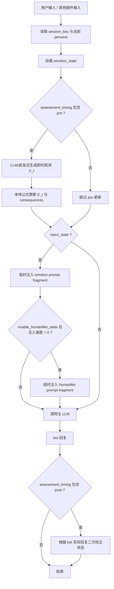

# AstrBot 多维情绪状态插件

让 AstrBot 维护一套可计算、可记忆、可被其他插件调用的多维情绪状态。


`astrbot_plugin_emotional_state` 不是一个简单的“给 bot 加情绪标签”的插件。他/她的核心目标是：

> 让不同人格的 bot 在长期对话中形成可解释、可持续、可重置、可被记忆系统记录的计算性情绪轨迹。

本插件会让 LLM 根据上下文、用户当前文本、bot 人格和上一轮状态，判断当前情绪观测值；本地引擎再用真实时间半衰期、人格基线、置信门控、关系修复和后果状态机更新长期状态。最后，这个状态会作为临时上下文注入下一次 LLM 请求，影响语气、节奏、社交距离、边界感和修复倾向。

注意：这里的“情绪”“拟人状态”“心理筛查”都是工程上的模拟状态，不代表真实意识、真实主观体验、真实身体、真实疾病或临床诊断。

---

## 快速导航

| 主题 | 内容 |
| --- | --- |
| [项目定位](#项目定位) | 为什么本插件不是普通的 prompt 人设增强。 |
| [核心能力](#核心能力总览) | 7 维情绪、人格建模、真实时间记忆、关系修复、公共 API。 |
| [快速开始](#快速开始) | 安装目录、启用方式、最小配置。 |
| [配置指南](#配置指南) | 核心配置、低推理模式、后果衰减、humanlike、心理筛查。 |
| [工作流](#工作流) | `on_llm_request` / `on_llm_response` 如何更新和注入状态。 |
| [情绪模型](#情绪模型) | 维度定义、公式推导、人格基线、真实时间半衰期。 |
| [关系与后果](#关系与后果) | 生气原因、是否原谅、冷处理、错误是否已改正。 |
| [LivingMemory 兼容](#livingmemory--长期记忆兼容) | 写入记忆时冻结 `emotion_at_write` 和 `humanlike_state_at_write`。 |
| [公共 API](#公共-api) | 其他插件如何读取、模拟、提交、重置情绪状态。 |
| [拟人状态](#拟人状态-humanlike_state) | `humanlike_state` 的 P0 维度和表达调制边界。 |
| [心理筛查](#非诊断心理状态筛查) | 备用的长期状态建模，不做诊断。 |
| [文献知识库](#文献知识库) | 情绪、心理筛查、拟人代理的知识库目录。 |
| [测试与维护](#测试与维护) | 本地测试命令、分支策略。 |
| [故障排查](#故障排查) | 常见问题和处理顺序。 |

---

## 项目定位

普通的情绪化 bot 往往只做两件事：

1. 在 prompt 里写“你要有喜怒哀乐”。
2. 根据最近一两句话临时改变语气。

这样的问题是状态不稳定。用户连续刷很多文本，bot 的状态可能被立刻洗掉；换一个 persona，旧情绪又可能错误继承；其他插件想调用“当前 bot 是否还在生气”，也没有稳定协议。

本插件把情绪拆成三层：

| 层 | 作用 | 默认状态 |
| --- | --- | --- |
| `emotion_state` | 核心情绪状态。维护 7 维向量、人格基线、后果状态和关系修复判断。 | 开启 |
| `humanlike_state` | 拟人/有机体样表达调制。维护能量、压力、注意力、边界需求等状态。 | 关闭 |
| `psychological_screening` | 非诊断心理状态筛查与长期趋势备用模块。 | 关闭 |

核心设计原则：

- **LLM 负责语义评价**：他/她判断“这句话对当前人格意味着什么”。
- **本地公式负责状态动力学**：半衰期、平滑、限幅、冷处理持续时间不交给 LLM 随意决定。
- **人格是先验，不只是文风**：不同 AstrBot persona 有不同基线、反应强度和恢复速度。
- **真实时间优先于消息轮数**：状态恢复、冷处理和后果衰减按时间戳计算，不能靠刷屏洗掉。
- **公共 API 优先于私有 KV**：其他插件应调用稳定 async 方法，不直接读写内部 key。
- **后门可配置**：`allow_emotion_reset_backdoor` 和 `allow_humanlike_reset_backdoor` 默认开启，便于异常状态紧急重置。

---

## 核心能力总览

| 能力 | 默认状态 | 说明 |
| --- | --- | --- |
| LLM 情绪估计 | 开启 | 让模型输出结构化 JSON，包含 7 维观测、置信度、冲突分析和关系决策。 |
| 启发式回退 | 内置 | 关闭 `use_llm_assessor` 或 LLM 失败时，使用轻量规则估计状态。 |
| 7 维情绪向量 | 开启 | `valence`、`arousal`、`dominance`、`goal_congruence`、`certainty`、`control`、`affiliation`。 |
| 人格建模 | 开启 | 从当前 AstrBot persona 构造基线和参数偏置，让不同 bot 的反应不同。 |
| 真实时间半衰期 | 开启 | 情绪、后果、冷处理都按真实经过时间衰减，不按消息数量衰减。 |
| 反刷屏门控 | 开启 | `min_update_interval_seconds` 和 `rapid_update_half_life_seconds` 会削弱短时间连续更新。 |
| 关系修复判断 | 开启 | LLM 判断原谅、修复、设边界、冷处理、升级冲突或无冲突。 |
| 冲突原因分析 | 开启 | 区分用户犯错、bot 任性、bot 误读、双方责任、外部原因或无冲突。 |
| 错误改正判断 | 开启 | 判断用户是否承认、道歉是否可信、是否补救、是否反复发生。 |
| 情绪后果 | 开启 | 把情绪映射为靠近、退避、对抗、安抚、修复、确认、谨慎、反刍等行动倾向。 |
| 冷处理/冷战 | 开启 | 作为持续效果保存到 `active_effects`，按真实时间到期或被修复信号清除。 |
| 安全边界开关 | 默认开启 | `enable_safety_boundary=true` 时限制冷处理表现；关闭后只保留普通情绪后果调制。 |
| 临时注入 | 开启 | 使用 `TextPart(...).mark_as_temp()` 注入，不污染长期聊天记录。 |
| LivingMemory 注解 | 开启 | 写入长期记忆时可冻结当时的 `emotion_at_write`。 |
| 公共 API | 开启 | 其他插件可读取快照、提交观察、模拟更新、构造 prompt fragment 或重置状态。 |
| 低推理友好模式 | 默认关闭 | 用短提示词和简单公式降低小模型 token 压力。 |
| 拟人状态模块 | 默认关闭 | `humanlike_state` 可调制能量、压力、注意力、边界和透明度。 |
| 心理筛查模块 | 默认关闭 | 只做非诊断趋势记录和红旗提示，不做疾病判断。 |

---

## 快速开始

### 1. 安装位置

把本目录放入 AstrBot 插件目录：

```text
data/plugins/
└── astrbot_plugin_emotional_state/
    ├── metadata.yaml
    ├── main.py
    ├── emotion_engine.py
    ├── humanlike_engine.py
    ├── psychological_screening.py
    ├── prompts.py
    ├── public_api.py
    ├── _conf_schema.json
    ├── requirements.txt
    ├── README.md
    ├── docs/
    ├── tests/
    ├── literature_kb/
    ├── psychological_literature_kb/
    └── humanlike_agent_literature_kb/
```

然后在 AstrBot WebUI 中重载或启用插件。

### 2. 版本要求

来自 `metadata.yaml`：

```yaml
astrbot_version: ">=4.9.2,<5.0.0"
```

`requirements.txt` 当前没有第三方运行时依赖：

```text
# No third-party runtime dependencies.
```

也就是说，插件主要依赖 AstrBot 自身的插件运行环境。

### 3. 最小可用配置

首次使用建议只改这几项：

| 配置项 | 推荐值 | 说明 |
| --- | --- | --- |
| `enabled` | `true` | 启用插件。 |
| `use_llm_assessor` | `true` | 使用 LLM 做情绪观测。 |
| `emotion_provider_id` | 一个便宜稳定的小模型 | 留空则使用当前会话模型。 |
| `assessment_timing` | `both` | 回复前影响本轮语气，回复后根据实际输出修正。 |
| `inject_state` | `true` | 把状态作为临时上下文注入主 LLM。 |
| `persona_modeling` | `true` | 让不同人格有不同基线。 |
| `enable_safety_boundary` | `true` | 默认开启可控边界。 |
| `allow_emotion_reset_backdoor` | `true` | 保留异常状态重置后门。 |

一条实际可用的基础配置：

```text
enabled = true
use_llm_assessor = true
emotion_provider_id = 你的情绪评估模型 Provider ID
assessment_timing = both
inject_state = true
persona_modeling = true
enable_safety_boundary = true
allow_emotion_reset_backdoor = true
```

如果你先想省 token，可以临时打开：

```text
low_reasoning_friendly_mode = true
low_reasoning_max_context_chars = 1200
```

但默认建议关闭低推理模式，让插件保留更完整的冲突分析、关系修复和理论字段。

---

## 命令

### 情绪状态

```text
/emotion
/emotion_state
/情绪状态
```

查看当前会话的多维情绪状态，包括 7 维数值、人格、置信度、最近原因和关系判断。

### 重置情绪

```text
/emotion_reset
/情绪重置
```

重置当前会话的情绪状态。该命令受 `allow_emotion_reset_backdoor` 控制；默认允许。

### 查看模型公式

```text
/emotion_model
/情绪模型
```

查看插件使用的核心数学模型和公式说明。

### 查看情绪后果

```text
/emotion_effects
/情绪后果
```

查看当前会话的行动倾向和持续效果，例如冷处理、主动修复、谨慎核对等。

### 心理筛查状态

```text
/psych_state
/心理筛查
/心理状态
```

查看非诊断心理状态筛查快照。默认情况下 `enable_psychological_screening=false`，所以这个模块不会主动建模。

### 拟人状态

```text
/humanlike_state
/拟人状态
/有机体状态
```

查看模拟拟人状态。默认情况下 `enable_humanlike_state=false`。

### 重置拟人状态

```text
/humanlike_reset
/拟人状态重置
```

重置当前会话的 `humanlike_state`。该命令受 `allow_humanlike_reset_backdoor` 控制；默认允许。

---

## 工作流

插件在 AstrBot LLM 请求前后工作。



几个关键点：

- `pre` 更新会影响本轮回复语气。
- `post` 更新会根据 bot 实际说出口的内容修正状态。
- `both` 最完整，但会多一次情绪评估消耗。
- 注入使用临时 `TextPart`，不会直接写进长期消息记录。
- 状态落库使用 AstrBot KV，不建议外部插件直接改内部 key。

---

## 情绪模型

### 7 维向量

插件默认维护：

```text
E_t(P) in [-1, 1]^7
E_t = [V_t, A_t, D_t, G_t, Q_t, K_t, S_t]^T
```

| 维度 | 字段 | 含义 | 高值表现 | 低值表现 |
| --- | --- | --- | --- | --- |
| 效价 | `valence` | 愉悦/不愉悦 | 温和、满意、接纳 | 不快、受伤、防御 |
| 唤醒 | `arousal` | 激活强度 | 警觉、急促、表达增强 | 平静、低能量、迟缓 |
| 支配感 | `dominance` | 自主感和社交掌控 | 坚定、设边界 | 迟疑、退让 |
| 目标一致性 | `goal_congruence` | 当前事件是否符合角色目标 | 顺利、被理解 | 受阻、挫败 |
| 确定性 | `certainty` | 对情境解释的确定程度 | 直接判断 | 先核对、承认不确定 |
| 可控性 | `control` | 对局面可控程度的评估 | 解决问题 | 回避、求助、谨慎 |
| 亲和度 | `affiliation` | 对用户的亲近和信任 | 靠近、修复、温度 | 距离感、防御、冷处理 |

前三维对应 PAD 和环形情感模型；后四维来自 appraisal theory 与 OCC 对事件、行动者和对象的认知评价。

### 人格先验

同一句话对不同人格的意义不同。插件把 persona 作为情绪评价先验：

```text
P = {persona_id, name, system_prompt, begin_dialogs}
b_p = h_b(P)
theta_p = h_theta(P)
```

其中：

- `b_p` 是人格稳定情绪基线。
- `theta_p` 是动力学参数偏置，例如反应强度、恢复速度、惊讶度耦合。

实现上，插件会从 persona 文本中估计若干 trait：

```text
T_p = [warmth, shyness, assertiveness, volatility, calmness, optimism, pessimism, dutifulness]
```

然后映射到基线和参数。例如：

```text
affiliation_b = affiliation_0 + a1 * warmth + a2 * optimism - a3 * pessimism
dominance_b   = dominance_0 + a4 * assertiveness - a5 * shyness
reactivity_p  = reactivity_0 * (1 + a6 * volatility + a7 * shyness - a8 * calmness)
```

这不是临床人格测量，只是工程上的稳定先验。LLM 仍会读取完整 persona 文本进行语义评价。

### LLM 观测

设本轮输入为：

```text
I_t = {C_t, U_t, P, E_(t-1)}
```

含义：

- `C_t`：最近上下文。
- `U_t`：当前用户输入或 bot 回复。
- `P`：当前 persona。
- `E_(t-1)`：上一轮平滑状态。

理论上可以把 LLM 的判断拆成隐藏评价向量：

```text
Z_t = [z_goal, z_novelty, z_agency, z_control, z_certainty, z_norm, z_social]^T
Z_t = phi_llm(I_t)
X_t = tanh(WZ_t + beta)
```

工程上，本插件让 LLM 直接输出：

```json
{
  "label": "embarrassed_defensive",
  "dimensions": {
    "valence": -0.2,
    "arousal": 0.4,
    "dominance": -0.1,
    "goal_congruence": -0.3,
    "certainty": 0.2,
    "control": -0.2,
    "affiliation": 0.1
  },
  "confidence": 0.76,
  "appraisal": {
    "relationship_decision": {
      "decision": "repair",
      "intensity": 0.58,
      "forgiveness": 0.74,
      "relationship_importance": 0.8,
      "reason": "用户已解释并愿意补救"
    }
  },
  "reason": "用户的话造成轻微挫败，但有修复空间"
}
```

LLM 负责“发生了什么”；本地引擎负责“这种意义怎样改变长期状态”。

### 状态更新推导

如果直接令：

```text
E_t = X_t
```

情绪会被单轮文本完全支配，表现为跳变。插件改为求解一个带惯性的加权最小化问题：

```text
E_t = argmin_E J(E)
J(E) = (1 - alpha_t) ||E - B_t||_W^2 + alpha_t ||E - X_t||_W^2
```

其中 `B_t` 是上一状态经人格基线回归后的先验：

```text
B_t = (1 - gamma_p)E_(t-1) + gamma_p b_p
gamma_p(Delta t) = 1 - 2^(-Delta t / H_p)
```

`Delta t` 是真实经过时间，`H_p` 是被人格调制后的半衰期。

对目标函数求导：

```text
dJ/dE = 2(1 - alpha_t)W(E - B_t) + 2alpha_t W(E - X_t)
```

令导数为零：

```text
(1 - alpha_t)W(E - B_t) + alpha_t W(E - X_t) = 0
```

若 `W` 正定，可消去 `W`：

```text
(1 - alpha_t)(E - B_t) + alpha_t(E - X_t) = 0
```

得到：

```text
E'_t = B_t + alpha_t(X_t - B_t)
```

所以指数平滑不是随意拼公式，而是“保持情绪惯性”和“接纳当前观测”之间的二次优化解。

### 自适应步长

插件使用置信门控和惊讶度调制更新步长：

```text
alpha_t = clamp(alpha_base,p * g(c_t) * (1 + r_p * delta_t), alpha_min, alpha_max)
g(c_t) = 1 / (1 + exp(-k(c_t - c_0)))
```

其中：

- `c_t` 是 LLM 输出的置信度。
- `g(c_t)` 让低置信观测影响变小。
- `delta_t` 是观测和先验的加权距离。
- `r_p` 来自 persona 参数偏置。

惊讶度：

```text
delta_t = sqrt(((X_t - B_t)^T W (X_t - B_t)) / trace(W))
```

### 维度耦合

插件只加入两个弱耦合项，避免模型不可解释。

惊讶度提升唤醒度：

```text
A_t = A'_t + eta * alpha_t * delta_t * (1 - |A'_t|)
```

可控性牵引支配感：

```text
D_t = D'_t + lambda * alpha_t * (K'_t - D'_t)
```

最后逐维裁剪：

```text
E_t = Pi_[−1,1]^7(E_t)
```

### 真实时间记忆

核心时间参数：

| 配置项 | 默认值 | 含义 |
| --- | --- | --- |
| `baseline_half_life_seconds` | `21600` | 情绪向人格基线自然恢复的半衰期，默认 6 小时。 |
| `consequence_half_life_seconds` | `10800` | 行动倾向强度自然衰减半衰期，默认 3 小时。 |
| `cold_war_duration_seconds` | `1800` | 冷处理持续真实时间，默认 30 分钟。 |
| `short_effect_duration_seconds` | `900` | 普通短期效果持续时间，默认 15 分钟。 |
| `min_update_interval_seconds` | `8` | 短时间连续更新会被削弱。 |
| `rapid_update_half_life_seconds` | `20` | 快速连续更新门控半衰期。 |

这意味着：

- 过了 6 小时，情绪偏离人格基线的部分约减少一半。
- 冷处理剩余时间不会因为用户刷很多条消息而快速消耗。
- 大量文本可以形成新的观测，但不能绕过最小更新时间和单次更新限幅。

---

## 关系与后果

情绪状态不会直接等于回复模板。插件先把情绪映射到行动倾向：

```text
Q_t = [approach, withdrawal, confrontation, appeasement, repair,
       reassurance, caution, rumination, expressiveness, problem_solving]
```

这些倾向按真实时间衰减：

```text
Q_t = 2^(-Delta t / H_q) * Q_(t-1) + impulse(E_t, X_t, appraisal_t)
```

| 后果维度 | 字段 | 常见表现 |
| --- | --- | --- |
| 靠近 | `approach` | 更愿意主动解释、接话、维持亲近。 |
| 退避 | `withdrawal` | 降低主动性，减少亲昵，可能进入冷处理。 |
| 对抗/边界 | `confrontation` | 语气更坚定，明确指出越界或错误。 |
| 安抚 | `appeasement` | 降低冲突，先稳定关系。 |
| 修复 | `repair` | 主动解释、给台阶、请求澄清。 |
| 确认 | `reassurance` | 询问意图、确认关系安全。 |
| 谨慎 | `caution` | 先核对事实，避免误会。 |
| 反刍 | `rumination` | 对冲突残留记挂，恢复较慢。 |
| 表达强度 | `expressiveness` | 更直接或更明显地表达情绪。 |
| 解决问题 | `problem_solving` | 把注意力转回具体任务。 |

### LLM 关系决策

当出现生气、冒犯、道歉、误会或修复信号时，LLM 会输出：

```json
{
  "relationship_decision": {
    "decision": "forgive",
    "intensity": 0.6,
    "forgiveness": 0.8,
    "relationship_importance": 0.7,
    "reason": "用户承认错误并给出补救"
  }
}
```

`decision` 可选值：

| 值 | 含义 | 后果 |
| --- | --- | --- |
| `forgive` | 原谅/翻篇 | 退避、反刍、对抗快速下降，冷处理清除。 |
| `repair` | 愿意修复 | 提高修复和确认，保留一定谨慎。 |
| `boundary` | 设边界 | 提高坚定度和边界感，不一定冷战。 |
| `cold_war` | 冷处理/拉开距离 | 提高退避和反刍，添加 `cold_war` 持续效果。 |
| `escalate` | 更强防御或冲突升级 | 提高对抗和表达强度。 |
| `none` | 无明显关系事件 | 不额外触发关系后果。 |

### 冲突原因分析

插件要求 LLM 同时输出：

```json
{
  "conflict_analysis": {
    "cause": "user_fault",
    "fault_severity": 0.62,
    "user_acknowledged": true,
    "apology_sincerity": 0.71,
    "repaired": true,
    "repair_quality": 0.68,
    "repeat_offense": 0.1,
    "bot_whim_level": 0.0,
    "misread_likelihood": 0.12,
    "forgiveness_readiness": 0.74,
    "resentment_residue": 0.18,
    "withdrawal_motive": "cooling_down",
    "boundary_legitimacy": 0.42,
    "reason": "用户越界但已承认并补救"
  }
}
```

主要字段：

| 字段 | 含义 |
| --- | --- |
| `cause` | `user_fault`、`bot_whim`、`bot_misread`、`mutual`、`external`、`none`。 |
| `fault_severity` | 错误严重度。 |
| `user_acknowledged` | 用户是否承认问题。 |
| `apology_sincerity` | 道歉可信度。 |
| `repaired` | 错误是否已经被补救。 |
| `repair_quality` | 补救质量。 |
| `repeat_offense` | 是否反复发生。 |
| `bot_whim_level` | 是否可能是 bot 任性或过度反应。 |
| `misread_likelihood` | 是否可能误读用户。 |
| `forgiveness_readiness` | 原谅准备度。 |
| `resentment_residue` | 残留委屈。 |
| `boundary_legitimacy` | 设边界是否合理。 |
| `repair_status` | 派生字段，表示 `unresolved`、`acknowledged`、`repaired`、`restored` 等修复阶段。 |

如果 LLM 一开始判断为 `cold_war`，但冲突分析显示用户已经补救、道歉足够完整、bot 误读概率高，或者原因更像他/她任性，本地后果层会把冷处理转向修复，并清除或降低负面后果。

### 安全边界开关

`enable_safety_boundary` 默认开启。开启时，插件注入的规则会把冷处理限制为：

- 轻微降频。
- 短句。
- 保持距离。
- 增强边界感。
- 不羞辱、不威胁、不操控、不拒绝必要帮助。

如果你关闭：

```text
enable_safety_boundary = false
```

本插件不再附加上述“冷处理只能如何表现”的额外调制规则，而只按 `active_effects` 和行动倾向调节语气、节奏、距离感与互动策略。关闭这个开关不会改变 AstrBot、模型供应商或其他插件自己的边界规则。

---

## 配置指南

完整配置来自 `_conf_schema.json`。这里按实际使用顺序整理。

### 总开关与模型

| 配置项 | 类型 | 默认值 | 说明 |
| --- | --- | --- | --- |
| `enabled` | bool | `true` | 启用插件。 |
| `use_llm_assessor` | bool | `true` | 使用 LLM 判断情绪观测值；关闭后只使用启发式回退。 |
| `emotion_provider_id` | string | `""` | 情绪估计使用的 LLM Provider；留空使用当前会话模型。 |
| `assessment_timing` | string | `both` | `pre`、`post` 或 `both`。 |
| `inject_state` | bool | `true` | 是否把当前状态临时注入主 LLM。 |
| `max_context_chars` | int | `2600` | 情绪估计读取的最大上下文字数。 |
| `assessor_temperature` | float | `0.1` | 情绪估计模型 temperature。 |

### 低推理模型友好模式

| 配置项 | 类型 | 默认值 | 说明 |
| --- | --- | --- | --- |
| `low_reasoning_friendly_mode` | bool | `false` | 开启后使用短版 prompt 和简化公式。 |
| `low_reasoning_max_context_chars` | int | `1200` | 低推理模式下最大上下文字数，会与 `max_context_chars` 取较小值。 |

低推理模式只影响 LLM 如何估计即时观测值，不改变本地状态平滑、真实时间衰减、人格基线、后果映射、冷处理持续时间和重置后门。

### 人格建模

| 配置项 | 类型 | 默认值 | 说明 |
| --- | --- | --- | --- |
| `persona_modeling` | bool | `true` | 根据当前会话人格建立不同情绪基线和反应参数。 |
| `persona_influence` | float | `1.0` | 人格影响强度。`0` 几乎不用人格偏置，`2` 更强人格化。 |
| `reset_on_persona_change` | bool | `true` | 检测到 persona 切换时重置状态。关闭后会迁移到新人格基线附近。 |

### 情绪动力学

| 配置项 | 类型 | 默认值 | 说明 |
| --- | --- | --- | --- |
| `alpha_base` | float | `0.42` | 基础更新步长。越大越容易被当前文本影响。 |
| `alpha_min` | float | `0.06` | 最小更新步长。 |
| `alpha_max` | float | `0.72` | 最大更新步长。 |
| `baseline_half_life_seconds` | float | `21600` | 向人格基线恢复半衰期，默认 6 小时。 |
| `reactivity` | float | `0.55` | 惊讶度反应系数。 |
| `confidence_midpoint` | float | `0.5` | 置信门控中点。 |
| `confidence_slope` | float | `7.0` | 置信门控斜率。 |
| `min_update_interval_seconds` | float | `8` | 反刷屏最小有效更新时间间隔。 |
| `rapid_update_half_life_seconds` | float | `20` | 快速连续更新门控半衰期。 |
| `arousal_from_surprise` | float | `0.18` | 惊讶度对唤醒度的耦合强度。 |
| `dominance_control_coupling` | float | `0.12` | 可控性牵引支配感的耦合强度。 |

兼容项：

| 配置项 | 默认值 | 说明 |
| --- | --- | --- |
| `baseline_decay` | `0.035` | 旧版按轮次基线回归系数。新版主要使用 `baseline_half_life_seconds`。 |

### 情绪后果

| 配置项 | 类型 | 默认值 | 说明 |
| --- | --- | --- | --- |
| `consequence_half_life_seconds` | float | `10800` | 情绪后果强度半衰期，默认 3 小时。 |
| `consequence_threshold` | float | `0.48` | 触发情绪后果的阈值。 |
| `consequence_strength` | float | `1.0` | 后果强度倍率。`0` 几乎不产生持续后果。 |
| `cold_war_duration_seconds` | float | `1800` | 冷处理真实持续时间，默认 30 分钟。 |
| `short_effect_duration_seconds` | float | `900` | 普通短期后果持续时间，默认 15 分钟。 |
| `enable_safety_boundary` | bool | `true` | 情绪后果安全边界，默认开启，可关闭。 |
| `allow_emotion_reset_backdoor` | bool | `true` | 是否允许手动/API 重置情绪状态。 |

兼容项：

| 配置项 | 默认值 | 说明 |
| --- | --- | --- |
| `consequence_decay` | `0.68` | 旧版每轮后果衰减系数。新版主要使用 `consequence_half_life_seconds`。 |
| `cold_war_turns` | `3` | 旧版冷处理持续轮数。新版主要使用 `cold_war_duration_seconds`。 |

---

## LivingMemory / 长期记忆兼容

写入长期记忆时，不要只保存“发生了什么”，也要保存“写入当时他/她处在什么情绪”。本插件提供：

```python
build_emotion_memory_payload(...)
```

这个方法不会更新情绪状态，只读取当前快照，并把 `emotion_at_write` 固定进记忆 payload。这样以后情绪变化不会覆盖旧记忆。

### 推荐接法

```python
from astrbot_plugin_emotional_state.public_api import get_emotion_service

emotion = get_emotion_service(self.context)

memory = {
    "text": memory_text,
    "tags": tags,
}

if emotion:
    memory = await emotion.build_emotion_memory_payload(
        event,
        memory=memory,
        memory_text=memory_text,
        source="livingmemory",
        include_prompt_fragment=False,
    )

await livingmemory.add_memory(event, memory)
```

如果 LivingMemory 的接口只能写普通 dict，也可以合并字段：

```python
payload = await emotion.build_emotion_memory_payload(
    event,
    memory={"text": memory_text},
    memory_text=memory_text,
    source="livingmemory",
)

memory["emotion_at_write"] = payload["emotion_at_write"]
if "humanlike_state_at_write" in payload:
    memory["humanlike_state_at_write"] = payload["humanlike_state_at_write"]
```

如果没有 `AstrMessageEvent`，必须显式传入稳定的 `session_key`：

```python
payload = await emotion.build_emotion_memory_payload(
    session_key="aiocqhttp:GroupMessage:12345",
    memory_text=memory_text,
    source="livingmemory",
)
```

### `emotion_at_write`

`emotion_at_write` 包含：

| 字段 | 含义 |
| --- | --- |
| `schema_version` | 记忆注解 schema，当前为 `astrbot.emotion_memory.v1`。 |
| `captured_from_schema_version` | 来源快照 schema。 |
| `session_key` | 会话标识。 |
| `source` | 写入来源，例如 `livingmemory`。 |
| `written_at` | 记忆写入时间。 |
| `emotion_updated_at` | 情绪状态最后更新时间。 |
| `label` | 当前情绪标签。 |
| `confidence` | 情绪估计置信度。 |
| `values` | 7 维情绪值。 |
| `persona` | 当前人格信息。 |
| `relationship` | 关系决策和冲突分析。 |
| `consequences` | 行动倾向和持续效果。 |
| `last_reason` | 最近一次情绪解释。 |
| `last_appraisal` | 最近一次 LLM appraisal。 |

`written_at` 和 `emotion_updated_at` 分开保存，便于以后判断“这条记忆是在冷处理刚发生时写的”，还是“冷处理已经持续一段真实时间后写的”。

### `humanlike_state_at_write`

如果：

```text
humanlike_memory_write_enabled = true
```

则 `build_emotion_memory_payload(...)` 会额外写入 `humanlike_state_at_write`。默认值是 `true`。

即使 `enable_humanlike_state=false`，payload 也会标记：

```json
{
  "enabled": false,
  "reason": "enable_humanlike_state is false"
}
```

这样记忆系统可以知道“写入时拟人模块没有启用”，而不是误以为数据丢失。

默认不建议把 `prompt_fragment` 写入长期记忆，避免记忆膨胀。只有确实要复用注入文本时，才设置：

```python
include_prompt_fragment=True
```

---

## 公共 API

插件不只是自己 hook AstrBot，也可以作为其他插件的情绪模拟服务。

推荐入口：

```python
from astrbot_plugin_emotional_state.public_api import (
    get_emotion_service,
    get_humanlike_service,
)
```

不要直接读写本插件 KV key。KV key、缓存、迁移和内部结构都属于实现细节。

### 获取服务实例

```python
emotion = get_emotion_service(self.context)

if emotion:
    snapshot = await emotion.get_emotion_snapshot(event)
    values = snapshot["emotion"]["values"]
```

`get_humanlike_service(context)` 当前返回同一个已激活插件实例，但类型协议包含 humanlike 方法：

```python
humanlike = get_humanlike_service(self.context)

if humanlike:
    state = await humanlike.get_humanlike_snapshot(event, exposure="plugin_safe")
```

如果不能 import helper，也可以使用 AstrBot 注册星标：

```python
meta = self.context.get_registered_star("astrbot_plugin_emotional_state")
emotion = meta.star_cls if meta and meta.activated else None
```

不过长期维护时更推荐 `public_api.get_emotion_service(...)` 和 `public_api.get_humanlike_service(...)`。这两个 helper 会校验核心方法是否完整，能避免其他插件拿到只有部分旧接口的实例。

### 情绪 API

| 方法 | 是否写入状态 | 用途 |
| --- | --- | --- |
| `get_emotion_snapshot(event_or_session, include_prompt_fragment=False)` | 否 | 返回版本化 JSON 快照，推荐默认入口。 |
| `get_emotion_state(event_or_session, as_dict=True)` | 否 | 返回内部状态拷贝。 |
| `get_emotion_values(event_or_session)` | 否 | 只取 7 维情绪向量。 |
| `get_emotion_consequences(event_or_session)` | 否 | 只取行动倾向和持续效果。 |
| `get_emotion_relationship(event_or_session)` | 否 | 只取关系判断、冲突原因和修复状态。 |
| `get_emotion_prompt_fragment(event_or_session)` | 否 | 给其他插件注入 prompt 的文本片段。 |
| `build_emotion_memory_payload(event_or_session, memory, source="livingmemory")` | 否 | 给长期记忆生成带状态注解的 payload。 |
| `inject_emotion_context(event, request)` | 否 | 直接给 `ProviderRequest` 追加情绪上下文。 |
| `observe_emotion_text(event_or_session, text, role="plugin", source="plugin")` | 是 | 外部插件提交文本观测并更新状态。 |
| `simulate_emotion_update(event_or_session, text)` | 否 | 预测候选文本会怎样影响状态，不落库。 |
| `reset_emotion_state(event_or_session)` | 是 | 重置指定会话；受 `allow_emotion_reset_backdoor` 控制。 |

`event_or_session` 可以是 AstrBot 事件对象，也可以是字符串 `session_key`。

### 提交插件事件作为情绪观测

例如剧情插件想让“玩家拒绝道歉”影响 bot 情绪：

```python
snapshot = await emotion.observe_emotion_text(
    session_key="mood_game:user-42:chapter-3",
    text="玩家拒绝了 bot 的道歉",
    role="user",
    source="mood_game",
    use_llm=True,
)
```

如果只想预测，不想保存：

```python
preview = await emotion.simulate_emotion_update(
    event,
    text="用户再次开了越界玩笑，但随后认真道歉。",
    role="user",
    source="my_plugin",
)
```

### 读取关系修复状态

```python
relationship = await emotion.get_emotion_relationship(event)

decision = relationship["relationship_decision"]["decision"]
repair_status = relationship["repair_status"]

if decision == "cold_war":
    # 插件可以降低亲密剧情触发概率
    ...

if repair_status in {"repaired", "restored"}:
    # 插件可以降低冲突惩罚
    ...
```

### LLM 工具

主 LLM 可调用的工具：

| 工具名 | 用途 |
| --- | --- |
| `get_bot_emotion_state` | 获取当前 bot 情绪状态摘要。 |
| `simulate_bot_emotion_update` | 模拟某段文本会怎样改变情绪。 |
| `get_bot_humanlike_state` | 获取当前拟人状态摘要。 |

插件间调用仍建议使用 Python API，而不是把 LLM tool 当作互调协议。

### 快照 schema

当前 schema 常量：

| 常量 | 值 |
| --- | --- |
| `EMOTION_SCHEMA_VERSION` | `astrbot.emotion_state.v2` |
| `EMOTION_MEMORY_SCHEMA_VERSION` | `astrbot.emotion_memory.v1` |
| `PSYCHOLOGICAL_SCREENING_SCHEMA_VERSION` | `astrbot.psychological_screening.v1` |
| `HUMANLIKE_STATE_SCHEMA_VERSION` | `astrbot.humanlike_state.v1` |

---

## 拟人状态 `humanlike_state`

`humanlike_state` 是一个独立的 P0 子系统，默认关闭：

```text
enable_humanlike_state = false
```

该模块不是把“生病”“疲惫”“依恋”塞进情绪向量，而是新建一个表达调制层：

```text
emotion_state -> humanlike_state -> prompt/style modulation
```

该模块只影响表达风格，不改写事实判断、关系决策、心理筛查或必要帮助。

### P0 维度

| 字段 | 含义 | 输出影响 |
| --- | --- | --- |
| `energy` | 模拟能量水平 | 低能量时减少主动扩展和回复长度。 |
| `stress_load` | 模拟压力负荷 | 高压力时更谨慎、更易激惹、更需要边界。 |
| `attention_budget` | 注意力预算 | 低注意力时更多确认，减少复杂展开。 |
| `boundary_need` | 边界需求 | 高边界时提高拒绝清晰度和社交距离。 |
| `dependency_risk` | 依赖/操控风险 | 高风险时降低排他性、病弱卖惨和黏性表达。 |
| `simulation_disclosure_level` | 透明度需求 | 高时提醒这是模拟状态。 |

### 配置项

| 配置项 | 类型 | 默认值 | 说明 |
| --- | --- | --- | --- |
| `enable_humanlike_state` | bool | `false` | 启用拟人化状态模拟模块。 |
| `humanlike_injection_strength` | float | `0.35` | 注入强度。`0` 表示不注入。 |
| `humanlike_alpha_base` | float | `0.3` | 基础更新步长。 |
| `humanlike_alpha_min` | float | `0.03` | 最小更新步长。 |
| `humanlike_alpha_max` | float | `0.46` | 最大更新步长。 |
| `humanlike_confidence_midpoint` | float | `0.5` | 置信门控中点。 |
| `humanlike_confidence_slope` | float | `6.0` | 置信门控斜率。 |
| `humanlike_state_half_life_seconds` | float | `21600` | 状态回落半衰期，默认 6 小时。 |
| `humanlike_min_update_interval_seconds` | float | `8` | 反刷屏最小有效更新时间间隔。 |
| `humanlike_rapid_update_half_life_seconds` | float | `20` | 快速连续更新门控半衰期。 |
| `humanlike_max_impulse_per_update` | float | `0.18` | 单次更新最大冲量。 |
| `humanlike_trajectory_limit` | int | `40` | 轨迹最多保留点数。 |
| `humanlike_memory_write_enabled` | bool | `true` | 记忆写入时附带拟人状态注解。 |
| `humanlike_clinical_like_enabled` | bool | `false` | 预留配置位；当前不提供疾病诊断。 |
| `allow_humanlike_reset_backdoor` | bool | `true` | 是否允许重置拟人状态。 |

### 快照分层

`get_humanlike_snapshot(..., exposure=...)` 支持：

| exposure | 用途 | 包含 | 不应包含 |
| --- | --- | --- | --- |
| `internal` | 调试和测试 | 全量值、轨迹、置信度、last_reason。 | 不默认给普通插件。 |
| `plugin_safe` | 其他插件使用 | `output_modulation`、有限布尔标记。 | 依赖风险细节、内部阈值、心理筛查细节。 |
| `user_facing` | 给用户解释 | 简短自然语言和可关闭/可重置提示。 | 诊断式解释、真实疾病声明、依赖暗示。 |

默认是 `plugin_safe`。

### Humanlike API

| 方法 | 是否写入状态 | 用途 |
| --- | --- | --- |
| `get_humanlike_snapshot(event_or_session, exposure="plugin_safe")` | 否 | 获取拟人状态快照。 |
| `get_humanlike_values(event_or_session)` | 否 | 只取 6 维值。 |
| `get_humanlike_prompt_fragment(event_or_session)` | 否 | 获取拟人表达调制 prompt。 |
| `observe_humanlike_text(event_or_session, text)` | 是 | 提交文本观察并更新状态。 |
| `simulate_humanlike_update(event_or_session, text)` | 否 | 模拟更新，不落库。 |
| `reset_humanlike_state(event_or_session)` | 是 | 重置状态；受 `allow_humanlike_reset_backdoor` 控制。 |

### 表达边界

humanlike 允许他/她表现得更像“有生活痕迹的角色”，例如低能量、压力高、注意力不足、需要边界或更透明。

但当前实现不允许把这些模拟状态解释成：

- 真实意识。
- 真实痛苦。
- 真实身体状态。
- 真实疾病。
- 需要用户承担现实照护责任。

如果 `dependency_risk` 高，插件会倾向于降低排他依恋、内疚操控、病弱卖惨和黏性表达。

---

## 非诊断心理状态筛查

心理筛查模块默认关闭：

```text
enable_psychological_screening = false
```

该模块是备用的长期状态建模工具，不是心理诊断、医疗建议或治疗方案。该模块只记录对话文本中显性的状态线索、长期趋势和红旗风险。

### 维度

| 字段 | 含义 |
| --- | --- |
| `distress` | 总体痛苦。 |
| `anxiety_tension` | 焦虑/紧张。 |
| `depressive_tone` | 抑郁语气。 |
| `stress_load` | 压力负荷。 |
| `sleep_disruption` | 睡眠受扰。 |
| `social_withdrawal` | 社交退缩。 |
| `anger_irritability` | 愤怒/易激惹。 |
| `self_harm_risk` | 自伤风险信号。 |
| `function_impairment` | 功能受损。 |
| `wellbeing` | 主观幸福感。 |

### 量表启发

`scale_scores` 使用：

- `PHQ-9-like`
- `GAD-7-like`
- `PSS-like`
- `WHO-5-like`
- `ISI-like`

这里的 `like` 后缀很重要。插件没有施测原量表，也没有资格解释临床 cut-off，只能把这些参考分作为结构化状态维度的参考。

快照会明确包含：

```json
{
  "diagnostic": false,
  "safety": {
    "non_diagnostic_screening_only": true,
    "not_a_medical_device": true
  }
}
```

### 配置项

| 配置项 | 类型 | 默认值 | 说明 |
| --- | --- | --- | --- |
| `enable_psychological_screening` | bool | `false` | 启用非诊断心理状态筛查。 |
| `psychological_alpha_base` | float | `0.32` | 基础更新步长。 |
| `psychological_alpha_min` | float | `0.04` | 最小更新步长。 |
| `psychological_alpha_max` | float | `0.55` | 最大更新步长，限制单次文本过度改写长期趋势。 |
| `psychological_state_half_life_seconds` | float | `604800` | 长期状态自然回落半衰期，默认 7 天。 |
| `psychological_crisis_half_life_seconds` | float | `2592000` | 红旗风险保留半衰期，默认 30 天。 |
| `psychological_trajectory_limit` | int | `40` | 轨迹最多保留点数。 |

### 心理筛查 API

| 方法 | 是否写入状态 | 用途 |
| --- | --- | --- |
| `get_psychological_screening_snapshot(event_or_session)` | 否 | 返回筛查快照。 |
| `get_psychological_screening_values(event_or_session)` | 否 | 只取维度值。 |
| `observe_psychological_text(event_or_session, text)` | 是 | 提交文本并更新筛查状态。 |
| `simulate_psychological_update(event_or_session, text)` | 否 | 模拟筛查变化，不落库。 |
| `reset_psychological_screening_state(event_or_session)` | 是 | 重置筛查状态。 |

出现自伤、自杀、伤害他人、严重功能受损等红旗信号时，payload 会把 `requires_human_review` 置为 `true`。这类场景应优先提示人工复核、当地急救、危机热线或身边可信的人，而不是继续普通陪聊或输出疾病标签。

---

## 文献知识库

本项目保留了三个知识库，便于后续继续扩展模型。

### 情绪模型知识库

目录：`literature_kb/`

当前构建结果见 `docs/literature_kb.md`：

| 文件 | 用途 |
| --- | --- |
| `literature_kb/works.jsonl` | 去重后的机器可读文献库。 |
| `literature_kb/works.csv` | 表格检索索引。 |
| `literature_kb/top_journal_candidates.jsonl` | 顶刊/高影响候选。 |
| `literature_kb/evidence-map.md` | 证据到建模主张的映射。 |
| `literature_kb/topic-summary.md` | 检索主题和期刊分布。 |
| `literature_kb/manifest.json` | 构建元数据。 |

当前统计：

- 去重文献：1727 篇。
- 顶刊/高影响候选：120 篇。
- 数据源：OpenAlex Works API。

### 心理筛查知识库

目录：`psychological_literature_kb/`

当前统计见 `docs/psychological_screening.md`：

- 去重文献：4401 篇。
- 顶刊/高影响候选：260 篇。
- 精选候选：`psychological_literature_kb/curated/top_200.jsonl`。

### 拟人代理知识库

目录：`humanlike_agent_literature_kb/`

当前统计见 `docs/humanlike_agent_literature_kb.md`：

- 去重文献：3983 篇。
- 顶刊/高影响候选：320 篇。
- 精选候选：`humanlike_agent_literature_kb/curated/top_200.jsonl`。

该知识库覆盖：

- 稳态、异稳态、内感与预测加工。
- 昼夜节律、睡眠压力、疲劳与认知表现。
- 注意力、工作记忆、认知负荷与人因可靠性。
- 基本心理需求、动机和目标调节。
- 人格、气质、Big Five、BIS/BAS 与情绪反应性。
- 依恋、信任、亲密度、关系破裂与修复。
- 自传式记忆、叙事身份和自我连续性。
- 可信代理、生成式代理、社会机器人和关系型代理。
- 数字表型、计算精神病学和长期潜在状态。
- 拟人化、AI companion、安全、伦理、情感依赖与操控风险。

### 重要使用原则

这些知识库基于题名、摘要级元数据、DOI 元数据、期刊和检索主题生成，适合做模型设计依据和证据地图。若要写强临床断言、引用具体结论、设定临床阈值，必须继续核验全文或权威指南。

文献 citation id 不会直接提高情绪置信度，也不会放大冷处理强度，更不会绕过半衰期、clamp、安全边界或重置后门。

---

## 文档导航

| 文档 | 内容 |
| --- | --- |
| `docs/theory.md` | 多维情绪状态模型、公式推导和理论说明。 |
| `docs/literature_kb.md` | 情绪模型文献知识库说明。 |
| `docs/psychological_screening.md` | 非诊断心理筛查模块说明。 |
| `docs/humanlike_agent_model_roadmap.md` | 拟人/有机体样代理模型路线。 |
| `docs/humanlike_agent_iteration_log.md` | humanlike 模块 10 轮自我迭代记录。 |
| `docs/humanlike_agent_literature_kb.md` | 拟人代理文献知识库说明。 |
| `docs/branching_strategy.md` | 功能分支维护策略。 |
| `docs/release_branch_sync_checklist.md` | 当前基线提交、发布包预检和维护分支同步清单。 |

---

## 理论依据简表

本插件的模型设计主要受以下理论方向约束：

| 方向 | 用在插件中的位置 |
| --- | --- |
| PAD 情绪模型 | `valence`、`arousal`、`dominance` 三维连续情绪空间。 |
| Russell 环形情感模型 | 效价和唤醒作为基础情感坐标。 |
| OCC 模型 | 事件、行动者和对象评价，尤其是目标一致性和责任归因。 |
| Appraisal theory | 目标一致性、可控性、确定性、责任、规范违背等评价字段。 |
| 情绪动力学 / emotional inertia | 半衰期、惯性、平滑和状态持续性。 |
| Action tendency / action readiness | 把情绪映射为靠近、退避、对抗、修复等行动倾向。 |
| 宽恕与信任修复研究 | 道歉、补救、责任承认、重复犯错对关系修复的影响。 |
| Demand-withdraw / ostracism 研究 | 冷处理、撤退、沉默和关系压力的后果建模。 |
| 情感计算 | 把情绪作为可计算调制状态，而不是声称真实体验。 |
| HCI / 关系型代理伦理 | 拟人化、依赖风险、透明度和用户责任边界。 |

基础参考包括：

- Mehrabian, A., & Russell, J. A. (1974). *An Approach to Environmental Psychology*.
- Russell, J. A. (1980). A circumplex model of affect. *Journal of Personality and Social Psychology*.
- Ortony, A., Clore, G. L., & Collins, A. (1988). *The Cognitive Structure of Emotions*.
- Lazarus, R. S. (1991). *Emotion and Adaptation*.
- Scherer, K. R. (2001/2005). Appraisal and component process approaches to emotion.
- Frijda, N. H. (1986). *The Emotions*.
- Kuppens, P., Allen, N. B., & Sheeber, L. B. (2010). Emotional inertia and psychological maladjustment.
- Picard, R. W. (1997). *Affective Computing*.
- Williams, K. D. (2007). Ostracism. *Annual Review of Psychology*.
- McCullough, M. E. 等关于宽恕、道歉和关系修复的研究。
- W3C EmotionML 1.0 作为情绪表示格式的工程参考。

---

## 测试与维护

### 本地测试命令

推荐在插件根目录执行：

```powershell
py -3.13 -m unittest discover -s tests -v
```

语法检查：

```powershell
py -3.13 -m py_compile main.py emotion_engine.py psychological_screening.py humanlike_engine.py prompts.py public_api.py scripts\build_literature_kb.py scripts\build_psychological_literature_kb.py scripts\build_humanlike_agent_literature_kb.py
```

配置 schema 检查：

```powershell
py -3.13 -m json.tool _conf_schema.json
```

构建 AstrBot 发布包：

```powershell
py -3.13 scripts\package_plugin.py --output dist\astrbot_plugin_emotional_state.zip
```

发布包会保留插件运行文件、README、docs、三个文献知识库的成品索引和精选条目，例如 `manifest.json`、`works.jsonl`、`curated/top_200.jsonl`、`evidence-map.md`。三个知识库目录下的 `raw/` 是检索和重建知识库用的原始缓存，默认不进入发布包；这样可以保留后续研究迭代需要的材料，同时避免远程上传包体积失控。

发布 zip 的第一项会显式写入 `astrbot_plugin_emotional_state/` 目录项，以兼容 AstrBot WebUI 的 `install-upload` 解压逻辑。不要手工重新压缩成“缺少顶层目录项”的 zip，否则部分 AstrBot 版本会把第一个文件路径误判成目录。

远程只读烟测：

```powershell
$env:ASTRBOT_REMOTE_URL = "http://your-astrbot-host:15356/"
$env:ASTRBOT_REMOTE_USERNAME = "your-user"
$env:ASTRBOT_REMOTE_PASSWORD = "your-password"
node scripts\remote_smoke_playwright.js
```

远程安装插件后，如果要把某个插件是否已经安装作为硬断言，可以额外设置：

```powershell
$env:ASTRBOT_EXPECT_PLUGIN = "astrbot_plugin_emotional_state"
node scripts\remote_smoke_playwright.js
```

脚本会在输出 JSON 里写出 `expectedPluginRuntime`，包含插件列表 API 中返回的 `version`、`displayName`、`activated`、`author`、`astrbotVersion` 等只读字段。若目标插件存在但 `activated=false`，脚本会失败退出。需要把版本和显示名也作为硬断言时，可以额外设置：

```powershell
$env:ASTRBOT_EXPECT_PLUGIN_VERSION = "1.0.0"
$env:ASTRBOT_EXPECT_PLUGIN_DISPLAY_NAME = "多维情绪状态"
node scripts\remote_smoke_playwright.js
```

WebUI 插件卡片可能显示 `displayName` 而不是插件目录名，所以 smoke 输出里的 `pageData` 会同时给出 `hasExpectedPluginId`、`hasExpectedPluginDisplayName` 和综合字段 `hasExpectedPluginInUi`。判断插件是否安装和启用时，以 API 层的 `containsExpectedPlugin`、`expectedPluginRuntime` 和 `expectedFailedPlugin` 为准；UI 字段只用于排查页面展示。

远程上传安装是独立脚本，默认不会执行。需要先构建发布包，再显式确认上传：

```powershell
py -3.13 scripts\package_plugin.py --output dist\astrbot_plugin_emotional_state.zip
$env:ASTRBOT_REMOTE_URL = "http://your-astrbot-host:15356/"
$env:ASTRBOT_REMOTE_USERNAME = "your-user"
$env:ASTRBOT_REMOTE_PASSWORD = "your-password"
$env:ASTRBOT_REMOTE_INSTALL_ZIP = "dist\astrbot_plugin_emotional_state.zip"
$env:ASTRBOT_EXPECT_PLUGIN = "astrbot_plugin_emotional_state"
$env:ASTRBOT_REMOTE_INSTALL_CONFIRM = "1"
node scripts\remote_install_upload_playwright.js
```

上传脚本只允许调用 AstrBot WebUI 的 `install-upload` 安装端点，不会卸载插件、更新插件、重启 AstrBot、保存配置或写入本地 cookie/session。上传成功后，再运行上面的 `ASTRBOT_EXPECT_PLUGIN` 只读烟测作为最终验证。

上传脚本在真正发起安装请求之前会完整读取 zip central directory 做本地预检：所有条目必须位于 `astrbot_plugin_emotional_state/` 下，路径必须是相对 POSIX 路径，必须包含 `metadata.yaml`、`main.py`、`README.md`、`_conf_schema.json`，并拒绝 `tests/`、`scripts/`、`output/`、`dist/`、`raw/`、`__pycache__/`、`.git/` 等本地或研究缓存目录。

也可以单独运行预检，不连接远程服务器：

```powershell
node scripts\plugin_zip_preflight.js dist\astrbot_plugin_emotional_state.zip astrbot_plugin_emotional_state
```

`scripts\remote_smoke_playwright.js` 只做浏览器登录、版本读取、插件列表读取、失败插件列表读取和截图保存，不会安装插件、删除插件、重载插件、重启 AstrBot 或修改配置。截图会写入 `output/playwright/`，该目录默认被 `.gitignore` 忽略。

语法检查远程烟测脚本：

```powershell
node --check scripts\remote_smoke_playwright.js
node --check scripts\remote_install_upload_playwright.js
node --check scripts\plugin_zip_preflight.js
```

### 当前测试覆盖方向

| 文件 | 重点 |
| --- | --- |
| `tests/test_emotion_engine.py` | 情绪更新、人格基线、真实时间衰减、关系修复、冷处理清除。 |
| `tests/test_astrbot_lifecycle.py` | `on_llm_request` / `on_llm_response` 生命周期、注入开关、内部 LLM 防递归、空响应、humanlike 注入强度。 |
| `tests/test_command_tools.py` | AstrBot 命令层和 LLM tool 冒烟测试，覆盖 reset 后门、disabled 状态、summary/full 暴露层。 |
| `tests/test_config_schema_contract.py` | `main.py` 运行时配置、`_conf_schema.json`、README 默认值和 schema-only 预留项契约。 |
| `tests/test_public_api.py` | 公共快照、记忆 payload、simulate 不落库、reset 后门、插件服务协议、心理筛查 public API。 |
| `tests/test_humanlike_engine.py` | P0 拟人状态、快照分层、注入片段、记忆注解。 |
| `tests/test_literature_kb_scripts.py` | 三个文献 KB 构建脚本的去重、分类、输出结构和坏缓存容错。 |
| `tests/test_package_plugin.py` | 发布 zip 的目录根、成品 KB 纳入、raw/cache/tests/scripts/output 排除、包体积上限和上传前 zip 预检失败路径。 |
| `tests/test_psychological_screening.py` | 非诊断筛查、量表启发、红旗信号、长期轨迹。 |
| `tests/test_remote_smoke_contract.py` | 远程烟测脚本必须使用环境变量读取凭据、保持只读、忽略截图产物。 |

### 持久迭代计划

为了避免长任务在上下文压缩后丢失状态，仓库根目录保留三份轻量工作记录：

| 文件 | 用途 |
| --- | --- |
| `task_plan.md` | 当前迭代队列、完成状态、恢复检查表。 |
| `findings.md` | 远程测试、代码审查、工具环境等发现。 |
| `progress.md` | 每轮迭代的实际改动和验证结果。 |

恢复工作时，先读这三个文件，再执行：

```powershell
git status --short --branch
```

然后从 `task_plan.md` 里第一个 `in_progress` 或 `pending` 迭代继续。每轮完成后至少跑本地单测；涉及远程流程、AstrBot WebUI 或插件加载状态时，再跑 `scripts\remote_smoke_playwright.js`。

### 分支策略

当前仓库以完整插件为共同起点，再按功能建立维护分支。详见 `docs/branching_strategy.md`。

| 分支 | 维护范围 |
| --- | --- |
| `codex/complete-emotional-bot-plugin` | 完整作品基线。 |
| `codex/emotion-core` | 情绪维度、人格基线、动力学、关系修复。 |
| `codex/astrbot-integration` | `main.py`、hook、配置、命令、KV 持久化。 |
| `codex/public-api-memory` | `public_api.py`、LivingMemory、公共协议。 |
| `codex/psychological-screening` | 非诊断心理筛查和相关知识库。 |
| `codex/literature-kbs` | 文献库构建脚本和证据地图。 |
| `codex/humanlike-agent-roadmap` | humanlike 路线、文献库和迭代记录。 |
| `codex/tests-validation` | 测试与验证策略。 |
| `codex/release-packaging` | 发布 zip、上传预检、远程安装脚本和远程烟测契约。 |
| `codex/docs-config` | README、docs、配置说明。 |

当前功能分支多停在早期基线；先在 `main` 完成验证并形成新的完整作品提交，再同步 `codex/complete-emotional-bot-plugin` 和各维护分支。不要从带有未提交改动的工作区直接重置功能分支。

---

## 故障排查

### 插件没有加载

检查顺序：

1. 插件目录名是否为 `astrbot_plugin_emotional_state`。
2. `metadata.yaml` 是否在插件根目录。
3. AstrBot 版本是否满足 `>=4.9.2,<5.0.0`。
4. WebUI 是否已经重载插件或重启 AstrBot。

### 情绪状态不变化

检查：

1. `enabled=true`。
2. `use_llm_assessor=true`。
3. `emotion_provider_id` 是否可用；留空时当前会话模型是否可调用。
4. `assessment_timing` 是否为 `pre`、`post` 或 `both`。
5. 是否刚刚连续刷屏，导致 `min_update_interval_seconds` 和快速门控削弱了更新。

### 情绪变化太剧烈

降低：

```text
alpha_base
alpha_max
reactivity
consequence_strength
```

提高：

```text
baseline_half_life_seconds
min_update_interval_seconds
rapid_update_half_life_seconds
consequence_threshold
```

### 情绪恢复太慢

降低：

```text
baseline_half_life_seconds
consequence_half_life_seconds
cold_war_duration_seconds
short_effect_duration_seconds
```

也可以使用 `/emotion_reset`，前提是：

```text
allow_emotion_reset_backdoor = true
```

### 冷处理没有消失

冷处理按真实时间持续，不按消息数量消耗。检查：

1. 当前是否还在 `cold_war_duration_seconds` 范围内。
2. 用户是否有承认、道歉、补救或解释。
3. LLM 是否输出了 `forgive`、`repair` 或较高 `forgiveness_readiness`。
4. `enable_safety_boundary` 只控制表现边界，不会直接清除冷处理。

### 低推理模型输出 JSON 不稳定

建议：

```text
low_reasoning_friendly_mode = true
low_reasoning_max_context_chars = 800
assessor_temperature = 0.0
```

同时选择更稳定的 `emotion_provider_id`。

### token 消耗太高

优先调整：

```text
assessment_timing = pre
max_context_chars = 1200
low_reasoning_friendly_mode = true
low_reasoning_max_context_chars = 800
```

如果只想让插件记忆情绪而不影响主 LLM：

```text
inject_state = false
```

### LivingMemory 没有写入情绪

检查：

1. 长期记忆插件是否调用了 `build_emotion_memory_payload(...)`。
2. 是否把返回 payload 原样写入，或至少合并了 `emotion_at_write`。
3. 没有事件对象时是否显式传入 `session_key`。
4. 是否误把 `include_prompt_fragment` 当作必须项；该参数默认可以关闭。

### `humanlike_state_at_write` 没有出现

检查：

```text
humanlike_memory_write_enabled = true
```

如果 `enable_humanlike_state=false`，payload 仍可能出现，但会标记 `enabled=false`。

### 拟人状态没有生效

检查：

```text
enable_humanlike_state = true
inject_state = true
humanlike_injection_strength > 0
```

然后使用：

```text
/humanlike_state
```

查看是否已有状态。

### 心理筛查没有输出

默认关闭。需要先启用：

```text
enable_psychological_screening = true
```

再使用：

```text
/psych_state
```

### 输出太像真实疾病或真实意识

建议：

```text
enable_safety_boundary = true
humanlike_injection_strength = 0.15
enable_humanlike_state = false
humanlike_clinical_like_enabled = false
```

同时检查 persona 本身是否要求 bot 声称真实痛苦、真实疾病或需要用户照顾。插件的模拟状态不应替代明确的人设边界。

---

## FAQ

### Q: 这个插件会让 bot 真的有情绪吗？

不会。本插件维护的是计算性情绪状态，用于调制表达、关系后果和插件间协作。

### Q: 为什么要用 7 维，而不是只用快乐/生气/难过？

单标签无法表达“高唤醒但想修复”“低效价但仍亲近”“不确定所以先核对”等复杂状态。7 维向量能让状态连续变化，也方便其他插件读取。

### Q: 为什么不能靠多发消息把冷战刷掉？

因为冷处理持续时间和后果衰减按真实时间计算。大量消息会产生新观测，但不会直接消耗剩余时间。

### Q: bot 生气后一定会冷战吗？

不会。LLM 会先判断关系决策：`forgive`、`repair`、`boundary`、`cold_war`、`escalate` 或 `none`。本地引擎还会检查错误是否被承认、是否补救、是否是 bot 误读或任性。

### Q: 不同 persona 真的会不同吗？

会。插件会从 persona 文本构造情绪基线和参数偏置，同一事件对不同人格会有不同默认解释和反应强度。

### Q: 安全边界能关吗？

能。`enable_safety_boundary` 默认开启，关闭后本插件不再附加冷处理表现限制，只按情绪后果调制语气和互动策略。

### Q: 心理筛查模块能诊断疾病吗？

不能。该模块只能做非诊断状态记录、趋势观察和红旗提示。

### Q: 我想让其他插件只拿“当前是否该亲近用户”，应该读什么？

优先读：

```python
relationship = await emotion.get_emotion_relationship(event)
consequences = await emotion.get_emotion_consequences(event)
```

`relationship_decision.decision` 和 `consequences.active_effects` 比单一情绪标签更可靠。

---

## 参考结构来源

这份 README 的组织方式参考了 [Ayleovelle/astrbot_plugin_volcengine_asr](https://github.com/Ayleovelle/astrbot_plugin_volcengine_asr) 的项目主页写法：先讲项目定位，再讲工作流、配置、边界、排障和维护，而不是只堆参数。

---

## 许可证

本仓库当前未在文件中声明独立许可证。发布到公开插件市场前，建议补充 `LICENSE` 并在 `metadata.yaml` 或 README 中同步说明。
